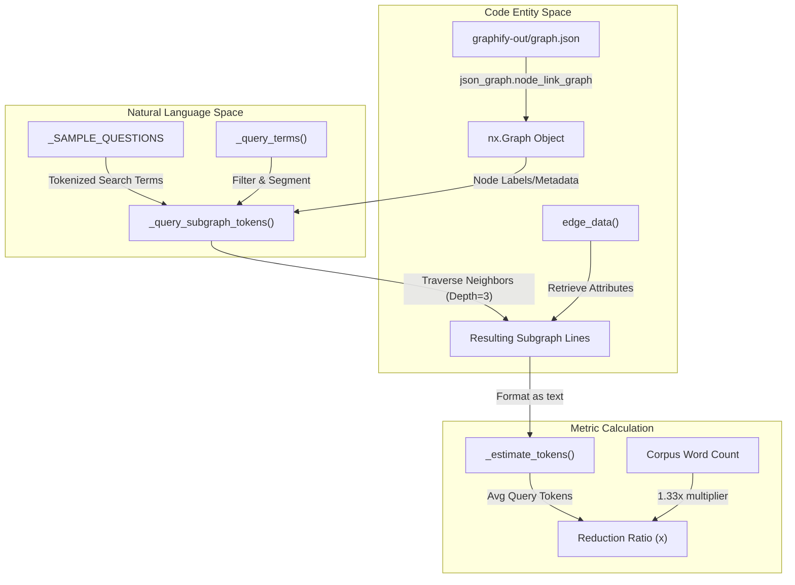
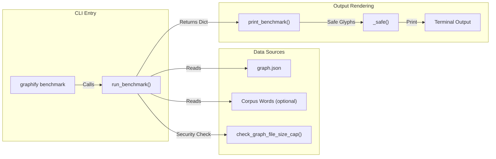

# Token Reduction Benchmark

<details>
<summary>Relevant source files</summary>

The following files were used as context for generating this wiki page:

- [graphify/benchmark.py](graphify/benchmark.py)
- [graphify/ingest.py](graphify/ingest.py)
- [graphify/serve.py](graphify/serve.py)
- [tests/test_benchmark.py](tests/test_benchmark.py)
- [tests/test_serve.py](tests/test_serve.py)

</details>


The Token Reduction Benchmark is a diagnostic utility located in `graphify/benchmark.py` that quantifies the efficiency gains of using a knowledge graph for information retrieval compared to a "naive" full-corpus approach. It measures how many tokens an LLM must process to answer a set of standard architectural questions when provided with a targeted graph context versus the raw text of the entire corpus.

### Core Logic and Flow

The benchmark operates by loading a built graph and simulating a series of Breadth-First Search (BFS) queries. It compares the estimated tokens of the resulting subgraphs against the total estimated tokens of the input corpus.

#### Benchmark Execution Pipeline

The following diagram illustrates how `run_benchmark()` calculates the reduction ratio by bridging the "Natural Language Space" (questions) to the "Code Entity Space" (graph nodes and edges).

**Token Reduction Data Flow**

**Sources:** [graphify/benchmark.py:39-75](), [graphify/benchmark.py:87-136](), [graphify/serve.py:87-101]()

---

### Implementation Details

#### Token Estimation Heuristics
Because `graphify` avoids heavy dependencies where possible, it uses mathematical approximations rather than a formal tokenizer (like `tiktoken`) for benchmarking:
*   **`_CHARS_PER_TOKEN`**: Set to `4` as a standard approximation [graphify/benchmark.py:13-13]().
*   **`_estimate_tokens()`**: Calculated as `max(1, len(text) // _CHARS_PER_TOKEN)` [graphify/benchmark.py:35-36]().
*   **Corpus Word-to-Token Ratio**: Uses a `1.33x` multiplier (`words * 100 // 75`) to estimate tokens from raw word counts [graphify/benchmark.py:113-113]().

#### Subgraph Context Simulation
The function `_query_subgraph_tokens()` simulates how an agent would retrieve context from the graph:
1.   **Keyword Matching**: It extracts terms from the question using `_query_terms()` [graphify/serve.py:87-101]() and scores nodes based on whether terms appear in the node label [graphify/benchmark.py:41-47]().
2.   **Seed Selection**: The top 3 matching nodes are selected as BFS starting points [graphify/benchmark.py:48-49]().
3.   **BFS Expansion**: It traverses the graph to a default `depth` of 3, tracking visited nodes and edges seen [graphify/benchmark.py:53-64]().
4.   **Serialization**: The visited nodes and edges are converted into a text representation containing labels, source files, and relations using `edge_data()` [graphify/build.py:9-11]() to retrieve edge attributes [graphify/benchmark.py:66-73]().

#### Sample Questions
The benchmark uses a static list of architectural questions defined in `_SAMPLE_QUESTIONS` to ensure consistent measurement across different runs [graphify/benchmark.py:78-84]():
*   "how does authentication work"
*   "what is the main entry point"
*   "how are errors handled"
*   "what connects the data layer to the api"
*   "what are the core abstractions"

**Sources:** [graphify/benchmark.py:39-75](), [graphify/benchmark.py:78-84](), [graphify/serve.py:87-101](), [graphify/build.py:9-11]()

---

### Key Functions

| Function | Purpose | Key Inputs |
| :--- | :--- | :--- |
| `run_benchmark()` | Primary entry point for calculating metrics; includes a security check via `check_graph_file_size_cap()`. | `graph_path`, `corpus_words`, `questions` |
| `_query_subgraph_tokens()` | Estimates the size of the graph context for a specific string via BFS. | `G` (Graph), `question`, `depth` |
| `print_benchmark()` | Formats the results into a human-readable CLI report. | `result` dict |
| `_safe()` | Handles Unicode glyph fallbacks for Windows consoles (cp1252) to prevent `UnicodeEncodeError`. | `unicode_char`, `ascii_fallback` |

**Sources:** [graphify/benchmark.py:16-27](), [graphify/benchmark.py:39-136](), [graphify/benchmark.py:139-156](), [graphify/security.py:10-10]()

---

### Output Format and Compatibility

The `print_benchmark()` function generates a report summarizing efficiency. It uses `_safe()` and `_hr()` to ensure that horizontal rules and arrows (e.g., `→`) do not crash Windows consoles that lack UTF-8 support [graphify/benchmark.py:16-32]().

**System Component Interaction**

**Sources:** [graphify/benchmark.py:87-105](), [graphify/benchmark.py:139-156]()

**Example CLI Output Structure:**
```text
graphify token reduction benchmark
--------------------------------------------------
  Corpus:          10,000 words -> ~13,333 tokens (naive)
  Graph:           150 nodes, 300 edges
  Avg query cost:  ~250 tokens
  Reduction:       53.3x fewer tokens per query

  Per question:
    [62.1x] how does authentication work
    [45.2x] what is the main entry point
```

### Corpus Estimation
If `corpus_words` is not provided (which occurs when running on an existing `graph.json` without the original detection manifest), the system estimates the corpus size by assuming ~50 words of context per node: `corpus_words = G.number_of_nodes() * 50` [graphify/benchmark.py:109-111]().

**Sources:** [graphify/benchmark.py:109-113](), [graphify/benchmark.py:145-156]()
