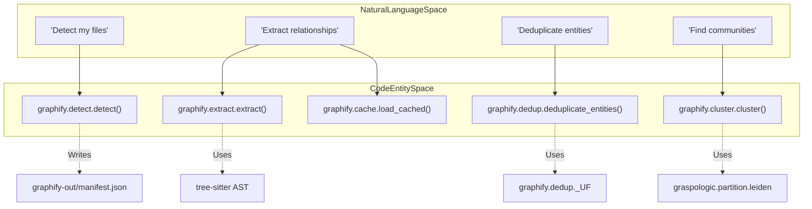
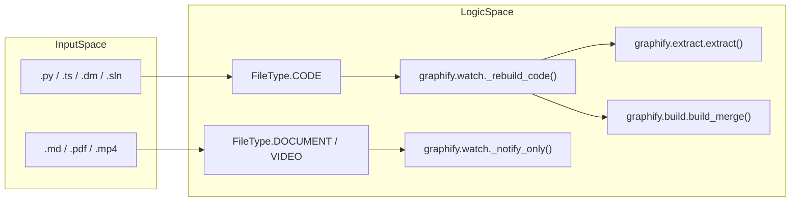

# Glossary

Relevant source files

The following files were used as context for generating this wiki page:

- [CHANGELOG.md](CHANGELOG.md)
- [docs/how-it-works.md](docs/how-it-works.md)
- [graphify/analyze.py](graphify/analyze.py)
- [graphify/build.py](graphify/build.py)
- [graphify/cache.py](graphify/cache.py)
- [graphify/cluster.py](graphify/cluster.py)
- [graphify/dedup.py](graphify/dedup.py)
- [graphify/detect.py](graphify/detect.py)
- [graphify/extract.py](graphify/extract.py)
- [graphify/google_workspace.py](graphify/google_workspace.py)
- [graphify/llm.py](graphify/llm.py)
- [graphify/querylog.py](graphify/querylog.py)
- [graphify/report.py](graphify/report.py)
- [graphify/skill.md](graphify/skill.md)
- [graphify/watch.py](graphify/watch.py)
- [pyproject.toml](pyproject.toml)
- [tests/test_analyze.py](tests/test_analyze.py)
- [tests/test_build.py](tests/test_build.py)
- [tests/test_claude_cli_backend.py](tests/test_claude_cli_backend.py)
- [tests/test_claude_md.py](tests/test_claude_md.py)
- [tests/test_cli_export.py](tests/test_cli_export.py)
- [tests/test_cluster.py](tests/test_cluster.py)
- [tests/test_dedup.py](tests/test_dedup.py)
- [tests/test_detect.py](tests/test_detect.py)
- [tests/test_google_workspace.py](tests/test_google_workspace.py)
- [tests/test_llm_backends.py](tests/test_llm_backends.py)
- [tests/test_provider_registry.py](tests/test_provider_registry.py)
- [tests/test_querylog.py](tests/test_querylog.py)
- [tests/test_rationale.py](tests/test_rationale.py)
- [tests/test_skillgen.py](tests/test_skillgen.py)
- [tests/test_watch.py](tests/test_watch.py)
- [tests/test_wheel_packaging.py](tests/test_wheel_packaging.py)
- [tools/skillgen/gen.py](tools/skillgen/gen.py)
- [tools/skillgen/platforms.toml](tools/skillgen/platforms.toml)

This page defines the technical terms, jargon, and domain-specific concepts used throughout the `graphify` codebase. It serves as a reference for onboarding engineers to understand the data structures and algorithmic logic that drive the pipeline.

## Core Concepts

### 1. God Node
A "God Node" is a high-degree entity that acts as a central hub within the knowledge graph. These represent the most-connected real abstractions in a corpus, such as a core `Client` class or a primary `Value` object [graphify/analyze.py:95-100]().
*   **Implementation**: Identified by sorting nodes by degree in `networkx` [graphify/analyze.py:101-102]().
*   **Filtering**: Synthetic nodes (file hubs and method stubs) and generic JSON keys (e.g., `id`, `type`, `name`) are explicitly excluded via `_is_file_node` and `_is_json_key_node` [graphify/analyze.py:50-93]().
*   **Builtin Noise**: A `_PYTHON_ANNOTATION_NOISE` filter (and `_BUILTIN_NOISE_LABELS` in analysis) suppresses types like `str`, `int`, `bool`, and `MagicMock` from becoming god nodes [graphify/analyze.py:11-16](), [CHANGELOG.md:9-9]().

### 2. Community & Cohesion Score
A partition of the graph where nodes are more densely connected to each other than to the rest of the network.
*   **Detection**: Uses the **Leiden algorithm** via the `graspologic` library [graphify/cluster.py:21-52]().
*   **Oversized Splitting**: If a community exceeds 25% of the graph size, `graphify` recursively splits it to maintain navigable clusters [graphify/cluster.py:55-104]().
*   **Cohesion Score**: A metric (0.0 to 1.0) calculating the ratio of actual intra-community edges to the maximum possible edges [graphify/cluster.py:125-134]().
*   **Stable IDs**: `remap_communities_to_previous` ensures that community IDs remain stable across incremental updates by matching node overlap [graphify/cluster.py:137-175]().

### 3. Entity Deduplication (MinHash/LSH)
A multi-pass pipeline to merge near-identical entities (e.g., `AuthManager` vs `auth_manager`) [graphify/dedup.py:1-5]().
*   **Entropy Gate**: Blocks deduplication for low-entropy labels (e.g., `x`, `tmp`) to prevent false positives [graphify/dedup.py:117-119]().
*   **Blocking**: Uses **MinHash** and **Locality Sensitive Hashing (LSH)** to find candidate pairs efficiently [graphify/dedup.py:11-13]().
*   **Verification**: Applies **Jaro-Winkler** similarity with a **Community Boost**—a score bonus if both nodes already share a community [graphify/dedup.py:119-120]().
*   **Union-Find**: Merges identified duplicates into a single survivor node while rewiring edges [graphify/dedup.py:90-113]().

### 4. Audit Trail (Confidence Tags)
Every relationship (edge) in the graph is tagged with a confidence level to maintain an "honest" representation of the data [graphify/report.py:45-55]().
*   **EXTRACTED**: Explicitly found in source code via AST analysis [graphify/extract.py:139]().
*   **INFERRED**: Reasonable inferences made by LLM subagents (e.g., `semantically_similar_to`) [graphify/analyze.py:192-194]().
*   **AMBIGUOUS**: Flagged for review; these are weighted more heavily in "Surprising Connections" scoring [graphify/analyze.py:194-195]().

### 5. Semantic Cache
A SHA256-based content-addressable storage system that prevents redundant LLM processing [graphify/cache.py:1-7]().
*   **Logic**: Computes a hash of the file content (stripping YAML frontmatter for `.md` files) and the path relative to the root [graphify/cache.py:97-146]().
*   **Portability**: Relativizes `source_file` fields in the payload before saving to ensure the cache is portable across clones [graphify/cache.py:149-183]().

---

## Technical Terms & Jargon

| Term | Definition | Code Pointer |
| :--- | :--- | :--- |
| **AST Extraction** | Deterministic structural analysis of code using `tree-sitter`. | [graphify/extract.py:1-10]() |
| **Bifurcated Update** | `watch` logic: instant AST rebuilds for code, but deferred flags for docs. | [graphify/watch.py:240-270]() |
| **Norm Label** | A diacritic-insensitive, lowercase label used for robust search. | [graphify/serve.py:124-127]() |
| **Ghost Duplicates** | Nodes with same label/file but different IDs (e.g. AST vs Semantic). Auto-merged at build. | [CHANGELOG.md:10-10]() |
| **Surprising Connection** | An edge bridging structurally distant communities or different file categories. | [graphify/analyze.py:119-149]() |
| **Hyperedge** | A grouping of nodes rendered as a shaded region in visualizations. | [graphify/export.py:64-104]() |
| **Rationale Node** | A node generated by LLM to explain the reasoning behind an inference. | [graphify/semantic_cleanup.py:1-15]() |
| **AffectedHit** | Dataclass tracking a node impacted by a change during BFS reverse traversal. | [graphify/affected.py:15-25]() |
| **MCP** | **Model Context Protocol** server for exposing graph tools to AI agents. | [graphify/serve.py:1-10]() |
| **Shrink Guard** | Logic in `_check_shrink` to warn if an update would delete >20% of the graph. | [graphify/watch.py:214-233]() |
| **Whisper Prompting** | Using God Nodes to provide domain context to the `faster-whisper` transcriber. | [graphify/transcribe.py:22-30]() |

---

## Data Flow: Natural Language to Code Entities

### Pipeline Stage Mapping
This diagram bridges the user's high-level pipeline stages to the specific functions and files responsible for them.

**Sources:** [graphify/detect.py:1-20](), [graphify/extract.py:1-10](), [graphify/dedup.py:1-15](), [graphify/cluster.py:21-52]().

### File Type & Logic Branching
This diagram shows how `graphify` classifies incoming files and which code paths handle them during the `watch` and `extraction` phases.

**Sources:** [graphify/detect.py:18-33](), [graphify/watch.py:11-20](), [graphify/build.py:107-153]().

---

## Infrastructure & Files

### 1. manifest.json & graphify-out
The `graphify-out/` directory is the central artifact store. `manifest.json` tracks the state of the corpus, including file hashes, types, and last-processed timestamps [graphify/detect.py:26]().

### 2. .graphifyignore / .graphifyinclude
Control files that allow users to explicitly exclude or include patterns during file discovery [graphify/detect.py:194-196](). Note that `graphify-out/memory/` files bypass ignore filters to preserve `graphify remember` data [graphify/detect.py:202-205]().

### 3. TSConfig Alias Resolver
Recursive logic in the extraction engine that follows `extends` chains in `tsconfig.json` to resolve TypeScript path aliases (e.g., `@/components` -> `src/components`) [graphify/extract.py:100-145]().

### 4. Payload-bearing Hooks
Git hooks installed via `graphify hook install` that keep the graph in sync with commits. Since 0.8.31, they embed the absolute `sys.executable` to ensure reliability in GUI clients [CHANGELOG.md:21-24]().
*   **Pending Queue**: If a rebuild is locked, changed paths are queued in `.pending_changes` to be merged by the lock-holder [graphify/watch.py:16-36]().
*   **Advisory Lock**: `_rebuild_lock` uses `fcntl.flock` to prevent concurrent builds [graphify/watch.py:91-149]().

### 5. Progressive-Disclosure Skills
Host-specific `SKILL.md` files (e.g. for Claude Code, Cursor) that are split into a lean core and an on-demand `references/` sidecar to reduce context token usage [CHANGELOG.md:35-35]().

### 6. Query Logging
Logging of all `graphify query` and MCP calls to `~/.cache/graphify-queries.log` in JSONL format for audit and performance tracking [graphify/querylog.py:1-15](), [CHANGELOG.md:25-25]().

**Sources:** [graphify/detect.py:26-33](), [graphify/extract.py:100-145](), [graphify/watch.py:16-149](), [graphify/cache.py:1-15](), [graphify/querylog.py:1-15](), [CHANGELOG.md:5-40]().
