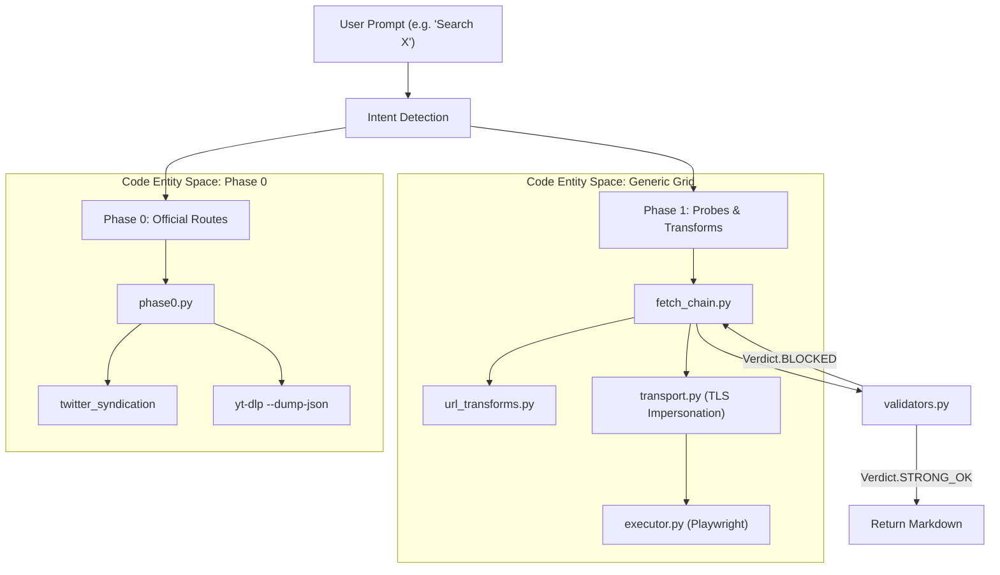
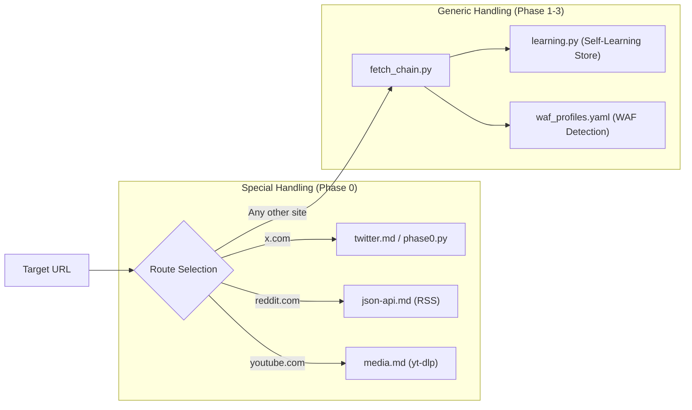

# Overview

Relevant source files

The following files were used as context for generating this wiki page:

- [.claude-plugin/plugin.json](.claude-plugin/plugin.json)
- [PLATFORMS.md](PLATFORMS.md)
- [README.es.md](README.es.md)
- [README.ja.md](README.ja.md)
- [README.ko.md](README.ko.md)
- [README.md](README.md)
- [README.zh.md](README.zh.md)
- [assets/hero.png](assets/hero.png)
- [assets/pipeline.png](assets/pipeline.png)

`insane-search` is a resilient public-page retrieval engine designed for **Claude Code**. It exists to solve the "I can't access that" problem encountered when AI agents attempt to fetch URLs protected by Web Application Firewalls (WAFs), anti-bot challenges (CAPTCHAs), or platform-specific restrictions.

The core philosophy is **adaptive escalation**: the system never pre-judges a URL. Instead, it flows through a multi-phase pipeline, starting with lightweight public API probes and escalating to full browser emulation only when necessary.

## High-Level Capabilities

| Feature | Description |
| :--- | :--- |
| **No API Keys** | Uses public endpoints, syndication feeds, and identity spoofing to avoid auth requirements. |
| **WAF Bypass** | Impersonates browser TLS fingerprints (JA3/JA4) using `curl_cffi` to bypass Cloudflare, Akamai, and DataDome. |
| **Phase 0→3 Pipeline** | Escalates from official APIs to probes, then TLS impersonation, and finally headless browsers. |
| **Zero Setup** | Automatically detects and installs missing dependencies like `yt-dlp` or `curl_cffi` on first run. |
| **Privacy Focused** | Operates strictly on public content; it is programmed to stop at login walls and paywalls. |

Sources: [.claude-plugin/plugin.json:1-42](), [README.md:50-68]()

## System Architecture

The engine is structured as a sequence of fallback strategies. When a standard fetch fails (e.g., returns a `403 Forbidden`), `insane-search` triggers its internal logic to find an alternative route to the same content.

### The Escalation Pipeline

The following diagram illustrates how a request for a "blocked" entity (like a Tweet or a Reddit thread) moves from Natural Language intent into the specific code entities that handle retrieval.

**Diagram: Intent to Code Entity Mapping**

Sources: [README.md:79-95](), [PLATFORMS.md:4-10]()

## Integration with Claude Code

`insane-search` integrates as a plugin for Claude Code. It does not require new commands; it hooks into the environment to provide enhanced `fetch` capabilities.

*   **Plugin Infrastructure**: Managed via `.claude-plugin/plugin.json`.
*   **Auto-Installation**: The `setup/setup.sh` script ensures the local environment has necessary Python headers and binaries.
*   **Update Notifier**: A background hook (`gptaku-update-check.cjs`) checks for new versions to ensure bypass strategies remain current against evolving WAFs.

For details on installation and setup, see [Getting Started & Installation](#1.1).

Sources: [.claude-plugin/plugin.json:1-4](), [PLATFORMS.md:73-89]()

## Supported Platforms

While the engine is generic, it contains "Phase 0" logic for high-traffic platforms that offer official (but often hidden) public endpoints.

**Diagram: Platform Routing Map**

For a complete list of platforms and their specific retrieval methods, see [Supported Platforms & Reference Index](#1.2).

Sources: [PLATFORMS.md:11-48](), [README.md:46-48]()

## Ethical and Legal Boundaries

The tool is strictly a **public content reader**. 
*   **No Authentication**: It does not store cookies for logged-in sessions or bypass paywalls.
*   **Transparency**: If a site is behind a login wall, the engine returns `authentication required` rather than attempting to circumvent security.
*   **Safety**: Includes SSRF (Server-Side Request Forgery) guards to prevent the agent from accessing internal network resources.

For details on the license and safety constraints, see [Legal, Disclaimer & License](#1.3).

Sources: [README.md:97-104](), [PLATFORMS.md:90-96]()

## Child Pages Navigation

*   **[Getting Started & Installation](#1.1)**: Installation via marketplace, dependency management, and first-run behavior.
*   **[Supported Platforms & Reference Index](#1.2)**: Detailed map of X, Reddit, YouTube, and academic platform handling.
*   **[Legal, Disclaimer & License](#1.3)**: MIT license, usage boundaries, and liability disclaimers.
