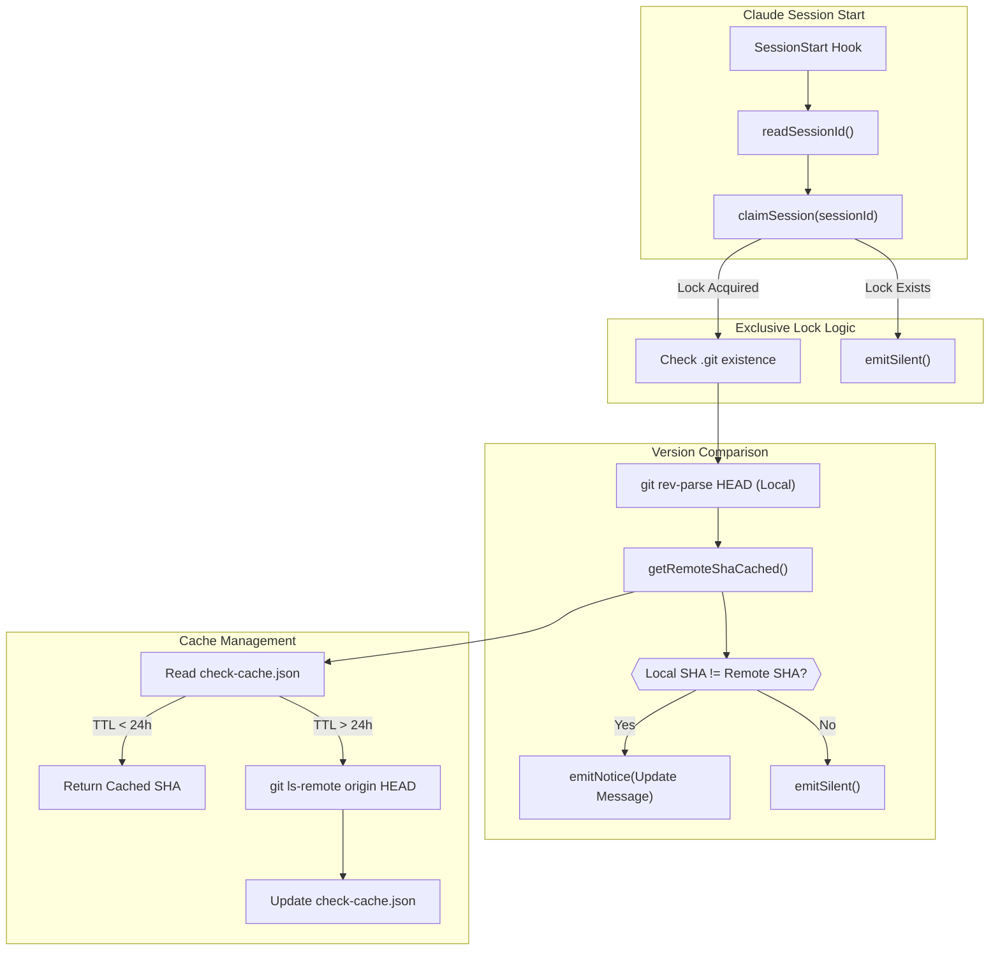
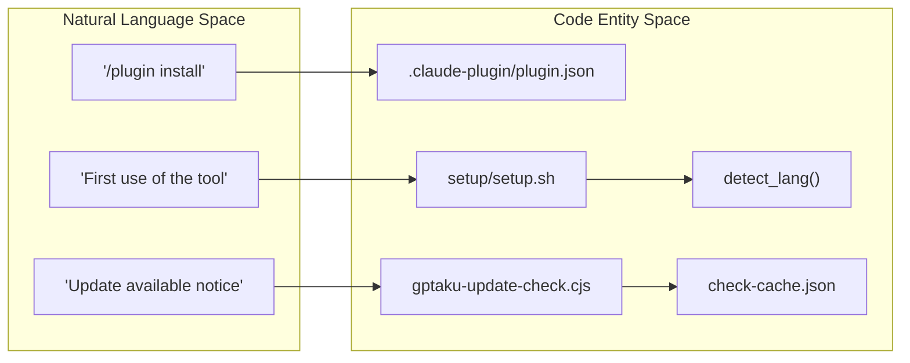

# Getting Started & Installation

<details>
<summary>Relevant source files</summary>

The following files were used as context for generating this wiki page:

- [.claude-plugin/plugin.json](.claude-plugin/plugin.json)
- [README.md](README.md)
- [setup/gptaku-update-check.cjs](setup/gptaku-update-check.cjs)
- [setup/setup.sh](setup/setup.sh)

</details>


This page provides a technical guide for installing `insane-search` as a Claude Code plugin, detailing the first-run initialization process, automatic dependency management, and the infrastructure supporting update notifications.

## Installation via Plugin Marketplace

`insane-search` is distributed as part of the `gptaku-plugins` marketplace. It integrates directly with the Claude Code CLI environment.

### Installation Commands
To install the plugin, execute the following commands in your terminal where Claude Code is active:

```bash
/plugin marketplace add https://github.com/fivetaku/gptaku_plugins.git
/plugin install insane-search@gptaku-plugins
/reload-plugins
```
Sources: [README.md:28-32]()

### Marketplace Manifest
The plugin identity and capabilities are defined in the manifest file, which specifies the version, author, and a wide array of keywords that Claude Code uses to understand the plugin's scope (e.g., `web-access`, `tls-impersonation`, `yt-dlp`).

Sources: [.claude-plugin/plugin.json:1-42]()

## First-Run Setup & Initialization

Upon installation or first execution, the system runs a specialized setup script to ensure the environment is correctly configured. This process is designed to be idempotent and non-blocking.

### Setup Logic (`setup.sh`)
The `setup/setup.sh` script performs several critical infrastructure tasks:
1.  **Environment Validation**: Checks for the presence of `node` and `python3` [setup/setup.sh:105-106]().
2.  **Update Hook Injection**: Injects the `gptaku-update-check.cjs` script into the Claude `settings.json` file under the `SessionStart` hook [setup/setup.sh:110-123]().
3.  **Language Detection**: Analyzes past Claude session transcripts (`.jsonl` files) to determine the user's preferred language (Korean, Japanese, or English) by counting character ranges [setup/setup.sh:32-84]().
4.  **Idempotency Markers**: Creates marker files in `~/.gptaku-setup/` to prevent redundant setup operations [setup/setup.sh:24-27]().

### Star State Machine
The setup script manages a "Star" request flow to encourage community support while remaining non-intrusive. It uses a state machine recorded in `~/.gptaku-setup/insane-search.star.json`.

| State | Trigger | Action |
| :--- | :--- | :--- |
| `asked` | `setup.sh ask` | Emits `STAR_ASK <lang>` to the assistant [setup/setup.sh:133-136](). |
| `yes` | `setup.sh star yes` | Stars the repository using `gh api` if the user is authenticated [setup/setup.sh:92-100](). |
| `no` | `setup.sh star no` | Records the decision to suppress future prompts [setup/setup.sh:92-94](). |

Sources: [setup/setup.sh:1-138]()

## Update Notifier Infrastructure

`insane-search` includes a shared update notification system that monitors the marketplace for new versions without impacting session performance.

### Data Flow: Update Check
The `gptaku-update-check.cjs` script runs at the start of every Claude session. It uses an exclusive lock to ensure that if multiple `gptaku` plugins are installed, only one performs the network check.

Title: Update Notification Logic Flow

Sources: [setup/gptaku-update-check.cjs:32-137]()

## Automatic Dependency Installation

A key feature of `insane-search` is its "Zero Setup" philosophy. It does not require manual installation of complex binary dependencies. Instead, it handles them on-demand during the first execution of a fetch that requires them.

### Key Dependencies Managed
*   **`curl_cffi`**: Used for Phase 2 TLS Impersonation [README.md:52-55]().
*   **`yt-dlp`**: Used for Phase 0 media and caption extraction from YouTube and other platforms [README.md:64-65]().
*   **`playwright`**: Used for Phase 3 headless browser execution [README.md:52-55]().

### The Escalation Trigger
The system only triggers these installations when a standard fetch fails. For example, if a request hits a `403 Forbidden` or a WAF (Web Application Firewall) wall, the `fetch_chain` escalates through the phases, checking for and installing the necessary tools for that specific phase.

Title: Natural Language to Code Entity Mapping (Setup)

Sources: [README.md:50-55](), [setup/setup.sh:32-84](), [setup/gptaku-update-check.cjs:25-30]()
