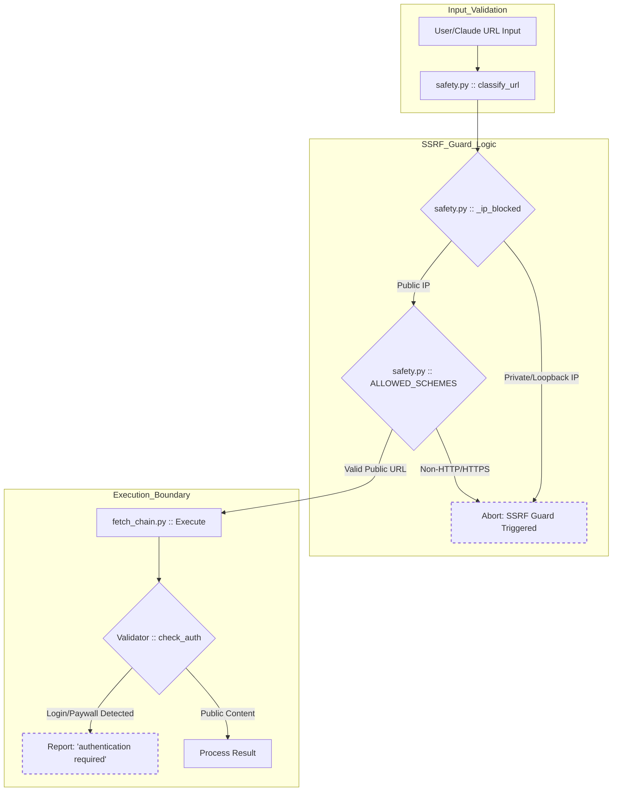
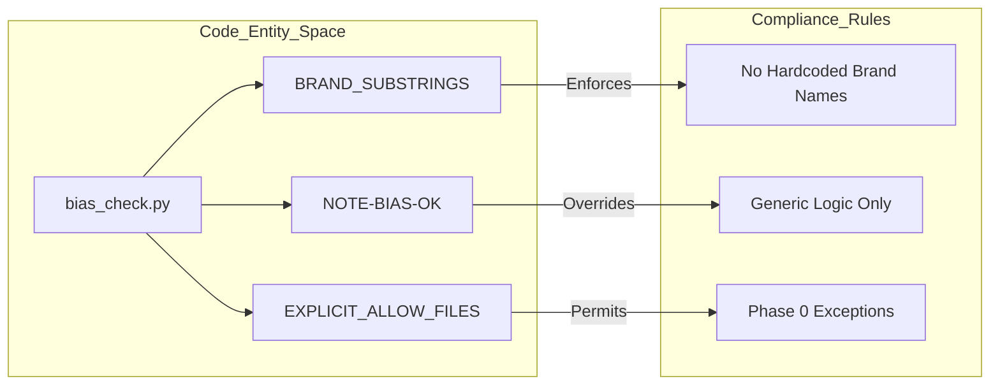

# Legal, Disclaimer & License

Relevant source files

The following files were used as context for generating this wiki page:

- [.gitignore](.gitignore)
- [DISCLAIMER.md](DISCLAIMER.md)
- [LICENSE](LICENSE)

This page outlines the legal framework, liability limitations, and intended-use boundaries for `insane-search`. As a tool designed to navigate complex web environments and Web Application Firewalls (WAFs), it is critical for users and developers to understand the distinction between public content retrieval and unauthorized access.

## MIT License

`insane-search` is released under the **MIT License**, a permissive free software license. This allows for wide redistribution and modification, provided the original copyright notice and permission notice are included in all copies or substantial portions of the software.

### License Text Summary
*   **Copyright**: (c) 2026 fivetaku [LICENSE:3-3]()
*   **Permissions**: Grant of rights to use, copy, modify, merge, publish, distribute, sublicense, and/or sell copies [LICENSE:5-9]().
*   **Conditions**: The above copyright notice and permission notice must be included in all copies [LICENSE:12-13]().
*   **Warranty**: The software is provided "AS IS", without warranty of any kind [LICENSE:15-17]().

Sources: [LICENSE:1-21]()

## Disclaimer of Liability

The author and copyright holders expressly disclaim all liability for damages or claims arising from the use of this software. Users operate `insane-search` entirely at their own risk [DISCLAIMER.md:23-27]().

### Key Legal Provisions
| Provision | Description |
| :--- | :--- |
| **No Warranty** | No guarantee that the software is correct, secure, or suitable for any particular purpose [DISCLAIMER.md:14-19](). |
| **Limitation of Liability** | The author is not liable for claims, damages, or losses, whether in contract or tort [DISCLAIMER.md:23-27](). |
| **No Affiliation** | The author does not endorse or support third-party projects that fork or integrate this tool, including security or automation tooling [DISCLAIMER.md:38-46](). |

Sources: [DISCLAIMER.md:12-46]()

## Intended Use & Dual-Use Nature

`insane-search` is a general-purpose developer tool. Because it provides sophisticated capabilities for TLS impersonation and request routing, it is inherently **dual-use** [DISCLAIMER.md:31-34](). While it is published for legitimate, authorized retrieval of information, the author cannot control how third parties apply the technology.

### Scope of Access Boundaries
The tool is strictly designed as a reader for **publicly available content only** [DISCLAIMER.md:59-59]().

1.  **No Authentication Bypass**: The system is engineered to stop at logins and paywalls. It reports `authentication required` rather than attempting to defeat these barriers [DISCLAIMER.md:59-62]().
2.  **No Credential Storage**: The engine never logs in on behalf of a user and does not store or transmit credentials [DISCLAIMER.md:61-62]().
3.  **Not a Pentesting Tool**: It is not intended for circumventing access controls or gaining unauthorized access to private systems [DISCLAIMER.md:62-64]().

### User Responsibility
Users are solely responsible for:
*   Compliance with all applicable laws and regulations [DISCLAIMER.md:49-50]().
*   Adherence to the Terms of Service (ToS) of any platform or website interacted with [DISCLAIMER.md:51-52]().
*   Obtaining proper authorization before interacting with systems they do not own [DISCLAIMER.md:52-54]().

Sources: [DISCLAIMER.md:29-67]()

## Implementation: Safety and Compliance Logic

The codebase implements several technical safeguards to enforce the legal and safety boundaries described above. These are primarily located in the `Safety` and `Bias Check` modules.

### Safety Enforcement Flow
The following diagram illustrates how `insane-search` enforces safety boundaries (like SSRF protection and authentication limits) before a request is ever dispatched to the `Transport` layer.

**Logic Flow: Safety and Compliance Verification**

Sources: [DISCLAIMER.md:59-62](), [skills/insane-search/engine/safety.py:1-50](), [skills/insane-search/engine/fetch_chain.py:100-150]()

### Bias Check & No-Site-Name Rule
To maintain neutrality and prevent hardcoded bypasses for specific brands (which might violate the "General Purpose" intent), the system uses a linter (`bias_check.py`) to enforce the **No-Site-Name Rule**.

**Entity Mapping: Compliance Linting**

Sources: [skills/insane-search/engine/bias_check.py:10-80]()

### Technical Constraints Table
The following table maps the legal requirements to specific code implementations.

| Legal Requirement | Code Entity / Implementation | Purpose |
| :--- | :--- | :--- |
| **SSRF Prevention** | `safety.py :: classify_url` | Prevents access to internal/private networks. |
| **Public Only** | `validators.py :: Verdict.AUTH_REQUIRED` | Explicitly identifies and stops at authentication gates. |
| **No-Site-Name Rule** | `bias_check.py` | Ensures the tool remains a generic engine rather than a targeted scraper. |
| **Dual-Use Neutrality** | `waf_profiles.yaml` | Uses generic WAF fingerprints rather than site-specific hacks. |

Sources: [DISCLAIMER.md:59-66](), [skills/insane-search/engine/safety.py:1-40](), [skills/insane-search/engine/validators.py:5-25](), [skills/insane-search/engine/bias_check.py:5-30]()
