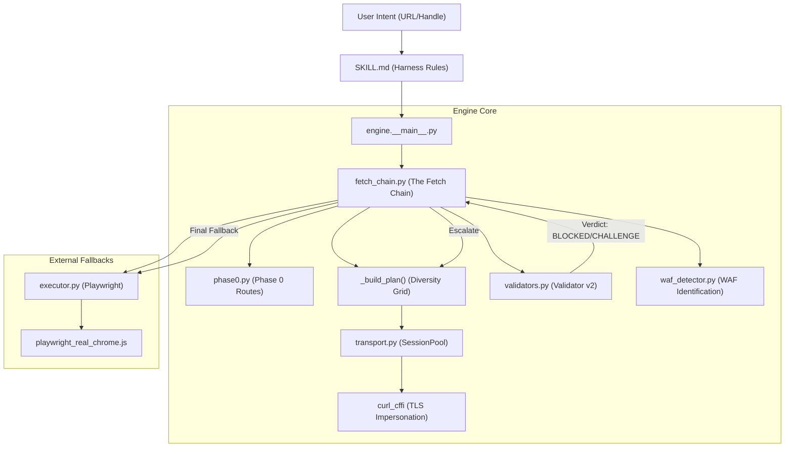
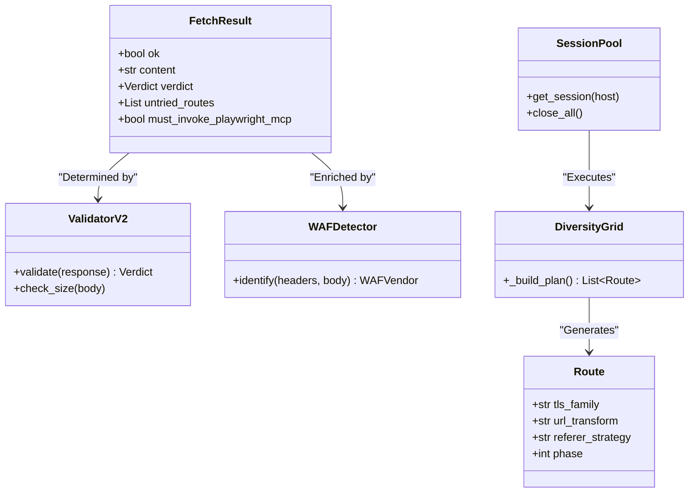

# Architecture Overview

Relevant source files

The following files were used as context for generating this wiki page:

- [CHANGELOG.md](CHANGELOG.md)
- [skills/insane-search/SKILL.md](skills/insane-search/SKILL.md)

The `insane-search` engine is a high-performance, adaptive retrieval system designed to bypass Web Application Firewalls (WAF) and bot detection mechanisms. Unlike standard fetch tools that rely on static headers, `insane-search` employs a multi-phase escalation strategy that moves from lightweight official APIs to a massive diversity grid of TLS-impersonated requests, finally falling back to headless browser automation.

The system is governed by the **No-Site-Name Rule**, which prohibits hardcoding site-specific logic in the core engine, ensuring the bypass strategies remain domain-agnostic and resilient to target site changes.

## The Phase 0→3 Escalation Pipeline

The engine operates on a four-tier escalation model. Each phase is triggered only if the preceding phase fails to return a validated "Success" verdict.

1.  **Phase 0: Official Public Routes** — Sanctioned exceptions to the No-Site-Name Rule. Uses public, unauthenticated endpoints (RSS, Atom, oEmbed, syndication APIs) for platforms like Reddit, X/Twitter, and YouTube.
2.  **Phase 1: Lightweight Probes** — Rapid, low-cost attempts using generic headers and high-speed proxies (e.g., Jina Reader) to check if the content is openly accessible.
3.  **Phase 2: TLS Impersonation Grid** — The core engine. It executes an exhaustive grid of requests using `curl_cffi` to impersonate browser TLS fingerprints (JA3/JA4) across different families (Chrome, Firefox, Safari, Edge) combined with URL transforms.
4.  **Phase 3: Headless Browser** — The final fallback. Launches a local Playwright instance with real browser stacks to handle complex JavaScript challenges and cookie-based gates.

For a detailed walkthrough of the triggers and signals for each phase, see [Phase 0→3 Adaptive Escalation Pipeline](#2.1).

### System Component Map
The following diagram illustrates how the natural language intent from the user is translated into specific code entities and execution paths.

**Diagram: Intent to Execution Flow**

**Sources:** [skills/insane-search/SKILL.md:95-125](), [engine/fetch_chain.py:10-50](), [engine/__main__.py:1-50]()

---

## The No-Site-Name Rule (R3)

A core architectural constraint is the **No-Site-Name Rule** [skills/insane-search/SKILL.md:47-48](). To prevent "logic rot" and maintain generalizability, the engine (excluding `phase0.py`) is forbidden from containing site-specific strings, selectors, or domain-locked logic.

*   **Enforcement**: Handled by `engine/bias_check.py`, which scans for brand substrings and URL patterns during CI [skills/insane-search/SKILL.md:47-48]().
*   **Runtime Hints**: Site-specific selectors or referrers must be passed at runtime via the `--selector` CLI argument or `user_hint` [skills/insane-search/SKILL.md:49-50]().

For details on the linter and enforcement, see [Bias Check & No-Site-Name Rule](#3.6).

---

## Core Subsystems

### The Fetch Chain & Diversity Grid
The `fetch_chain.py` module manages the lifecycle of a request. It uses a "Diversity Grid" scheduler to ensure that even a small number of attempts covers a wide range of TLS fingerprints and URL mutations (e.g., switching to mobile subdomains).

*   **R6 Exhaustive Rule**: The engine will not declare failure until the entire grid is exhausted [skills/insane-search/SKILL.md:53-59]().
*   **Self-Learning**: Successful routes are cached in `learned.json` to prioritize them in future requests to the same host [CHANGELOG.md:15-19]().

For details, see [The Fetch Chain & Diversity Grid](#2.2).

### Response Validation & WAF Detection
Success is not determined by an HTTP 200 status code alone. The `validators.py` module uses a 4-layer check (Hard Markers, Size Fingerprinting, JSON awareness, and Success Selectors) to issue a `Verdict` [CHANGELOG.md:52-54](). Simultaneously, `waf_detector.py` analyzes headers and body content to identify specific WAF vendors (Cloudflare, Akamai, etc.) to adjust the fetch strategy.

For details, see [Response Validation & WAF Detection](#2.4).

### Phase 0: Official Routes
The `phase0.py` module acts as a "sanctioned exception" to the No-Site-Name Rule. It detects URLs for major platforms and routes them through known-good public endpoints before the generic grid is even attempted [CHANGELOG.md:42-42]().

For details, see [Phase 0: Platform-Specific Official Routes](#2.3).

---

## Data & Entity Relationship
This diagram maps the internal data structures and classes to their roles in the retrieval process.

**Diagram: Code Entity Relationship**

**Sources:** [engine/fetch_chain.py:50-100](), [engine/validators.py:10-60](), [engine/transport.py:20-80](), [CHANGELOG.md:52-56]()

## Navigation
*   **Next Page**: [Phase 0→3 Adaptive Escalation Pipeline](#2.1)
*   **Related**: [The Fetch Chain & Diversity Grid](#2.2) | [Response Validation & WAF Detection](#2.4)
