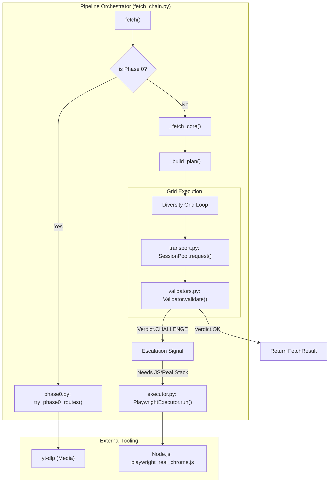
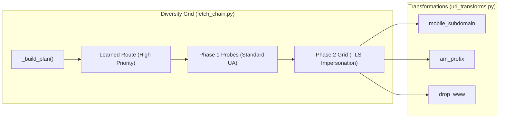

# Phase 0→3 Adaptive Escalation Pipeline

Relevant source files

The following files were used as context for generating this wiki page:

- [CHANGELOG.md](CHANGELOG.md)
- [README.md](README.md)
- [skills/insane-search/SKILL.md](skills/insane-search/SKILL.md)
- [skills/insane-search/references/fallback.md](skills/insane-search/references/fallback.md)
- [skills/insane-search/references/tls-impersonate.md](skills/insane-search/references/tls-impersonate.md)

The **Phase 0→3 Adaptive Escalation Pipeline** is the core decision engine of `insane-search`. It manages a sequence of retrieval strategies that escalate in complexity and resource intensity only when simpler methods fail or encounter defensive signals (WAFs, CAPTCHAs, or JS-only shells). This model ensures that the system remains efficient—using lightweight APIs where possible—while remaining resilient enough to break through sophisticated bot-management walls like Akamai or Cloudflare.

### Pipeline Overview

The pipeline operates on a "success-exit" basis: as soon as a phase returns a validated response (defined by `Verdict.STRONG_OK` or `Verdict.WEAK_OK`), the process terminates and returns the result.

| Phase | Name | Primary Mechanism | Use Case |
| :--- | :--- | :--- | :--- |
| **Phase 0** | **Official Routes** | Sanctioned public APIs & RSS feeds | X/Twitter, Reddit, YouTube, HN, arXiv |
| **Phase 1** | **Lightweight Probes** | Generic HTTP with varied User-Agents | Blogs, news sites, unprotected portals |
| **Phase 2** | **TLS Impersonation** | `curl_cffi` (JA3/JA4 fingerprinting) | WAF-protected sites (Cloudflare, Akamai) |
| **Phase 3** | **Headless Browser** | Playwright (Real Chrome stack) | JS-heavy SPAs, Turnstile, behavioral WAFs |

---

## Data Flow and Code Entity Mapping

The pipeline is orchestrated by `fetch_chain.py`, which coordinates the transition between phases and manages the "Diversity Grid" of request parameters.

### Pipeline Architecture Diagram
"This diagram maps the logical phases to the Python classes and functions responsible for execution."

**Sources:**
- [skills/insane-search/engine/fetch_chain.py:1-20]() (Orchestration logic)
- [skills/insane-search/engine/phase0.py:1-15]() (Phase 0 entry point)
- [skills/insane-search/engine/executor.py:1-30]() (Phase 3 execution)
- [skills/insane-search/SKILL.md:51-60]() (R5/R6 escalation rules)

---

## Phase 0: Platform-Specific Official Routes

Phase 0 is the only phase exempt from the **No-Site-Name Rule**. It uses a hardcoded mapping of domains to their official, non-authenticated public endpoints. This is prioritized because official routes are more stable and provide structured data (JSON/Atom) that is superior to scraped HTML.

- **Implementation:** `phase0.py` contains the `try_phase0_routes` function.
- **Key Logic:** It matches the input URL against patterns for Reddit (`.rss`), X/Twitter (syndication/oEmbed), and YouTube (`yt-dlp`).
- **Fallthrough:** If Phase 0 fails (e.g., a 429 rate limit on the RSS feed), the pipeline immediately falls through to Phase 1.

**Sources:**
- [skills/insane-search/engine/phase0.py:10-45]() (Route matching logic)
- [skills/insane-search/SKILL.md:105-125]() (Phase 0 Index)

---

## Phase 1 & 2: The Diversity Grid

Phases 1 and 2 are handled within the `_fetch_core` loop. The "Diversity Grid" ensures that the engine doesn't waste attempts by repeating the same TLS fingerprint or URL transformation.

### Escalation Logic (Phase 1 → 2)
The transition from Phase 1 (standard `curl`) to Phase 2 (`curl_cffi` TLS impersonation) is triggered by `validators.py`.

| Signal | Detection | Escalation Target |
| :--- | :--- | :--- |
| **WAF Header** | `cf-ray`, `x-datadome`, `server: cloudflare` | TLS Group: `chrome` |
| **WAF Cookie** | `_abck` (Akamai), `__cf_bm` | TLS Group: `safari` (for Akamai) |
| **Fingerprint Block** | HTTP 403 with standard curl | TLS Rotation (Safari → Chrome → Firefox) |

### Code Entity: The Scheduler
The `_build_plan` function in `fetch_chain.py` materializes the grid. It prioritizes:
1. **Learned Routes:** Successes stored in `learned.json` [[CHANGELOG.md:15-19]]().
2. **Diversity:** Alternating between TLS families (Safari, Chrome, Firefox) and URL transforms (Mobile, AM-prefix, No-WWW).

**Sources:**
- [skills/insane-search/engine/fetch_chain.py:120-160]() (`_build_plan` implementation)
- [skills/insane-search/engine/url_transforms.py:1-20]() (URL mutation rules)
- [skills/insane-search/references/fallback.md:48-62]() (Escalation signals table)

---

## Phase 3: Headless Browser Escalation

Phase 3 is the "nuclear option." It is triggered when Phase 2 fails or when a specific "Behavioral Challenge" is detected (e.g., Akamai `sec-if-cpt` or Cloudflare Turnstile).

### Trigger Conditions
- **Validator Verdict:** `CHALLENGE` with `needs_js_exec=True` [[skills/insane-search/engine/validators.py:40-50]]().
- **Grid Exhaustion:** When all TLS impersonation attempts return blocks.
- **WAF Profile Requirement:** If `waf_profiles.yaml` specifies `capabilities_needed: [needs_real_tls_stack]`.

### Implementation: `executor.py`
The `PlaywrightExecutor` does not run inside the Python process's main loop. Instead, it:
1. Spawns a Node.js process using `playwright_real_chrome.js`.
2. Passes a `Profile` directory to maintain session isolation.
3. **Cookie Bridge:** Extracts cookies from the successful browser session and saves them back to the Python `SessionPool` so subsequent requests can potentially drop back to Phase 2 [[skills/insane-search/engine/transport.py:80-95]]().

**Sources:**
- [skills/insane-search/engine/executor.py:50-100]() (`PlaywrightExecutor` lifecycle)
- [skills/insane-search/references/fallback.md:106-120]() (Phase 3 conditions)
- [CHANGELOG.md:52-60]() (Validator v2 and behavioral detection)

---

## Escalation Signals & Verdicts

The pipeline relies on the `Verdict` enum from `validators.py` to decide whether to stop or escalate.

| Verdict | Meaning | Action |
| :--- | :--- | :--- |
| `STRONG_OK` | Clear content, matched selectors | Terminate & Return |
| `WEAK_OK` | Meaningful text but no selectors | Terminate & Return |
| `SUSPECT_OK` | 200 OK but body is small/vague | Log & Continue Grid |
| `CHALLENGE` | WAF/CAPTCHA/JS-required detected | **Escalate to Phase 2/3** |
| `BLOCKED` | 403/401/IP Block | **Rotate TLS/Transform** |

**Sources:**
- [skills/insane-search/engine/validators.py:10-60]() (Verdict enum and validation logic)
- [CHANGELOG.md:5-9]() (Small-body heuristic fix)
