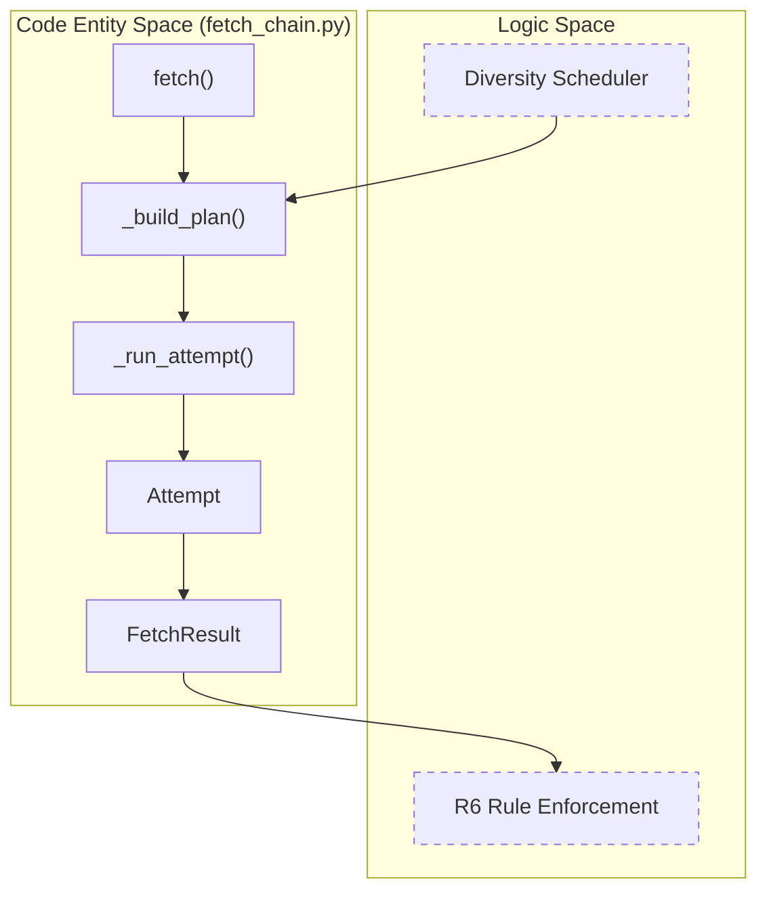
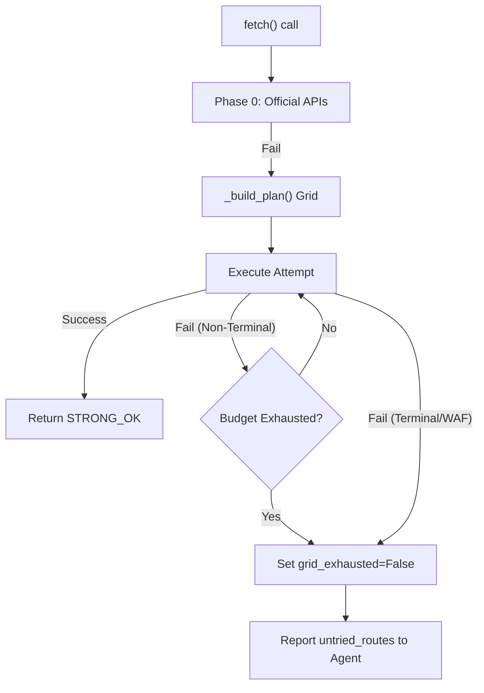

# The Fetch Chain & Diversity Grid

Relevant source files

The following files were used as context for generating this wiki page:

- [CHANGELOG.md](CHANGELOG.md)
- [skills/insane-search/engine/__init__.py](skills/insane-search/engine/__init__.py)
- [skills/insane-search/engine/fetch_chain.py](skills/insane-search/engine/fetch_chain.py)
- [skills/insane-search/engine/templates/.gitignore](skills/insane-search/engine/templates/.gitignore)
- [skills/insane-search/engine/templates/package.json](skills/insane-search/engine/templates/package.json)
- [skills/insane-search/engine/tests/test_smoke.py](skills/insane-search/engine/tests/test_smoke.py)
- [skills/insane-search/engine/url_transforms.py](skills/insane-search/engine/url_transforms.py)

This page provides a deep dive into the core execution logic of `insane-search`. It covers the lifecycle of a fetch request, the sophisticated scheduling algorithm that ensures high-success rates against Web Application Firewalls (WAFs), and the enforcement of the R6 exhaustive-grid rule.

## Overview of the Fetch Lifecycle

The `fetch_chain.py` module serves as the single entrypoint for generic fetching [skills/insane-search/engine/fetch_chain.py:1-4](). It coordinates a multi-stage process: **Probe → Validate → Detect → Plan → Execute → Report** [skills/insane-search/engine/fetch_chain.py:9]().

### 1. Probe & Validate
Every request begins with a lightweight "Probe" attempt using `curl_cffi` to check if the target URL is accessible with default settings [skills/insane-search/engine/fetch_chain.py:121-132](). The response is immediately passed to the validator to determine its `Verdict` (e.g., `STRONG_OK`, `CHALLENGE`, `BLOCKED`) [skills/insane-search/engine/fetch_chain.py:166-171]().

### 2. WAF Detection
If the probe is not decisively successful, the engine runs `detect()` to identify the WAF provider (e.g., Cloudflare, Akamai) based on headers, cookies, and body markers [skills/insane-search/engine/fetch_chain.py:41](). This detection loads a corresponding profile from `waf_profiles.yaml` to guide the subsequent "Diversity Grid" [skills/insane-search/engine/fetch_chain.py:199-202]().

### 3. Diversity Grid Planning (`_build_plan`)
The scheduler materializes a "grid" of all possible combinations of TLS fingerprints, URL transforms, and referer strategies [skills/insane-search/engine/fetch_chain.py:14-17]().

### 4. Execution & Reporting
The engine iterates through the plan until a terminal success or failure is reached, recording every attempt in a detailed `trace` for diagnostics [skills/insane-search/engine/fetch_chain.py:10-11]().

**Sources:** [skills/insane-search/engine/fetch_chain.py:1-171](), [skills/insane-search/engine/__init__.py:7-11]()

---

## The Diversity Grid Scheduler

The v2 scheduler is designed to maximize "Diversity" per attempt. Instead of exhausting all TLS versions for a single URL transform, it rotates through different dimensions simultaneously [skills/insane-search/engine/fetch_chain.py:13-17]().

### Implementation of `_build_plan`
The function `_build_plan` organizes the grid into rounds to ensure that even a small budget (e.g., `max_attempts=5`) touches multiple TLS families and URL variations [skills/insane-search/engine/fetch_chain.py:246-285]().

| Feature | Implementation Detail |
| :--- | :--- |
| **TLS Family Rotation** | Groups `curl_cffi` fingerprints into `safari`, `chrome`, `edge`, and `firefox`. It tries one from each family before repeating a family [skills/insane-search/engine/fetch_chain.py:185-192](). |
| **URL Transforms** | Applies domain-agnostic mutations like `mobile_subdomain` (`www.` → `m.`) or `am_prefix` [skills/insane-search/engine/url_transforms.py:7-15](). |
| **Deprioritization** | TLS fingerprints flagged as `tls_impersonate_avoid` in a WAF profile are moved to the end of the queue rather than deleted [skills/insane-search/engine/fetch_chain.py:18-19](). |
| **Self-Learning Promotion** | If a host has a successful history in `learned.json`, that specific route is promoted to the very front of the grid [CHANGELOG.md:15-16](). |

### Code-to-Logic Mapping: Scheduler Entities
The following diagram bridges the conceptual grid to the Python classes and functions.

**Diversity Grid Logic Map**

**Sources:** [skills/insane-search/engine/fetch_chain.py:13-31](), [skills/insane-search/engine/fetch_chain.py:64-117](), [skills/insane-search/engine/fetch_chain.py:246-285]()

---

## URL Transforms & Referer Strategies

Transforms and referers are used to bypass simple bot-detection rules that target standard desktop scrapers.

### URL Transforms
Located in `url_transforms.py`, these are domain-agnostic rules [skills/insane-search/engine/url_transforms.py:3-5]():
*   **`mobile_subdomain`**: Changes `www.example.com` to `m.example.com`. Effective for sites that serve lighter, less-protected content to mobile users [skills/insane-search/engine/url_transforms.py:32-42]().
*   **`am_prefix`**: Adds `m.` to apex domains (e.g., `example.com` → `m.example.com`) [skills/insane-search/engine/url_transforms.py:44-55]().
*   **`drop_www`**: Removes the `www.` prefix to hit the apex domain directly [skills/insane-search/engine/url_transforms.py:58-63]().

### Referer Strategies
Defined in `fetch_chain.py`, these simulate different traffic sources [skills/insane-search/engine/fetch_chain.py:49-60]():
1.  **`self_root`**: Sets the referer to the root of the target domain (e.g., `https://example.com/`).
2.  **`google_search`**: Sets the referer to `https://www.google.com/`.
3.  **`none`**: Sends no referer header.

**Sources:** [skills/insane-search/engine/url_transforms.py:1-98](), [skills/insane-search/engine/fetch_chain.py:49-60]()

---

## The R6 Exhaustive-Grid Rule

The "R6 Rule" is a structural requirement that the engine must attempt every viable route before declaring a URL "blocked" [CHANGELOG.md:40-43]().

### Implementation in `FetchResult`
When a fetch fails (`ok=False`), the `FetchResult` object includes diagnostic fields to inform the calling agent about the state of exhaustion [skills/insane-search/engine/fetch_chain.py:97-100]():
*   **`grid_exhausted`**: Boolean indicating if the entire planned grid was attempted [skills/insane-search/engine/fetch_chain.py:95]().
*   **`untried_routes`**: A list of routes that were planned but not executed due to a budget (`max_attempts`) or early terminal failure [skills/insane-search/engine/fetch_chain.py:99]().
*   **`must_invoke_playwright_mcp`**: A flag triggered when the engine encounters a terminal WAF challenge that requires a full browser (Phase 3) [skills/insane-search/engine/fetch_chain.py:100]().

### Failure Flow
If the engine gives up, it prints a `⛔ NOT EXHAUSTED (R6)` block to stderr if there are remaining routes [CHANGELOG.md:43](). This forces the system to either increase the budget or escalate to the Playwright executor.

**R6 Enforcement Flow**

**Sources:** [CHANGELOG.md:40-46](), [skills/insane-search/engine/fetch_chain.py:84-117]()

---

## TLS Family Rotation Details

The engine uses `curl_cffi` to impersonate browser TLS stacks. The scheduler ensures that the grid rotates through these families to avoid being fingerprinted by WAFs that block specific browser versions [skills/insane-search/engine/fetch_chain.py:185-192]().

| Family | Fingerprints (Examples) | Priority |
| :--- | :--- | :--- |
| `safari` | `safari_15_5`, `safari_16_0` | High |
| `chrome` | `chrome_110`, `chrome_120` | High |
| `firefox` | `firefox_102`, `firefox_117` | Medium |
| `edge` | `edge_101` | Medium |

The function `_family(tls)` maps specific fingerprints back to these broad categories to ensure the diversity logic functions correctly [skills/insane-search/engine/fetch_chain.py:188-192]().

**Sources:** [skills/insane-search/engine/fetch_chain.py:185-197](), [skills/insane-search/engine/fetch_chain.py:246-285]()
