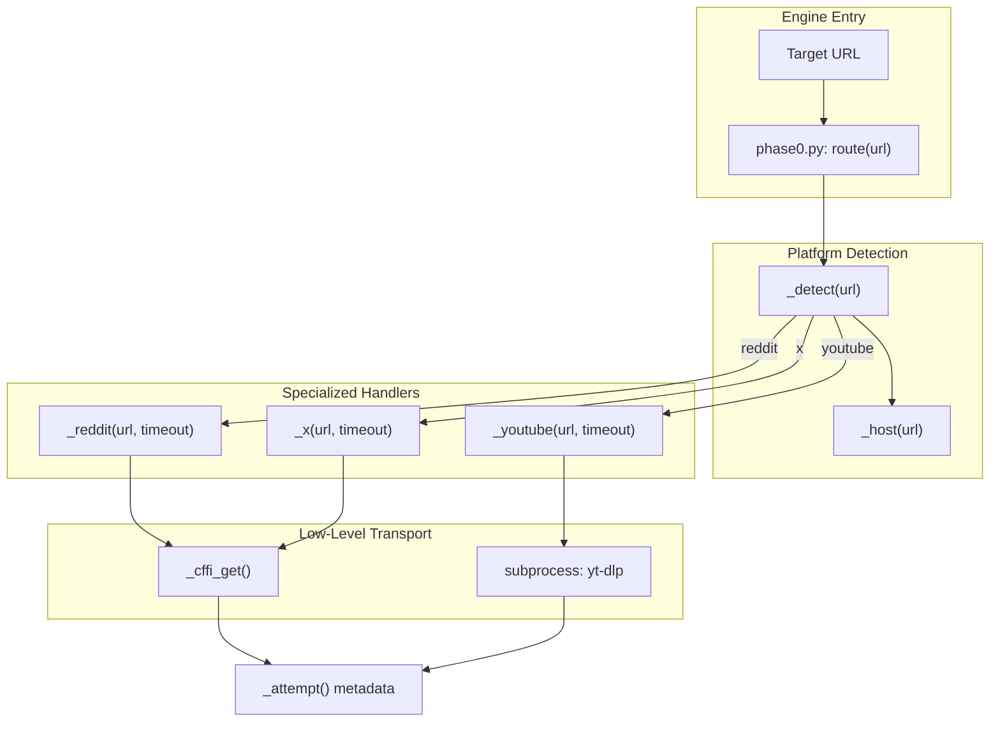
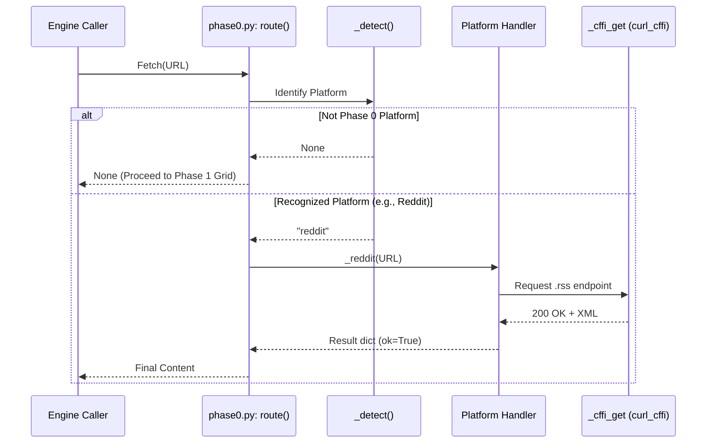

# Phase 0: Platform-Specific Official Routes

<details>
<summary>Relevant source files</summary>

The following files were used as context for generating this wiki page:

- [skills/insane-search/engine/phase0.py](skills/insane-search/engine/phase0.py)
- [skills/insane-search/references/json-api.md](skills/insane-search/references/json-api.md)
- [skills/insane-search/references/rss.md](skills/insane-search/references/rss.md)
- [skills/insane-search/references/twitter.md](skills/insane-search/references/twitter.md)

</details>


Phase 0 acts as the sanctioned exception to the "No-Site-Name Rule" within the `insane-search` engine. While the rest of the system is designed to be site-agnostic to avoid brittle scraping logic, `phase0.py` explicitly targets high-value platforms (Reddit, X/Twitter, YouTube) that provide official, unauthenticated public endpoints. By routing these requests through Phase 0 first, the system avoids the overhead and potential blocks of the generic WAF grid for sites where stable alternatives exist [skills/insane-search/engine/phase0.py:1-11]().

## Purpose and Scope

The primary goal of Phase 0 is to ensure that "official" routes are tried **before** the generic Phase 1-3 escalation. This prevents the agent from incorrectly declaring a site "blocked" simply because a generic browser-like request failed, when a specialized endpoint (like an RSS feed or a syndication API) would have succeeded [skills/insane-search/engine/phase0.py:3-7]().

### Key Characteristics
*   **Deterministic Routing**: Requests to recognized domains are automatically diverted to specialized handlers.
*   **No-Auth Public Endpoints**: Only routes requiring no API keys or user authentication are included.
*   **Exception to Linter**: This is the only module exempted from the `bias_check.py` linter which normally forbids platform-specific strings [skills/insane-search/engine/phase0.py:9-11]().
*   **Fallthrough Design**: If Phase 0 fails (e.g., a 404 or rate limit), the engine transparently falls through to the generic diversity grid [skills/insane-search/engine/phase0.py:15-16]().

## Implementation and Data Flow

The entry point for this phase is the `route(url)` function. It identifies the platform and dispatches the request to a specific internal handler.

### System Entity Mapping

The following diagram bridges the natural language concepts of "Platform Routing" to the specific code entities in `phase0.py`.

**Phase 0 Entity Mapping**

Sources: [skills/insane-search/engine/phase0.py:27-70](), [skills/insane-search/engine/phase0.py:73-152]()

## Platform Routing Logic

### Reddit (.rss over .json)
As of mid-2026, Reddit heavily gates unauthenticated `.json` endpoints with WAF challenges [skills/insane-search/references/json-api.md:8-10](). Phase 0 prioritizes the `.rss` (Atom) feed, which remains a stable, unauthenticated exception to Reddit's WAF [skills/insane-search/references/json-api.md:12-18]().

*   **Primary Route**: Appends `.rss` to the URL path [skills/insane-search/engine/phase0.py:77]().
*   **Secondary Route**: Attempts `.json` via `curl_cffi` as a low-cost fallback [skills/insane-search/engine/phase0.py:78-94]().
*   **Data Structure**: Returns Atom XML which can be parsed for `title`, `author`, and `content` (HTML body) [skills/insane-search/references/json-api.md:26-40]().

### X/Twitter (Syndication & oEmbed)
Directly fetching `x.com` usually results in a 402 or a JS-heavy SPA that simple probes cannot read [skills/insane-search/references/twitter.md:3-11](). Phase 0 uses three distinct public endpoints.

| Route | Function | Benefit |
| :--- | :--- | :--- |
| **tweet-result** | `cdn.syndication.twimg.com/tweet-result` | Structured JSON, high stability, includes engagement metrics [skills/insane-search/references/twitter.md:89-97](). |
| **oEmbed** | `publish.twitter.com/oembed` | Reliable HTML blockquote fallback for single tweets [skills/insane-search/references/twitter.md:64-72](). |
| **Syndication** | `syndication.twitter.com/srv/timeline-profile` | Retrieves the last ~100 tweets for a profile without an API key [skills/insane-search/references/twitter.md:13-21](). |

Sources: [skills/insane-search/engine/phase0.py:109-152](), [skills/insane-search/references/twitter.md:89-114]()

### YouTube (yt-dlp)
For YouTube and other media sites, Phase 0 leverages `yt-dlp` to extract metadata and subtitles without rendering the full page [skills/insane-search/references/rss.md:101-102]().

## Data Flow Architecture

The following diagram illustrates how a URL is processed through the Phase 0 pipeline before either returning a result or handing off to the generic engine.

**Phase 0 Data Flow**

Sources: [skills/insane-search/engine/phase0.py:13-24](), [skills/insane-search/engine/phase0.py:59-69](), [skills/insane-search/engine/phase0.py:80-88]()

## Handler Specifications

### The `_attempt` Metadata
Every request made in Phase 0 is wrapped in an `_attempt` dictionary. This ensures that even if a platform-specific route fails, the engine caller has a diagnostic trail of what was tried before the generic grid took over [skills/insane-search/engine/phase0.py:17-24]().

```python
# Internal metadata structure
{
    "route": "rss",
    "platform": "reddit",
    "ok": True,
    "status": 200,
    "bytes": 14500,
    "note": "feed"
}
```
Sources: [skills/insane-search/engine/phase0.py:53-55]()

### Transport Layer: `_cffi_get`
Phase 0 uses `curl_cffi` for its requests to ensure that even "official" endpoints see a valid browser-like TLS fingerprint (defaulting to `safari`). This prevents basic header-based blocking on APIs that expect legitimate browser traffic [skills/insane-search/engine/phase0.py:34-45]().

Sources: [skills/insane-search/engine/phase0.py:34-45](), [skills/insane-search/references/twitter.md:99-103]()
