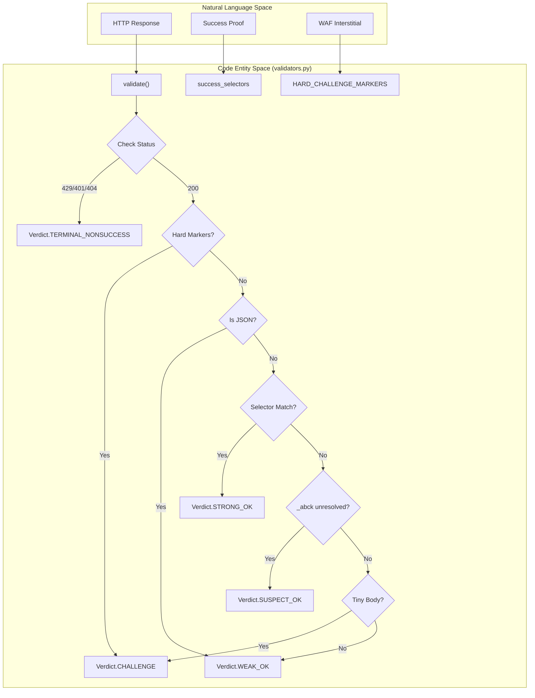
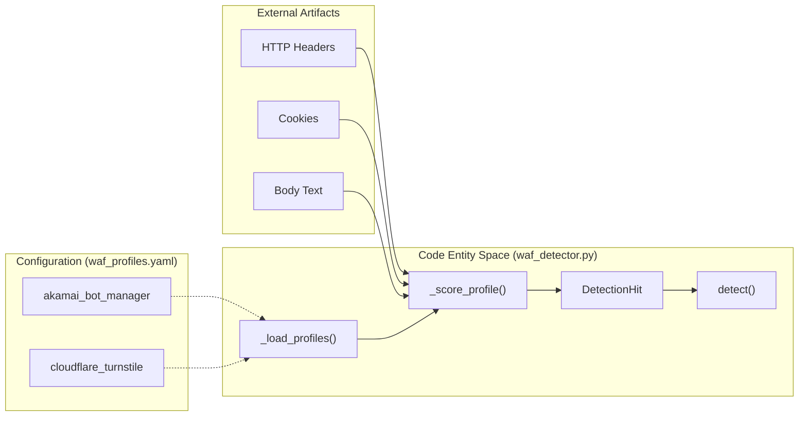

# Response Validation & WAF Detection

Relevant source files

The following files were used as context for generating this wiki page:

- [skills/insane-search/engine/tests/test_u1.py](skills/insane-search/engine/tests/test_u1.py)
- [skills/insane-search/engine/validators.py](skills/insane-search/engine/validators.py)
- [skills/insane-search/engine/waf_detector.py](skills/insane-search/engine/waf_detector.py)
- [skills/insane-search/engine/waf_profiles.yaml](skills/insane-search/engine/waf_profiles.yaml)

This module provides the intelligence layer for classifying HTTP responses and identifying the specific Web Application Firewall (WAF) products protecting a target. By moving beyond simple HTTP status code checks, `insane-search` can distinguish between transient network errors, permanent blocks, and solvable challenges, allowing the `fetch_chain.py` to adapt its strategy in real-time.

## Validator v2 Architecture

The `validators.py` module implements a 6-layer validation pipeline [skills/insane-search/engine/validators.py:3-10](). It is designed to be entirely generic and site-agnostic, adhering to the **No-Site-Name Rule**.

### The 6-Layer Validation Pipeline

| Layer | Name | Description |
| :--- | :--- | :--- |
| 1 | **HTTP Status** | Evaluates standard semantics (429 Rate Limit, 401 Auth, 404 Not Found) [skills/insane-search/engine/validators.py:236-250](). |
| 2 | **Hard Markers** | Checks for structural WAF containers (e.g., `sec-if-cpt-container`) that never appear in legitimate content [skills/insane-search/engine/validators.py:40-50](). |
| 3 | **Size Fingerprints** | Compares response byte size against `known_bad_sizes` provided by the caller [skills/insane-search/engine/validators.py:257-260](). |
| 4 | **JSON Awareness** | Ensures small JSON payloads (APIs) are not mislabeled as challenge stubs [skills/insane-search/engine/validators.py:263-270](). |
| 5 | **Success Selectors** | Uses `BeautifulSoup` to find caller-provided CSS selectors. A match here overrides "Soft Markers" [skills/insane-search/engine/validators.py:273-281](). |
| 6 | **Heuristics** | Final check for "Soft Markers", unresolved cookies, and tiny-body fragments [skills/insane-search/engine/validators.py:284-310](). |

### Data Flow: Response to Verdict

The following diagram illustrates how a raw response is transformed into a `Verdict` enum by `validate()`.

**Diagram: Validation Logic Flow**

Sources: [skills/insane-search/engine/validators.py:69-80](), [skills/insane-search/engine/validators.py:192-310](), [skills/insane-search/engine/tests/test_u1.py:90-118]()

## Verdict Classification

The `Verdict` enum [skills/insane-search/engine/validators.py:69-80]() determines the next step in the `fetch_chain`.

*   **STRONG_OK**: Terminal success. Positive proof (CSS selector) was found [skills/insane-search/engine/validators.py:72]().
*   **WEAK_OK**: Terminal success. Response looks clean, but no specific proof was requested/found [skills/insane-search/engine/validators.py:73]().
*   **SUSPECT_OK**: **Non-terminal**. The response might be valid, but suspicious artifacts (like an unresolved Akamai `_abck` cookie) were found. The chain continues searching for a better result [skills/insane-search/engine/validators.py:74]().
*   **CHALLENGE**: The request was intercepted by a WAF challenge (JS/Captcha) [skills/insane-search/engine/validators.py:75]().
*   **TERMINAL_NONSUCCESS**: Includes `RATE_LIMITED` (429), `AUTH_REQUIRED` (401), and `NOT_FOUND` (404). The grid stops because rotating TLS fingerprints will not resolve these issues [skills/insane-search/engine/validators.py:84-86]().

Sources: [skills/insane-search/engine/validators.py:69-86](), [skills/insane-search/engine/tests/test_u1.py:119-126]()

## WAF Detection Engine

The `waf_detector.py` module identifies WAF vendors by inspecting headers, cookies, and body content. Instead of a single boolean, it returns a ranked list of `DetectionHit` objects [skills/insane-search/engine/waf_detector.py:53-57]().

### Detection Mechanisms

Detection is driven by `waf_profiles.yaml`, which defines fingerprints for major vendors:

| Vendor | Detection Signals | Capabilities Needed |
| :--- | :--- | :--- |
| **Akamai** | Cookies: `_abck`, `bm_sz`. Server: `AkamaiGHost`. Body: `sec-if-cpt-container` | `needs_real_tls_stack`, `needs_js_exec` |
| **Cloudflare** | Cookies: `cf_clearance`. Headers: `cf-ray`. Body: `Just a moment...` | `needs_js_exec` |
| **DataDome** | Cookies: `datadome`. Body: `DataDome` | `needs_real_tls_stack`, `needs_js_exec` |
| **AWS WAF** | Cookies: `aws-waf-token`. Headers: `x-amzn-waf-*` | `needs_real_tls_stack` |

Sources: [skills/insane-search/engine/waf_profiles.yaml:19-135](), [skills/insane-search/engine/waf_detector.py:132-179]()

### Profile Gating & Confidence

The `detect()` function [skills/insane-search/engine/waf_detector.py:182-207]() applies `confidence_rules` defined in the YAML [skills/insane-search/engine/waf_profiles.yaml:25-28]().
*   **Strong (0.9)**: Multiple signals matched (e.g., both a cookie and a header).
*   **Weak (0.6)**: A single signal matched.
*   **Fallback (0.1)**: If no signals match, it returns `unknown_challenge` [skills/insane-search/engine/waf_detector.py:201-206]().

**Diagram: WAF Detection Entity Mapping**

Sources: [skills/insane-search/engine/waf_detector.py:132-179](), [skills/insane-search/engine/waf_profiles.yaml:1-15]()

## Implementation Details

### Byte-Size vs. Char-Count
Validator v2 measures body size in raw bytes rather than Unicode character count [skills/insane-search/engine/validators.py:21](). This prevents multi-byte languages (like Korean or Japanese) from bypassing the `SMALL_BODY_THRESHOLD` (3000 bytes) [skills/insane-search/engine/validators.py:66]() simply because their character count is low [skills/insane-search/engine/tests/test_u1.py:127-134]().

### Complete Page Heuristic
To avoid misidentifying small but valid pages (like `example.com`) as WAF stubs, `_looks_complete_content_page` checks for closing `</html>` tags and a minimum amount of visible text (64 chars) after stripping scripts and styles [skills/insane-search/engine/validators.py:159-171]().

### Profile Resilience
The `waf_detector.py` includes a `_DEFAULT_PROFILES` safety net in code [skills/insane-search/engine/waf_detector.py:31-45](). If `waf_profiles.yaml` is missing or corrupted, the system falls back to a conservative "unknown" strategy rather than crashing [skills/insane-search/engine/waf_detector.py:65-95]().

Sources: [skills/insane-search/engine/validators.py:152-171](), [skills/insane-search/engine/waf_detector.py:31-45](), [skills/insane-search/engine/tests/test_u1.py:137-148]()
