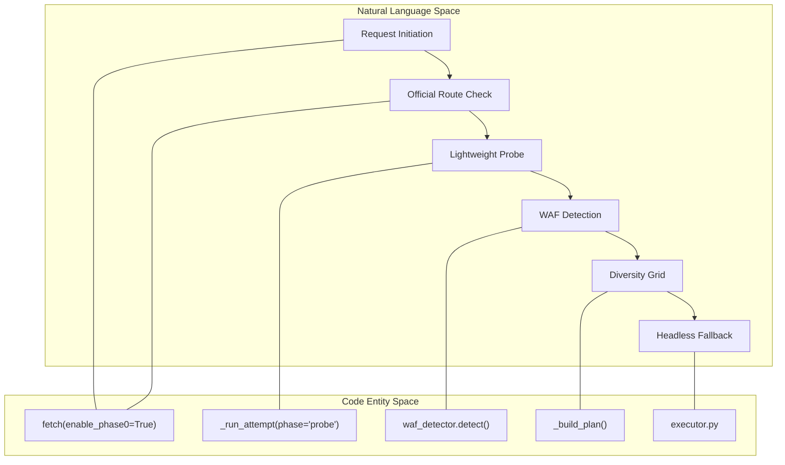
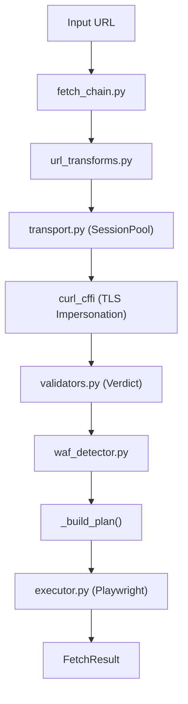

# Core Engine Modules

Relevant source files

The following files were used as context for generating this wiki page:

- [skills/insane-search/engine/__init__.py](skills/insane-search/engine/__init__.py)
- [skills/insane-search/engine/__main__.py](skills/insane-search/engine/__main__.py)
- [skills/insane-search/engine/fetch_chain.py](skills/insane-search/engine/fetch_chain.py)
- [skills/insane-search/engine/templates/.gitignore](skills/insane-search/engine/templates/.gitignore)
- [skills/insane-search/engine/templates/package.json](skills/insane-search/engine/templates/package.json)
- [skills/insane-search/engine/tests/test_smoke.py](skills/insane-search/engine/tests/test_smoke.py)
- [skills/insane-search/engine/url_transforms.py](skills/insane-search/engine/url_transforms.py)

The `insane-search` engine is a Python-based retrieval system located in `skills/insane-search/engine/`. It provides a robust, domain-agnostic fetch pipeline designed to bypass Web Application Firewalls (WAFs) and retrieve clean content for LLM consumption. 

The engine's primary entry point is the `fetch` function in `skills/insane-search/engine/fetch_chain.py` [skills/insane-search/engine/fetch_chain.py:3-7](). It orchestrates a multi-phase escalation process—from lightweight probes to an exhaustive "Diversity Grid" of TLS fingerprints and URL transforms, finally falling back to headless browsers.

### Engine Architecture & Logic Flow

The engine operates on a "No-Site-Name Rule," meaning it contains no hardcoded logic for specific domains (except for Phase 0 official API routing). Instead, it uses generic signals like response size, HTTP status codes, and CSS selectors to determine success or failure [skills/insane-search/engine/__init__.py:1-5]().

#### System-to-Code Mapping: Fetch Lifecycle
The following diagram bridges the high-level fetch phases to the specific Python entities that implement them.

**Diagram: Generic Fetch Lifecycle**

Sources: [skills/insane-search/engine/fetch_chain.py:1-31](), [skills/insane-search/engine/fetch_chain.py:54-62]()

### Public API and CLI

The engine can be used as a Python library or via a CLI.

*   **Python API**: The `fetch` function returns a `FetchResult` dataclass containing the retrieved `content`, the `final_url`, and a detailed `trace` of every attempt made [skills/insane-search/engine/fetch_chain.py:84-117]().
*   **CLI**: `python3 -m engine URL` allows for manual testing with flags for CSS selectors, device pinning, and JSON output [skills/insane-search/engine/__main__.py:4-17]().

### Sub-Module Overview

The engine's complexity is distributed across several specialized modules.

#### [Transport Layer & Session Pool](#3.1)
Managed by `transport.py`, this layer handles the underlying `curl_cffi` connections. It maintains a `POOL` of sessions per host to persist cookies and WAF sensors across attempts [skills/insane-search/engine/fetch_chain.py:130-131]().
For details, see [Transport Layer & Session Pool](#3.1).

#### [TLS Impersonation & URL Transforms](#3.2)
The engine rotates through browser TLS fingerprints (e.g., Chrome, Safari, Firefox) to evade fingerprinting [skills/insane-search/engine/fetch_chain.py:185-192](). Simultaneously, `url_transforms.py` applies domain-agnostic mutations like `mobile_subdomain` (www → m) to find the path of least resistance [skills/insane-search/engine/url_transforms.py:7-16]().
For details, see [TLS Impersonation & URL Transforms](#3.2).

#### [Playwright Executor & Browser Templates](#3.3)
When `curl_cffi` fails, `executor.py` triggers a Phase 3 fallback using Playwright. It utilizes Node.js templates like `playwright_real_chrome.js` to handle sites requiring full JavaScript execution or complex TLS stacks [skills/insane-search/engine/fetch_chain.py:67-67]().
For details, see [Playwright Executor & Browser Templates](#3.3).

#### [Self-Learning Store](#3.4)
Implemented in `learning.py`, this module persists successful "routes" (combinations of transform, TLS impersonation, and referer) to a local JSON store. Future requests to the same host prioritize these learned routes [skills/insane-search/engine/fetch_chain.py:240-250]().
For details, see [Self-Learning Store](#3.4).

#### [Safety & SSRF Guard](#3.5)
`safety.py` provides critical security boundaries, including DNS-rebinding protection and private IP blocking, ensuring the engine cannot be used to probe internal networks [skills/insane-search/engine/fetch_chain.py:34-36]().
For details, see [Safety & SSRF Guard](#3.5).

#### [Bias Check & No-Site-Name Rule](#3.6)
`bias_check.py` acts as a linter to enforce the architectural requirement that the engine remain site-agnostic. It scans for brand substrings and hardcoded URL patterns in the engine code [skills/insane-search/engine/__init__.py:1-5]().
For details, see [Bias Check & No-Site-Name Rule](#3.6).

### Data Flow: From URL to Result

The following diagram illustrates how a URL moves through the engine's internal components.

**Diagram: Engine Data Flow**

Sources: [skills/insane-search/engine/fetch_chain.py:134-172](), [skills/insane-search/engine/url_transforms.py:82-98](), [skills/insane-search/engine/__init__.py:7-11]()
