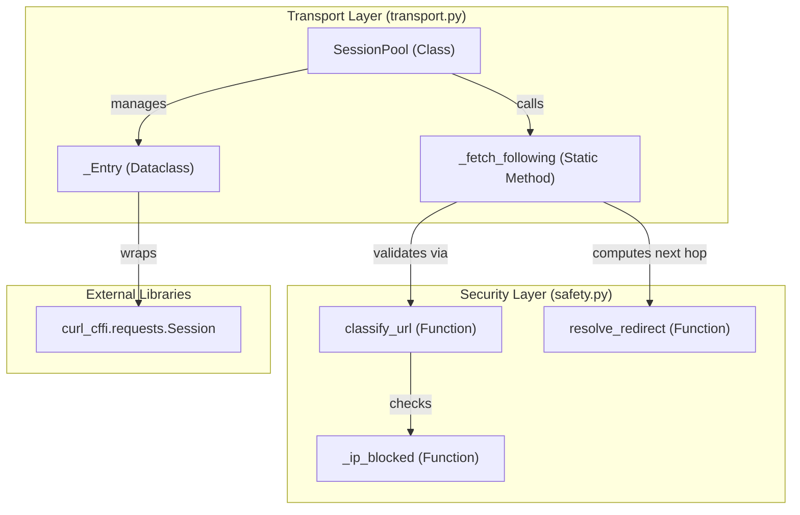
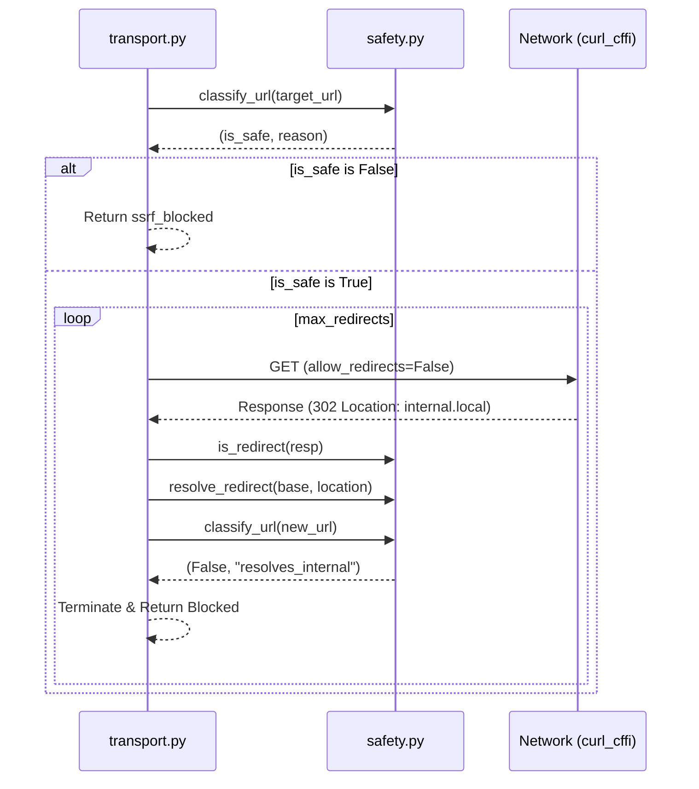

# Transport Layer & Session Pool

Relevant source files

The following files were used as context for generating this wiki page:

- [skills/insane-search/engine/safety.py](skills/insane-search/engine/safety.py)
- [skills/insane-search/engine/transport.py](skills/insane-search/engine/transport.py)

The transport layer in `insane-search` is responsible for managing low-level HTTP communication, ensuring connection and cookie persistence, and enforcing strict security boundaries. It centers around a thread-safe session pooling mechanism that bridges the gap between lightweight TLS-impersonated requests and heavyweight browser fallbacks.

## Overview

The primary goal of the transport layer is to maximize success rates against Web Application Firewalls (WAFs) while maintaining high performance. It achieves this through:
*   **Session Persistence**: Reusing TCP connections and cookies across multiple requests to the same host.
*   **Warmup Requests**: Proactively hitting site roots to mature WAF sensor cookies (e.g., Akamai `_abck`).
*   **Cookie Bridging**: Implementing a "FlareSolverr" pattern where cookies harvested by a headless browser (Phase 3) are injected back into the faster `curl_cffi` sessions.
*   **SSRF Protection**: Manually following redirects to ensure every hop is validated against private IP ranges.

### System Components & Code Entities

The following diagram illustrates how the `SessionPool` manages communication and security.

**Transport Architecture & Security Flow**

Sources: [skills/insane-search/engine/transport.py:43-46](), [skills/insane-search/engine/transport.py:164-168](), [skills/insane-search/engine/safety.py:37-39]()

## Session Pool Management

The `SessionPool` class is a thread-safe container keyed by a combination of `(host, impersonate)`. This ensures that different TLS fingerprints (e.g., `chrome` vs `safari`) do not share the same session state, which could trigger WAF anomalies.

### Key Operations

| Function | Role | Code Reference |
| :--- | :--- | :--- |
| `get()` | Retrieves or creates a `curl_cffi` session for a specific host/impersonation pair. | [skills/insane-search/engine/transport.py:51-71]() |
| `warmup()` | Performs an idempotent request to the site root to initialize session cookies. | [skills/insane-search/engine/transport.py:73-90]() |
| `inject_cookies()` | Seeds a session with cookies and User-Agents harvested from external executors (e.g., Playwright). | [skills/insane-search/engine/transport.py:92-116]() |
| `request()` | The main entry point for fetching a URL with SSRF guards and session reuse. | [skills/insane-search/engine/transport.py:118-125]() |

Sources: [skills/insane-search/engine/transport.py:43-125]()

## The Browser-to-Curl Cookie Bridge

One of the most powerful features of the transport layer is the ability to convert an expensive headless browser pass into cheap HTTP throughput. When a browser fallback successfully solves a JS challenge (like Cloudflare Turnstile), the resulting `cf_clearance` or session cookies are passed to `inject_cookies`.

Subsequent requests using the same `(host, impersonate)` key will use the `_Entry.injected_ua` and the seeded cookie jar, allowing `curl_cffi` to bypass the challenge that previously required a full browser.

Sources: [skills/insane-search/engine/transport.py:9-12](), [skills/insane-search/engine/transport.py:92-116]()

## Manual Redirects & SSRF Guards

`curl_cffi` follows redirects automatically by default, but it does not provide a hook to validate the destination IP of each hop. To prevent Server-Side Request Forgery (SSRF), `insane-search` disables automatic redirects and implements `_fetch_following`.

### Redirect Resolution Logic
1.  The `request()` function calls `safety.classify_url` on the initial target.
2.  If safe, `_fetch_following` executes the request with `allow_redirects=False`.
3.  If the response is a redirect (3xx), the `Location` header is extracted and resolved via `safety.resolve_redirect`.
4.  The new URL is passed back to `safety.classify_url` to check for DNS-rebinding or internal IP targets (e.g., `169.254.169.254`).
5.  The loop continues until a non-3xx response is received or `max_redirects` is reached.

**SSRF Guard Execution Flow**

Sources: [skills/insane-search/engine/safety.py:3-7](), [skills/insane-search/engine/safety.py:37-71](), [skills/insane-search/engine/transport.py:164-172]()

## Security Constraints

The `safety.py` module enforces strict boundaries on what can be fetched:
*   **Allowed Schemes**: Only `http` and `https` are permitted. [skills/insane-search/engine/safety.py:20-20]()
*   **IP Blocking**: The `_ip_blocked` function identifies private, loopback, link-local, reserved, multicast, and unspecified addresses. [skills/insane-search/engine/safety.py:28-34]()
*   **DNS-Rebinding Defense**: For hostnames, `classify_url` resolves all A/AAAA records and blocks the request if *any* resolved IP is internal. [skills/insane-search/engine/safety.py:59-71]()
*   **Environment Override**: Private ranges can be allowed for local development by setting `INSANE_ALLOW_PRIVATE=1`. [skills/insane-search/engine/safety.py:24-25]()

Sources: [skills/insane-search/engine/safety.py:1-71]()
