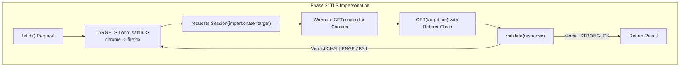
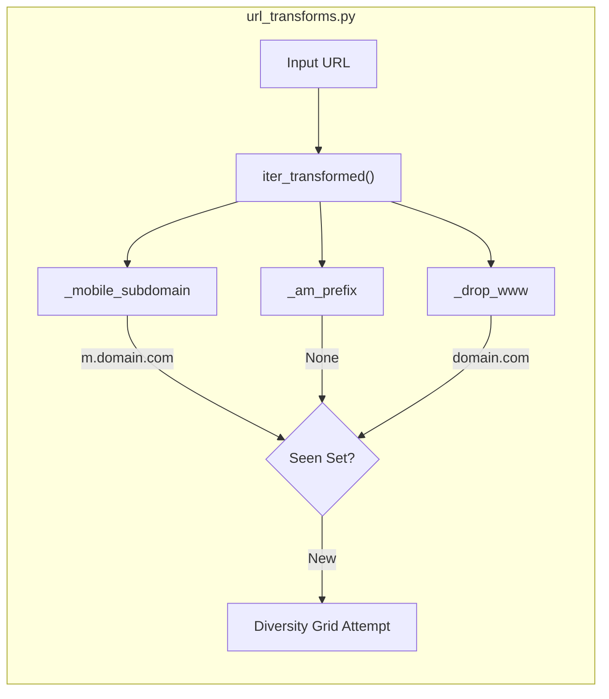

# TLS Impersonation & URL Transforms

Relevant source files

The following files were used as context for generating this wiki page:

- [skills/insane-search/engine/__init__.py](skills/insane-search/engine/__init__.py)
- [skills/insane-search/engine/templates/.gitignore](skills/insane-search/engine/templates/.gitignore)
- [skills/insane-search/engine/templates/package.json](skills/insane-search/engine/templates/package.json)
- [skills/insane-search/engine/tests/test_smoke.py](skills/insane-search/engine/tests/test_smoke.py)
- [skills/insane-search/engine/url_transforms.py](skills/insane-search/engine/url_transforms.py)
- [skills/insane-search/references/fallback.md](skills/insane-search/references/fallback.md)
- [skills/insane-search/references/tls-impersonate.md](skills/insane-search/references/tls-impersonate.md)

This page details how `insane-search` bypasses TLS-fingerprinting-based Web Application Firewalls (WAFs) and leverages domain-agnostic URL mutations to retrieve content. It focuses on the implementation of `curl_cffi` for JA3/JA4 impersonation and the rule-based transformations in `url_transforms.py`.

## TLS Impersonation with curl_cffi

Standard HTTP libraries (like `requests` or standard `curl`) use OpenSSL, which produces a distinct TLS fingerprint (JA3/JA4) that WAFs like Cloudflare, Akamai, and DataDome easily identify as "bot traffic" [skills/insane-search/references/tls-impersonate.md:1-5](). `insane-search` utilizes `curl_cffi` to replicate the exact TLS handshakes of modern browsers [skills/insane-search/references/tls-impersonate.md:31-56]().

### TLS Family Groups & Selection Strategy
The system implements a sequential retry strategy across different browser families. If one "impersonate" target fails, the scheduler rotates to the next [skills/insane-search/references/tls-impersonate.md:15-19]().

| Alias | Implementation (2026 Target) | Primary Use Case |
| :--- | :--- | :--- |
| `safari` | `safari260` | Optimized for Korean sites (e.g., Coupang, FMKorea) [skills/insane-search/references/tls-impersonate.md:64-64]() |
| `chrome` | `chrome146` | General purpose; effective against Cloudflare and Akamai [skills/insane-search/references/tls-impersonate.md:65-65]() |
| `firefox` | `firefox135` | Alternative fallback when Chrome/Safari are blocked [skills/insane-search/references/tls-impersonate.md:66-66]() |
| `chrome_android` | `chrome131_android` | Targeting mobile-specific API endpoints [skills/insane-search/references/tls-impersonate.md:67-67]() |

### Code Flow: TLS Target Rotation
The following diagram illustrates the data flow within a TLS-impersonated fetch attempt.

**Diagram: TLS Rotation & Session Warmup**

Sources: [skills/insane-search/references/tls-impersonate.md:31-56](), [skills/insane-search/references/fallback.md:76-100]()

## URL Transforms

`url_transforms.py` defines domain-agnostic mutation rules. These rules are never site-specific (obeying the No-Site-Name Rule) but target common infrastructure patterns like mobile subdomains or apex-to-www redirects [skills/insane-search/engine/url_transforms.py:1-16]().

### Core Transform Rules
The `TRANSFORMS` dictionary maps rule names to transformation functions [skills/insane-search/engine/url_transforms.py:66-71]().

1.  **`mobile_subdomain`**: Converts `www.example.com` to `m.example.com`. This is highly effective for Server-Side Rendered (SSR) sites that serve lighter, less protected content to mobile users [skills/insane-search/engine/url_transforms.py:32-41]().
2.  **`am_prefix`**: Converts apex domains (e.g., `example.com`) to `m.example.com` if no other subdomain exists [skills/insane-search/engine/url_transforms.py:44-56]().
3.  **`drop_www`**: Removes the `www.` prefix to test if the apex domain has weaker WAF gating [skills/insane-search/engine/url_transforms.py:58-63]().

### Implementation Logic
The `iter_transformed` function handles the execution of these rules, ensuring that duplicate URLs (e.g., if `original` and `drop_www` result in the same string) are not processed twice [skills/insane-search/engine/url_transforms.py:82-98]().

**Diagram: URL Mutation Pipeline**

Sources: [skills/insane-search/engine/url_transforms.py:32-98](), [skills/insane-search/engine/tests/test_smoke.py:82-93]()

## Referer Strategies & Identity Mimicry

To further impersonate legitimate user behavior, `insane-search` implements referer chaining and identity mimicry [skills/insane-search/references/tls-impersonate.md:31-46]().

1.  **Origin Warmup**: Before hitting the target deep-link, the session often performs a `GET` on the domain's homepage (origin) to acquire session cookies and establish a "history" [skills/insane-search/references/tls-impersonate.md:41-45]().
2.  **Referer Chain**: Initial requests often use `https://www.google.com/` as the referer. Subsequent requests within the same session update the referer to the site's own origin to mimic internal navigation [skills/insane-search/references/tls-impersonate.md:31-46]().
3.  **Locale Injection**: The `Accept-Language` header is dynamically generated based on the target locale (e.g., `ko-KR` for Korean sites) to match the expected profile of a local user [skills/insane-search/references/tls-impersonate.md:39-39]().

## Integration with the Diversity Grid

The TLS impersonation and URL transforms are orchestrated by the `fetch_chain.py` diversity grid. The grid treats each combination of (Transform × TLS Target × Referer) as a unique attempt in the escalation pipeline [skills/insane-search/references/fallback.md:4-11]().

| Signal | Detection Method | Escalation Action |
| :--- | :--- | :--- |
| **HTTP 403/430** | Status Code | Trigger Phase 2 (TLS Impersonation) [skills/insane-search/references/fallback.md:54-54]() |
| **WAF Headers** | `cf-ray`, `x-datadome` | Select specific TLS target (e.g., Chrome for CF) [skills/insane-search/references/fallback.md:56-56]() |
| **JS Challenge** | `sec-if-cpt-container` | Skip TLS rotation, go to Phase 3 (Playwright) [skills/insane-search/references/tls-impersonate.md:49-50]() |

### Advanced: Cookie Bridging
When a JS challenge is encountered, the system can use a headless browser (Phase 3) to solve the challenge, then export the `cf_clearance` or `_abck` cookies back into a `curl_cffi` session for high-speed subsequent requests [skills/insane-search/references/tls-impersonate.md:110-128]().

Sources: [skills/insane-search/references/fallback.md:48-62](), [skills/insane-search/references/tls-impersonate.md:110-128]()
