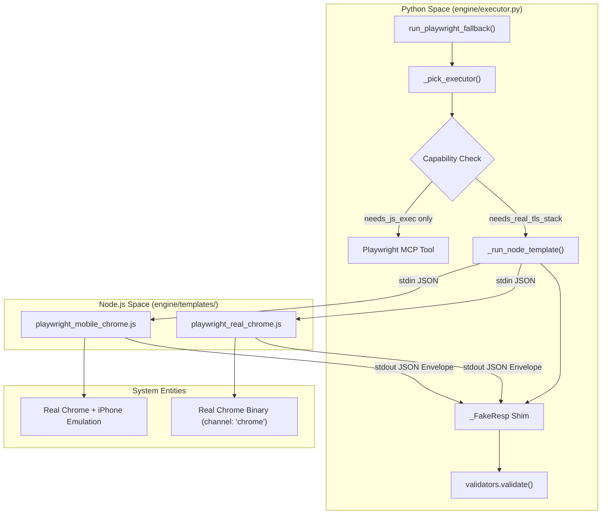
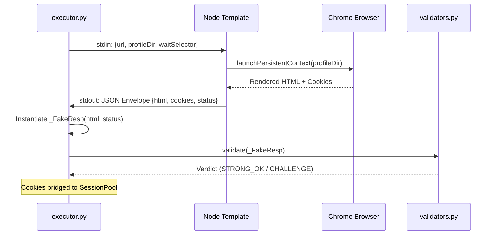

# Playwright Executor & Browser Templates

Relevant source files

The following files were used as context for generating this wiki page:

- [skills/insane-search/engine/executor.py](skills/insane-search/engine/executor.py)
- [skills/insane-search/engine/templates/playwright_mobile_chrome.js](skills/insane-search/engine/templates/playwright_mobile_chrome.js)
- [skills/insane-search/engine/templates/playwright_real_chrome.js](skills/insane-search/engine/templates/playwright_real_chrome.js)
- [skills/insane-search/references/playwright.md](skills/insane-search/references/playwright.md)

The Playwright Executor module provides a high-fidelity fallback mechanism for when lightweight `curl_cffi` probes fail to bypass sophisticated Web Application Firewalls (WAFs) or when a site requires heavy JavaScript execution for rendering. It selects the appropriate browser environment based on a site's detected WAF profile and bridges the resulting data (HTML and cookies) back into the primary Python session pool.

## Overview of Execution Flow

When the `fetch_chain` determines that a target requires more than TLS impersonation, it invokes `executor.py` [skills/insane-search/engine/executor.py:123-132](). The system evaluates the `capabilities_needed` defined in the WAF profile to choose between two primary approaches:

1.  **Playwright MCP**: A lightweight, Claude-integrated tool for standard JS rendering [skills/insane-search/references/playwright.md:15-16]().
2.  **Local Node + Real Chrome**: A specialized local execution environment using a system-installed Chrome binary to bypass advanced TLS-fingerprinting WAFs like Akamai [skills/insane-search/references/playwright.md:51-52]().

### Capability Matching Logic

The function `_pick_executor` determines the tool based on tags [skills/insane-search/engine/executor.py:65-75]():

| Capability Tags | Selected Executor | Logic Path |
| :--- | :--- | :--- |
| `needs_real_tls_stack` + `needs_js_exec` | `playwright_real_chrome` | Akamai, DataDome, PerimeterX |
| `needs_js_exec` only | `playwright_mcp` | Cloudflare Turnstile, SPA Rendering |
| `needs_mobile_context` | `playwright_mobile_chrome` | Mobile-only subdomains |

**Sources:** [skills/insane-search/engine/executor.py:65-75](), [skills/insane-search/references/playwright.md:112-121]()

## Code Entity Map: Executor Routing

The following diagram illustrates how the Python engine interacts with the Node.js templates and the decision tree for executor selection.

**Diagram: Executor Selection & Data Flow**

**Sources:** [skills/insane-search/engine/executor.py:65-101](), [skills/insane-search/engine/executor.py:144-180](), [skills/insane-search/engine/templates/playwright_real_chrome.js:88-101]()

## Node.js Templates & Stealth Strategies

The system uses two primary JavaScript templates located in `engine/templates/`. These templates follow a strict "No-Site-Name Rule," meaning they contain no site-specific logic and only branch based on parameters passed via `stdin` [skills/insane-search/engine/templates/playwright_real_chrome.js:10-12]().

### 1. playwright_real_chrome.js
This template is designed to bypass bot managers that detect the BoringSSL fingerprint of bundled Chromium.
*   **Channel**: Uses `channel: 'chrome'` to launch the system-installed Google Chrome [skills/insane-search/engine/templates/playwright_real_chrome.js:94]().
*   **Warmup Hop**: It visits the site root (`/`) before the deep URL to allow Akamai-style sensors to set session cookies [skills/insane-search/engine/templates/playwright_real_chrome.js:112-118]().
*   **Retry Logic**: If a `waitSelector` is provided and fails, it performs a "hard reload" to catch the page after a challenge has been solved [skills/insane-search/engine/templates/playwright_real_chrome.js:131-135]().
*   **Automation Stack**: Prefers `patchright` (a stealth-hardened Playwright fork) if available, otherwise falls back to `playwright-extra` with the `stealth` plugin [skills/insane-search/engine/templates/playwright_real_chrome.js:67-86]().

### 2. playwright_mobile_chrome.js
Inherits the real Chrome stack but injects device descriptors (UA, viewport, touch support) using `playwright.devices['iPhone 13 Pro']` [skills/insane-search/engine/templates/playwright_mobile_chrome.js:73-85](). This is used when a WAF is more lenient toward mobile signatures or when the content is only available on mobile subdomains.

**Sources:** [skills/insane-search/engine/templates/playwright_real_chrome.js:1-165](), [skills/insane-search/engine/templates/playwright_mobile_chrome.js:1-112]()

## Profile Directory Isolation

To prevent cookie leakage and profile-lock collisions during concurrent fetches, the executor manages isolated profile directories [skills/insane-search/engine/executor.py:184-189]().

The function `_profile_dir_for(url, choice)` generates a path based on:
1.  **Host Hash**: A SHA-1 hash of the hostname (preserving the No-Site-Name Rule) [skills/insane-search/engine/executor.py:44-47]().
2.  **Device Class**: Separate subdirectories for `desktop` and `mobile` to ensure emulation states do not bleed [skills/insane-search/engine/executor.py:48-49]().

**Sources:** [skills/insane-search/engine/executor.py:37-50]()

## Response Bridging & Cookie Sync

Since the browser runs in a separate process, the results must be bridged back to the Python `SessionPool`.

### The JSON Envelope
The Node templates wrap the results in a structured JSON envelope containing [skills/insane-search/engine/templates/playwright_real_chrome.js:30-40]():
*   `html`: The full rendered page source.
*   `finalUrl`: The URL after all redirects.
*   `status`: The HTTP status code.
*   `cookies`: An array of cookie objects (name, value, domain).
*   `userAgent`: The specific UA used by the browser.

### _FakeResp Shim
In Python, the `_FakeResp` class [skills/insane-search/engine/executor.py:103-111]() mimics a `requests` or `curl_cffi` response object. This allows the standard `validators.validate()` function to process Playwright results without modification [skills/insane-search/engine/executor.py:207-211]().

**Diagram: Browser-to-Session Bridge**

**Sources:** [skills/insane-search/engine/executor.py:103-112](), [skills/insane-search/engine/executor.py:197-211](), [skills/insane-search/engine/templates/playwright_real_chrome.js:30-40]()

## Key Functions Reference

| Function | File | Description |
| :--- | :--- | :--- |
| `run_playwright_fallback` | [skills/insane-search/engine/executor.py:123]() | Main entry point for browser-based retrieval. |
| `_pick_executor` | [skills/insane-search/engine/executor.py:65]() | Maps capability tags to JS templates. |
| `_run_node_template` | [skills/insane-search/engine/executor.py:78]() | Handles subprocess execution and JSON communication. |
| `_profile_dir_for` | [skills/insane-search/engine/executor.py:37]() | Generates hashed, isolated paths for Chrome profiles. |
| `buildEnvelope` | [skills/insane-search/engine/templates/playwright_real_chrome.js:30]() | Serializes browser state for the Python parent. |

**Sources:** [skills/insane-search/engine/executor.py:1-211](), [skills/insane-search/engine/templates/playwright_real_chrome.js:1-165]()
