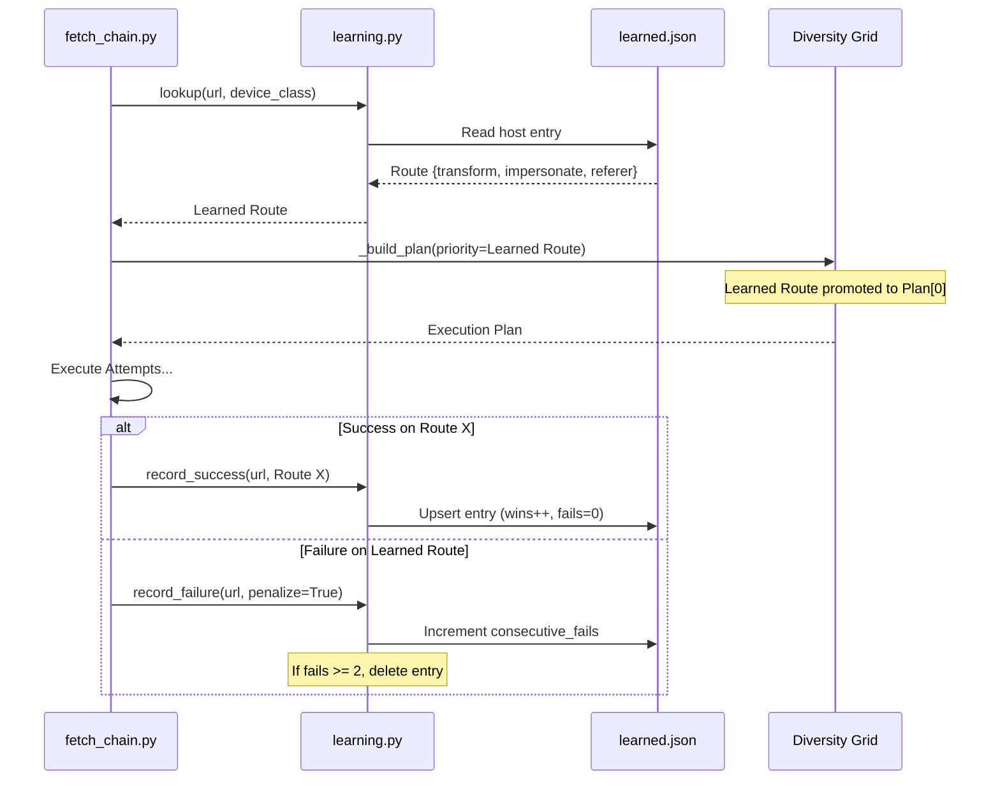
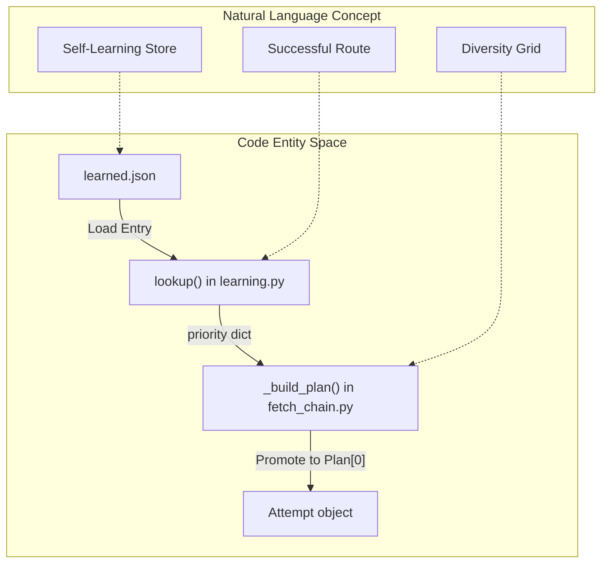

# Self-Learning Store

Relevant source files

The following files were used as context for generating this wiki page:

- [skills/insane-search/engine/learning.py](skills/insane-search/engine/learning.py)
- [skills/insane-search/engine/tests/test_u5.py](skills/insane-search/engine/tests/test_u5.py)

The Self-Learning Store is a lightweight persistence layer that optimizes the fetch process by remembering which specific combination of request parameters successfully bypassed a host's defenses. By caching successful "routes," the system can skip the trial-and-error phase of the [Diversity Grid](2.2.-the-fetch-chain-&-diversity-grid) on subsequent visits to the same host.

## Overview

The store is implemented in `learning.py` and maintains a JSON file (typically `~/.insane_search/learned.json`) [skills/insane-search/engine/learning.py:44-48](). It maps hostnames to a specific **Route Schema** consisting of:
*   **URL Transform**: The mutation applied to the URL (e.g., `mobile_subdomain`).
*   **Impersonation**: The TLS/JA3 fingerprint used (e.g., `chrome`).
*   **Referer Strategy**: The header strategy used (e.g., `self_root`).
*   **Phase**: The escalation level where success occurred (usually `grid`).

### Data Flow: The Learning Loop

The following diagram illustrates how a successful fetch informs future requests to the same host.

**Route Learning and Promotion Flow**

Sources: [skills/insane-search/engine/learning.py:122-176](), [skills/insane-search/engine/fetch_chain.py:134-142]() (inferred from test logic).

## Route Schema & Storage

The store uses a composite key of `host::device_class` (e.g., `example.com::desktop`) to ensure that mobile and desktop routes are learned independently [skills/insane-search/engine/learning.py:56-59]().

### Entry Structure
A typical entry in `learned.json` contains:
| Field | Description |
| :--- | :--- |
| `route` | Dictionary containing `transform`, `impersonate`, `referer`, and `phase`. |
| `wins` | Total number of times this specific route has succeeded. |
| `consecutive_fails` | Counter for real blockages used for eviction. |
| `last_used` | ISO timestamp of the last attempt (successful or not). |
| `last_success` | ISO timestamp of the last successful fetch. |

Sources: [skills/insane-search/engine/learning.py:144-150]()

## Strike-Based Eviction Policy

The store employs a "two-strike" policy to handle environment changes (e.g., a site updates its WAF configuration). 

### Failure Classification
Not all failures result in a penalty. The system distinguishes between route failures and transient/URL failures:
*   **Real Failures (Penalize)**: Outcomes like `exhausted`, `challenge`, or `blocked` suggest the route is no longer effective [skills/insane-search/engine/learning.py:37-38]().
*   **Transient/URL Failures (No Penalty)**: Outcomes like `429 (Rate Limit)`, `404 (Not Found)`, or `network_error` do not strike the route, as they are likely not caused by the request headers or TLS fingerprint [skills/insane-search/engine/learning.py:11-12](), [skills/insane-search/engine/learning.py:51-54]().

### Eviction Logic
1.  **Strike**: If a learned route results in a "Real Failure," `consecutive_fails` is incremented [skills/insane-search/engine/learning.py:169]().
2.  **Evict**: Once `consecutive_fails >= 2` (defined by `EVICT_AFTER_FAILS`), the entry is deleted from the store [skills/insane-search/engine/learning.py:32](), [skills/insane-search/engine/learning.py:171-172]().
3.  **Reset**: Any successful fetch using that route resets `consecutive_fails` to `0` [skills/insane-search/engine/learning.py:147]().

Sources: [skills/insane-search/engine/learning.py:8-16](), [skills/insane-search/engine/learning.py:32-38]()

## Pruning & Maintenance

To prevent the store from growing indefinitely, `learning.py` performs maintenance during the `load()` operation:

*   **TTL (Time-To-Live)**: Entries unused for more than 30 days (default) are pruned [skills/insane-search/engine/learning.py:30](), [skills/insane-search/engine/learning.py:77-82]().
*   **LRU (Least Recently Used) Cap**: The store is limited to 500 entries (default). If the limit is exceeded, the oldest entries based on `last_used` are dropped [skills/insane-search/engine/learning.py:31](), [skills/insane-search/engine/learning.py:83-90]().

Maintenance is "best-effort" and occurs in-memory during `load()`, with the results persisted during the next `save()` call to avoid unnecessary disk I/O [skills/insane-search/engine/learning.py:97-98]().

Sources: [skills/insane-search/engine/learning.py:74-91]()

## Grid Promotion via `_build_plan`

The `_build_plan` function in the fetch chain is responsible for integrating learned data into the execution strategy.

**Promotion Logic in Code Entities**

When `_build_plan` receives a `priority` route (retrieved via `lookup`), it:
1.  Generates the standard exhaustive grid of candidates.
2.  Identifies the candidate that matches the learned `transform`, `impersonate`, and `referer`.
3.  Moves that candidate to the front of the list (`plan[0]`) [skills/insane-search/engine/tests/test_u5.py:132-142]().
4.  Ensures no candidates are lost during reordering, maintaining the fallback safety of the full grid.

Sources: [skills/insane-search/engine/tests/test_u5.py:132-142](), [skills/insane-search/engine/learning.py:3-5]()
