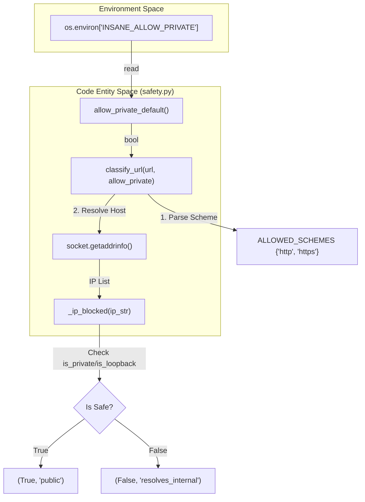
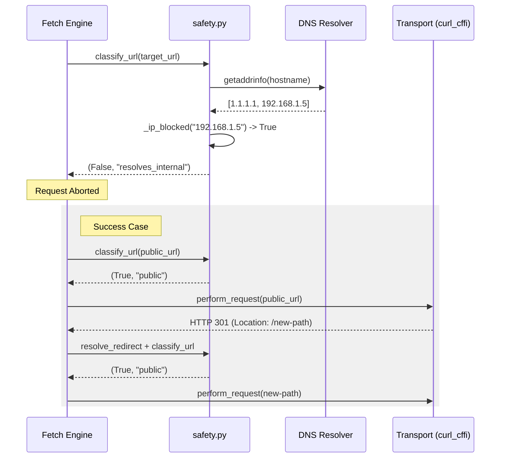

# Safety & SSRF Guard

Relevant source files

The following files were used as context for generating this wiki page:

- [skills/insane-search/engine/safety.py](skills/insane-search/engine/safety.py)

The `safety.py` module provides a deterministic security layer designed to prevent **Server-Side Request Forgery (SSRF)**. Because the `insane-search` engine fetches URLs influenced by external agents and follows redirects, it is vulnerable to hostile pages that might redirect a request to internal infrastructure (e.g., loopback, RFC-1918 private networks, or cloud metadata endpoints like `169.254.169.254`).

Since the underlying transport library (`curl_cffi`) does not provide built-in validation for redirect destinations against private IP ranges, `safety.py` implements a manual validation gate that must be passed before any request is dispatched or a redirect is followed.

## Implementation Overview

The safety system operates on a "default-deny" principle for internal targets. It validates both the initial URL and every subsequent hop in a redirect chain by resolving hostnames to IP addresses and checking them against a blocklist of non-public ranges.

### URL Classification Flow

The core logic resides in `classify_url`, which performs a multi-step validation:

1.  **Scheme Whitelisting**: Only `http` and `https` are permitted [skills/insane-search/engine/safety.py:20-20]().
2.  **IP Literal Check**: If the host is an IP address, it is checked immediately against the `_ip_blocked` filter [skills/insane-search/engine/safety.py:53-55]().
3.  **DNS-Rebinding Defense**: For hostnames, the system performs a DNS resolution using `socket.getaddrinfo`. It extracts all associated IP addresses (A/AAAA records) and blocks the request if *any* resolved IP falls into a restricted range [skills/insane-search/engine/safety.py:60-70]().

### DNS Resolution & IP Blocking Logic

The `_ip_blocked` function utilizes the standard `ipaddress` library to identify restricted ranges.

| Category | Description | Implementation |
| :--- | :--- | :--- |
| **Private** | RFC-1918 (10.0.0.0/8, 172.16.0.0/12, 192.168.0.0/16) | `ip.is_private` |
| **Loopback** | 127.0.0.1/8, ::1 | `ip.is_loopback` |
| **Link-Local** | 169.254.0.0/16 (Cloud Metadata) | `ip.is_link_local` |
| **Reserved** | IETF reserved ranges | `ip.is_reserved` |
| **Multicast** | 224.0.0.0/4 | `ip.is_multicast` |

Sources: [skills/insane-search/engine/safety.py:28-34]()

## Code Entity Map: Safety Validation

The following diagram illustrates how the safety functions interact with the network and environment variables to classify a target URL.

**Safety Classification Logic**

Sources: [skills/insane-search/engine/safety.py:20-71]()

## Manual Redirect Validation

Because the engine must intercept redirects to validate the next hop, it uses helper functions to inspect response objects before the transport layer proceeds.

*   **`is_redirect(resp)`**: Identifies HTTP status codes 301, 302, 303, 307, and 308 [skills/insane-search/engine/safety.py:83-87]().
*   **`location_of(resp)`**: Safely extracts the `Location` header in a case-insensitive manner [skills/insane-search/engine/safety.py:74-80]().
*   **`resolve_redirect(base_url, location)`**: Combines the base URL with the redirect location (handling relative paths) to produce the absolute destination for the next safety check [skills/insane-search/engine/safety.py:90-91]().

## Security Configuration

### Environment Overrides
While the system defaults to strict public-only access, developers can enable private network access for local testing or internal scraping tasks.

*   **Variable**: `INSANE_ALLOW_PRIVATE`
*   **Accepted Values**: `1`, `true`, `yes`
*   **Effect**: When enabled, `classify_url` returns `(True, "allow_private")` regardless of the host's IP address [skills/insane-search/engine/safety.py:24-25](), [skills/insane-search/engine/safety.py:49-50]().

### Data Flow: Request Guarding
This diagram shows how the safety module acts as a gatekeeper for the fetch engine.

**Request Guarding Data Flow**

Sources: [skills/insane-search/engine/safety.py:37-71](), [skills/insane-search/engine/safety.py:90-91]()
