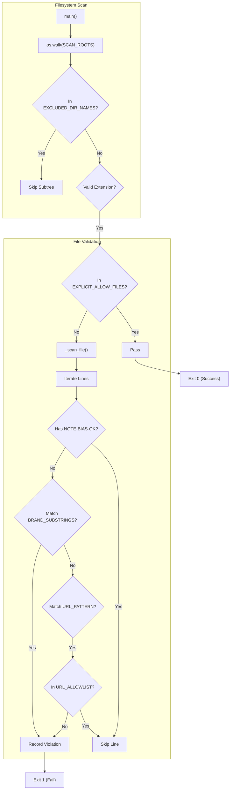

# Bias Check & No-Site-Name Rule

<details>
<summary>Relevant source files</summary>

The following files were used as context for generating this wiki page:

- [skills/insane-search/engine/bias_check.py](skills/insane-search/engine/bias_check.py)

</details>


The **No-Site-Name Rule** is a core architectural principle of `insane-search` designed to ensure the retrieval engine remains a generic, domain-agnostic utility. It prevents the "Fetch Chain" from being biased toward specific platforms (e.g., hardcoding special headers just for one retailer) and ensures that all site-specific logic is isolated in **Phase 0** or documented in **References**.

The `bias_check.py` script acts as a CI linter to enforce this rule by scanning the codebase for hardcoded brand names, domains, and URLs.

### Purpose and Scope
The linter serves three primary functions:
1.  **Neutrality Enforcement**: Ensures `engine/` logic (transformations, sessions, scheduling) works identically for all targets [skills/insane-search/engine/bias_check.py:4-5]().
2.  **Architectural Guardrail**: Forces developers to place site-specific "hacks" in `phase0.py` or use the generic WAF profile system instead of `if "site.com" in url:` blocks.
3.  **CI Validation**: Blocks pull requests that introduce site-specific bias into the generic fetch grid [skills/insane-search/engine/bias_check.py:7-9]().

---

### Logic Flow & Implementation

The `bias_check.py` script traverses the directory tree and applies a multi-stage filtering process to identify violations. It uses a combination of substring matching, regex pattern extraction, and an allowlist of "neutral" infrastructure hosts.

#### Data Flow Diagram: Linter Execution
The following diagram illustrates how a file is processed from the filesystem through the various check layers.

**Linter Logic Flow**

**Sources:** [skills/insane-search/engine/bias_check.py:98-134](), [skills/insane-search/engine/bias_check.py:154-164]()

---

### Detection Mechanisms

#### 1. Brand Substring Denylist
The script maintains a list of known brand and domain substrings that are strictly prohibited within the `engine/` directory. This includes major retailers, social media platforms, and portal sites.

| Category | Prohibited Substrings (Examples) |
| :--- | :--- |
| **Retailers** | `coupang`, `11st`, `musinsa`, `kurly`, `ohou` |
| **Communities** | `fmkorea`, `dcinside`, `daangn` |
| **Portals** | `naver.com`, `daum.net`, `kakao.com` |

**Sources:** [skills/insane-search/engine/bias_check.py:25-34]()

#### 2. URL Pattern Scanning
To catch domains not explicitly listed in the denylist, the script uses a regular expression `URL_PATTERN` to extract hostnames [skills/insane-search/engine/bias_check.py:38-41]().

*   **Pattern**: `https?://[\w\.-]+|[\w-]+\.(?:com|net|org|co\.kr|kr|io)\b`
*   **Neutral Allowlist**: Domains required for technical infrastructure or documentation are exempted. Examples include `google.com` (used as a neutral Referer), `playwright.dev`, `curl.se`, and `httpbin.org` [skills/insane-search/engine/bias_check.py:48-57]().

---

### Exemptions and Overrides

The No-Site-Name Rule allows for specific, documented exceptions where site names are necessary for functionality or explanation.

#### EXPLICIT_ALLOW_FILES (The Phase 0 Exception)
`phase0.py` is the **only** file in the engine directory allowed to contain site names. It serves as the official router for platform-specific public endpoints (e.g., Reddit RSS, YouTube metadata) [skills/insane-search/engine/bias_check.py:82-90]().

#### NOTE-BIAS-OK Comment Markers
Developers can bypass the linter for a specific line by adding a comment marker. This is typically used for explanatory comments or legitimate examples in code [skills/insane-search/engine/bias_check.py:73-79]().

| Language | Marker |
| :--- | :--- |
| **Python** | `# NOTE-BIAS-OK` |
| **JavaScript** | `// NOTE-BIAS-OK` |
| **Markdown** | `<!-- NOTE-BIAS-OK -->` |

**Sources:** [skills/insane-search/engine/bias_check.py:93-95](), [skills/insane-search/engine/bias_check.py:112-113]()

---

### CLI Usage and CI Integration

The `bias_check.py` script is designed to run in a CI environment (e.g., GitHub Actions) or as a pre-commit hook.

#### Strict Mode
By default, the linter only scans the `engine/` directory. Using the `--strict` flag expands the scan to include the `references/` directory [skills/insane-search/engine/bias_check.py:10-11](). This is generally used for deep audits, as references naturally contain many site names [skills/insane-search/engine/bias_check.py:61]().

#### Command Examples
| Command | Description |
| :--- | :--- |
| `python3 engine/bias_check.py` | Standard check (Engine only). |
| `python3 engine/bias_check.py --strict` | Full check (Engine + References). |
| `python3 engine/bias_check.py --root .` | Specify custom skill root. |

**Sources:** [skills/insane-search/engine/bias_check.py:138-146]()

---

### System Entity Mapping
The following diagram maps the logical "Bias Rules" to the specific code entities in `bias_check.py`.

**Code Entity Mapping**
```mermaid
classDiagram
    class BiasCheckLinter {
        +BRAND_SUBSTRINGS: list
        +URL_PATTERN: Pattern
        +URL_ALLOWLIST: set
        +EXPLICIT_ALLOW_FILES: set
        +main(argv)
        +_scan_file(path, root)
        +_line_is_exempt(line, ext)
    }

    class FileSystem {
        +SCAN_ROOTS_STRICT_OFF: list
        +EXCLUDED_DIR_NAMES: set
    }

    BiasCheckLinter ..> FileSystem : "Walks roots"
    BiasCheckLinter --> "phase0.py" : "Exempts via EXPLICIT_ALLOW_FILES"
    BiasCheckLinter --> "COMMENT_OK_MARKERS" : "Checks for # NOTE-BIAS-OK"
```
**Sources:** [skills/insane-search/engine/bias_check.py:25-90](), [skills/insane-search/engine/bias_check.py:137-164]()
