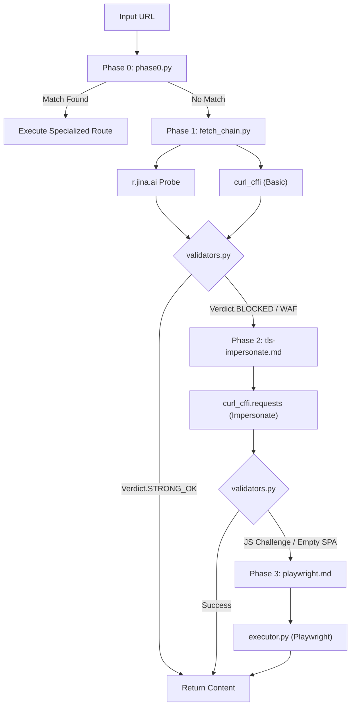
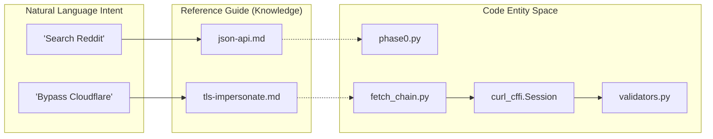

# Reference Guides

Relevant source files

The following files were used as context for generating this wiki page:

- [PLATFORMS.md](PLATFORMS.md)
- [assets/hero.png](assets/hero.png)
- [assets/pipeline.png](assets/pipeline.png)
- [skills/insane-search/references/fallback.md](skills/insane-search/references/fallback.md)
- [skills/insane-search/references/tls-impersonate.md](skills/insane-search/references/tls-impersonate.md)

The `skills/insane-search/references/` directory serves as the knowledge base for the engine. It contains technique-specific documentation that the system uses to determine the optimal retrieval path for different platforms and content types. These guides define the transition from generic web fetching to specialized API and browser-based extraction.

## The Adaptive Escalation Pipeline

The core logic of `insane-search` follows a four-phase escalation model. The system evaluates the response at each stage and decides whether to terminate with success or escalate to a more complex (and costly) method.

### Phase Overview
| Phase | Technique | Trigger |
|-------|-----------|---------|
| **Phase 0** | **Special Endpoints** | Matches known high-efficiency routes (RSS, JSON APIs, yt-dlp). |
| **Phase 1** | **Lightweight Probes** | Default for unknown sites; uses Jina Reader or basic `curl`. |
| **Phase 2** | **TLS Impersonation** | Triggered by WAF detection (403, 429, or WAF-specific headers/cookies). |
| **Phase 3** | **Playwright MCP** | Final fallback for JS-heavy challenges, CAPTCHAs, or SPA shells. |

For a detailed walkthrough of the escalation logic and response validation markers, see **[JSON APIs & RSS Feeds](#4.1)** and the engine's fallback logic in [skills/insane-search/references/fallback.md:1-160]().

### Escalation Workflow
The following diagram illustrates how the system navigates from a URL request to a validated response using code-level entities.

**Diagram: Pipeline Escalation Logic**

Sources: [skills/insane-search/references/fallback.md:15-121](), [skills/insane-search/references/tls-impersonate.md:1-56]()

---

## 4.1 JSON APIs & RSS Feeds
This guide covers high-efficiency, low-bandwidth retrieval patterns. It documents how to bypass front-end limitations by accessing direct data streams like Reddit's `.rss` feeds, Hacker News' Firebase API, and various developer platform APIs (npm, PyPI, dev.to).
*   **Key Patterns**: URL mutations (appending `.json` or `/rss`), OAuth-less public endpoints, and rate-limit jitter strategies.
*   **Details**: See [JSON APIs & RSS Feeds](#4.1) (Reference: [skills/insane-search/references/json-api.md](), [skills/insane-search/references/rss.md]()).

## 4.2 Public APIs (Bluesky, Mastodon, Stack Overflow, etc.)
Focuses on platforms with stable, documented REST or Atom APIs that do not require authentication for public data. This includes the AT Protocol for Bluesky, the Stack Exchange API v2.3, and academic sources like arXiv and CrossRef.
*   **Key Patterns**: Per-instance API discovery for Mastodon and `gh` CLI integration for GitHub.
*   **Details**: See [Public APIs (Bluesky, Mastodon, Stack Overflow, arXiv, GitHub)](#4.2) (Reference: [skills/insane-search/references/public-api.md]()).

## 4.3 Media Extraction (yt-dlp)
Documents the integration of `yt-dlp` as a Phase 0 tool. It allows the engine to treat video and audio platforms (YouTube, TikTok, SoundCloud) as structured data sources by extracting metadata and subtitles without rendering the page.
*   **Key Patterns**: Using `--dump-json` for metadata and `--write-auto-subs` for content retrieval.
*   **Details**: See [Media Extraction (yt-dlp)](#4.3) (Reference: [skills/insane-search/references/media.md]()).

## 4.4 Jina Reader Integration
Explains the role of `r.jina.ai` as a primary Phase 1 probe. It serves as a zero-config HTML-to-markdown converter and provides a crucial "lightweight" view of a site before the engine attempts complex TLS impersonation.
*   **Key Patterns**: Using Jina for RSS auto-discovery and SPA content extraction.
*   **Details**: See [Jina Reader Integration](#4.4) (Reference: [skills/insane-search/references/jina.md]()).

## 4.5 Cache & Archive Fallbacks
Covers the "Sidecar" strategy. When an origin server is unreachable or strictly blocked, the engine concurrently checks Google AMP Cache, archive.today, and the Wayback Machine.
*   **Key Patterns**: Provenance tagging requirements to ensure the user knows the data is from a cached source.
*   **Details**: See [Cache & Archive Fallbacks](#4.5) (Reference: [skills/insane-search/references/cache-archive.md]()).

## 4.6 Metadata Extraction (OGP & JSON-LD)
Details the last-resort data recovery methods. If a full body cannot be retrieved, the engine uses `metadata.md` patterns to scrape Open Graph Protocol (OGP) tags and JSON-LD structured data to provide at least a summary, price, or title.
*   **Key Patterns**: Recovery of `articleBody` from JSON-LD and product schemas from e-commerce sites.
*   **Details**: See [Metadata Extraction (OGP & JSON-LD)](#4.6) (Reference: [skills/insane-search/references/metadata.md]()).

---

## Technical Mapping: Natural Language to Code Entities

The following table and diagram bridge user-facing concepts to the specific code implementation files and classes.

| Concept | Code Entity | Implementation File |
|:---|:---|:---|
| **TLS Fingerprinting** | `curl_cffi` | [skills/insane-search/references/tls-impersonate.md:1-5]() |
| **WAF Detection** | `WafDetector` | [skills/insane-search/engine/waf_detector.py]() |
| **Grid Scheduling** | `_build_plan` | [skills/insane-search/engine/fetch_chain.py]() |
| **Browser Execution** | `PlaywrightExecutor` | [skills/insane-search/engine/executor.py]() |
| **Site-Specific Rules** | `Phase0Router` | [skills/insane-search/engine/phase0.py]() |

**Diagram: Entity Relationship Map**

Sources: [PLATFORMS.md:11-40](), [skills/insane-search/references/fallback.md:15-106]()
