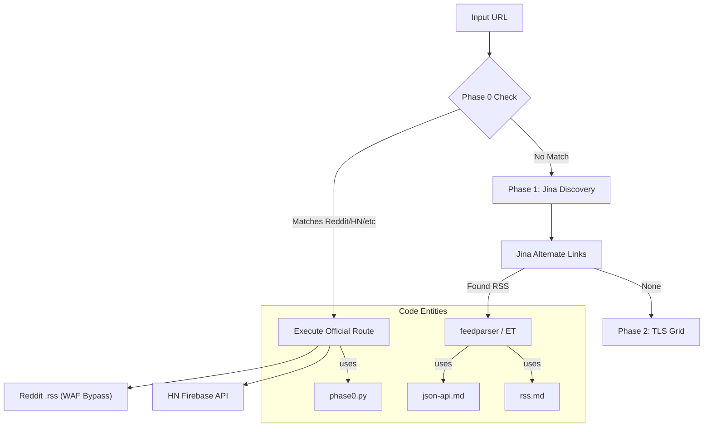
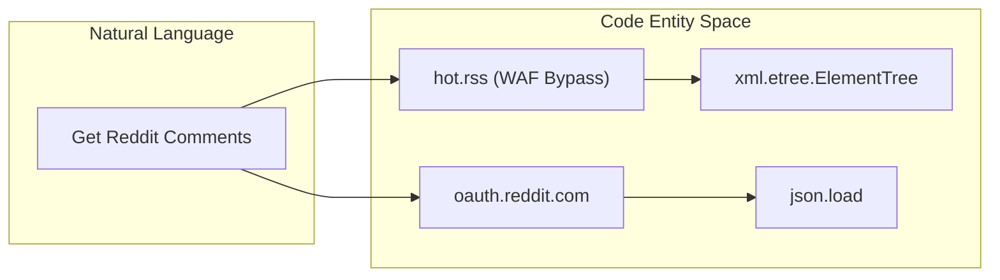

# JSON APIs & RSS Feeds

Relevant source files

The following files were used as context for generating this wiki page:

- [skills/insane-search/references/json-api.md](skills/insane-search/references/json-api.md)
- [skills/insane-search/references/rss.md](skills/insane-search/references/rss.md)

This page serves as a technical reference for direct structured data retrieval via public JSON APIs and RSS/Atom syndication feeds. These methods are prioritized in **Phase 0** of the escalation pipeline because they bypass heavy HTML scraping, provide cleaner data, and often have higher rate limits than standard web pages.

## Architectural Role: Structured Data vs. HTML

The `insane-search` engine prioritizes structured endpoints to minimize processing overhead and maximize data reliability. 

| Method | Phase | Advantage | Disadvantage |
| :--- | :--- | :--- | :--- |
| **JSON API** | 0 | Highest precision, includes metadata (votes, IDs). | Often requires specific URL transforms. |
| **RSS/Atom** | 0 | High WAF immunity, standard schema. | Limited metadata (usually lacks comments/votes). |
| **Jina Reader** | 1 | Auto-discovery of feeds, Markdown conversion. | Third-party dependency, latent updates. |

### Data Flow: Discovery to Extraction
The following diagram illustrates how the system transitions from a generic URL to a structured feed or API response.

**Diagram: Structured Data Discovery and Retrieval**

Sources: [skills/insane-search/references/json-api.md:1-11](), [skills/insane-search/references/rss.md:1-18]()

---

## Reddit: The WAF Bypass Strategy

As of mid-2024, Reddit has implemented aggressive WAF challenges for unauthenticated `.json` endpoints across `www` and `old` subdomains, resulting in 403 Forbidden errors even with high-quality TLS impersonation [skills/insane-search/references/json-api.md:8-10]().

### 1. Atom/RSS (Unauthenticated)
The `.rss` extension remains a reliable "backdoor" that Reddit's WAF typically exempts.
*   **Patterns**: `hot.rss`, `new.rss`, `rising.rss`, `top.rss?t=week`.
*   **Search**: `search.rss?q={query}&restrict_sr=1`.
*   **Limitations**: Missing `score`, `num_comments`, and `flair` [skills/insane-search/references/json-api.md:12-28]().

### 2. OAuth API (Authenticated)
For full metadata, the system utilizes `application-only` OAuth tokens.
*   **Endpoint**: `https://oauth.reddit.com` (Exempt from standard web WAF).
*   **Rate Limit**: 100 requests/minute per client [skills/insane-search/references/json-api.md:44-63]().

**Reddit Logic Bridge**

Sources: [skills/insane-search/references/json-api.md:31-40](), [skills/insane-search/references/json-api.md:56-63]()

---

## Curated JSON API Reference

The following platforms provide stable, unauthenticated JSON endpoints that are preferred over HTML scraping.

| Platform | Endpoint Pattern | Key Fields | Rate Limit |
| :--- | :--- | :--- | :--- |
| **Hacker News** | `hacker-news.firebaseio.com/v0/item/{id}.json` | `score`, `descendants`, `kids` | Negligible |
| **Lobste.rs** | `lobste.rs/hottest.json` | `tags`, `submitter_user` | Low |
| **dev.to** | `dev.to/api/articles?tag={tag}` | `public_reactions_count`, `reading_time` | Moderate |
| **npm** | `registry.npmjs.org/{pkg}/latest` | `version`, `dependencies` | High |
| **PyPI** | `pypi.org/pypi/{pkg}/json` | `info`, `releases` | High |
| **Wikipedia** | `en.wikipedia.org/api/rest_v1/page/summary/{title}` | `extract`, `thumbnail` | High |

Sources: [skills/insane-search/references/json-api.md:65-166]()

---

## RSS & Atom Syndication

RSS feeds are the primary mechanism for retrieving news and blog content without encountering JavaScript-based anti-bot measures.

### Feed Discovery & Parsing
1.  **Auto-Discovery**: Using Jina Reader with `Accept: application/json` to extract `external.alternate` links from the HTML `<head>` [skills/insane-search/references/rss.md:13-18]().
2.  **Brute-Force Discovery**: Attempting common suffixes: `/rss`, `/feed`, `/atom.xml`, `/rss.xml` [skills/insane-search/references/rss.md:22-30]().
3.  **Parsing**: Standardized via `feedparser` or `xml.etree.ElementTree` for simple Atom structures [skills/insane-search/references/rss.md:108-118]().

### Global News & Press
*   **Google News**: Supports keyword search (`/rss/search?q=...`) and topic-based headlines. It allows time filtering using the `when:7d` syntax [skills/insane-search/references/rss.md:32-43]().
*   **Korean Press**: Major outlets (SBS, Chosun, JoongAng, Donga, Khan, MK, MBC, Hankyung, Yonhap) provide direct, unauthenticated XML feeds [skills/insane-search/references/rss.md:45-76]().

### Platform-Specific Feeds
*   **Naver Blog**: `rss.blog.naver.com/{id}.xml`
*   **GitHub Releases**: `github.com/{owner}/{repo}/releases.atom`
*   **YouTube Channels**: `youtube.com/feeds/videos.xml?channel_id={id}`
*   **Substack**: `{publication}.substack.com/feed`

Sources: [skills/insane-search/references/rss.md:78-106]()

---

## Implementation Details

### WAF Bypass Strategy: User-Agent & Headers
Even for RSS/JSON, certain platforms require a mobile User-Agent or specific headers to avoid being flagged as a generic bot.
*   **Recommended UA**: `Mozilla/5.0 (iPhone; CPU iPhone OS 17_0 like Mac OS X) AppleWebKit/605.1.15` [skills/insane-search/references/json-api.md:15]().
*   **Header Consistency**: For `v2ex.com` and others, an identifiable `User-Agent: insane-search/1.0` is often safer than a forged browser string to avoid triggering heuristic blocks [skills/insane-search/references/json-api.md:165]().

### Rate Limit Mitigation
1.  **Intervals**: Continuous retries on `429 Too Many Requests` are discouraged. The engine identifies `429` as a signal to escalate to a different proxy or wait [skills/insane-search/references/json-api.md:42]().
2.  **IP vs. Client ID**: For Reddit, IP-based limits apply to RSS, while Client ID limits apply to OAuth. The system switches between them based on response codes [skills/insane-search/references/json-api.md:42-63]().

Sources: [skills/insane-search/references/json-api.md:15-63](), [skills/insane-search/references/rss.md:126-128]()
