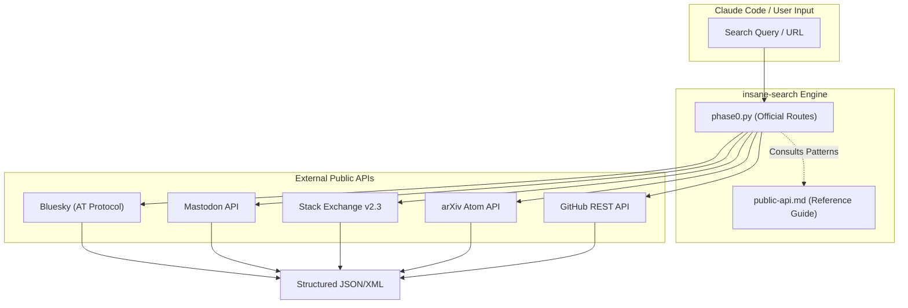
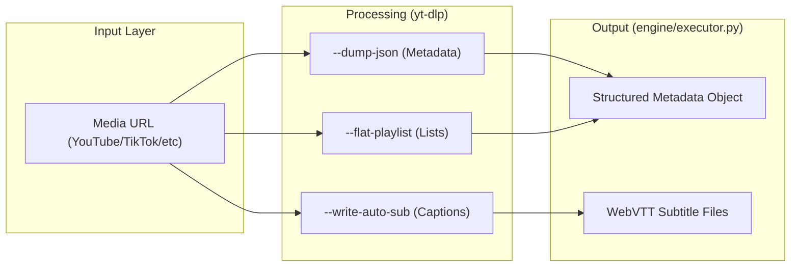

# Public APIs (Bluesky, Mastodon, Stack Overflow, arXiv, GitHub)

Relevant source files

The following files were used as context for generating this wiki page:

- [skills/insane-search/references/media.md](skills/insane-search/references/media.md)
- [skills/insane-search/references/public-api.md](skills/insane-search/references/public-api.md)

This page provides a technical reference for integrating with stable public REST APIs that require no authentication. These endpoints are utilized as high-reliability data sources within the `insane-search` ecosystem, often serving as the primary target in Phase 0 of the retrieval pipeline before escalating to more complex scraping or browser-based methods.

## Overview and Integration Strategy

The `insane-search` engine prioritizes official public APIs over HTML scraping whenever possible. These APIs provide structured JSON or Atom/XML data, ensuring higher accuracy and lower maintenance overhead compared to DOM parsing.

### Data Flow for Public APIs

The following diagram illustrates how the system routes requests through public API endpoints.

**Public API Request Lifecycle**

Sources: [skills/insane-search/references/public-api.md:1-5](), [skills/insane-search/references/media.md:1-5]()

---

## Supported Platforms and Implementations

### 1. Bluesky (AT Protocol)
Bluesky profiles and feeds are accessible via the AT Protocol's public XRPC endpoints. While search functionality is restricted (403), actor profiles and author feeds remain open.

*   **Key Functions**:
    *   `getProfile`: Retrieves display name, follower counts, and post counts.
    *   `getAuthorFeed`: Retrieves the 10 most recent posts for a given handle.
*   **Rate Limit**: Approximately 3,000 requests per hour.

Sources: [skills/insane-search/references/public-api.md:6-20]()

### 2. Mastodon API
Mastodon operates on a per-instance basis. While `mastodon.social` often restricts public timeline access, other instances like `hachyderm.io` or `fosstodon.org` typically allow unauthenticated lookups.

*   **Endpoint Patterns**:
    *   Account Lookup: `https://{instance}/api/v1/accounts/lookup?acct={username}`
    *   Statuses: `https://{instance}/api/v1/accounts/{id}/statuses`
    *   Hashtags: `https://{instance}/api/v1/timelines/tag/{tag}`

Sources: [skills/insane-search/references/public-api.md:21-34]()

### 3. Stack Exchange API (v2.3)
Used for retrieving high-quality technical answers from Stack Overflow and related sites.

*   **Implementation Details**:
    *   Uses the `filter=withbody` parameter to ensure the actual answer content is retrieved rather than just metadata.
    *   Supports sorting by `votes` to prioritize the most relevant community-vetted content.
*   **Rate Limit**: 300 requests per day per IP for unauthenticated requests.

Sources: [skills/insane-search/references/public-api.md:36-50]()

### 4. arXiv & Academic APIs
For scholarly articles, the system utilizes the arXiv Atom API and CrossRef.

| Platform | Protocol | Key Feature | Rate Limit |
| :--- | :--- | :--- | :--- |
| **arXiv** | Atom/XML | Search by title (`ti`), author (`au`), or abstract (`abs`). | 3 req/sec (1s sleep required) |
| **CrossRef** | JSON | DOI lookup and peer-reviewed metadata. | 50 req/sec |
| **OpenLibrary** | JSON | ISBN lookup and book metadata. | Unlimited |

Sources: [skills/insane-search/references/public-api.md:51-82]()

### 5. GitHub REST API
The system defaults to the `gh` CLI if available. If not, it falls back to the REST API for repository searches, release tracking, and code snippets.

*   **Rate Limit**: 60 requests per hour for unauthenticated users.
*   **Primary Use Cases**: Stars-based repository sorting and release versioning.

Sources: [skills/insane-search/references/public-api.md:93-106]()

---

## Media Extraction via yt-dlp
While not a REST API in the traditional sense, `yt-dlp` acts as a standardized interface for over 1,800 platforms, providing structured metadata via the `--dump-json` flag.

**Media Extraction Architecture**

Sources: [skills/insane-search/references/media.md:1-26](), [skills/insane-search/references/media.md:52-59]()

### Technical Capabilities
*   **Metadata Extraction**: Retrieves `title`, `uploader`, `duration`, and `description` without downloading the media file [skills/insane-search/references/media.md:18-26]().
*   **Subtitle Retrieval**: Supports automatic speech-to-text (YouTube) and manual captions in `.vtt` format [skills/insane-search/references/media.md:27-35]().
*   **Platform Specifics**: Includes specialized extractors for Korean platforms like Naver TV, Chzzk, and Soop [skills/insane-search/references/media.md:93-105]().

---

## Archive and Fallback Services
When live endpoints are blocked by WAFs (Web Application Firewalls), the system utilizes the Wayback Machine CDX API to check for historical snapshots.

*   **Availability Check**: `https://archive.org/wayback/available?url={URL}`
*   **CDX Search**: Used to retrieve a list of timestamps and status codes for available snapshots.

Sources: [skills/insane-search/references/public-api.md:83-91]()

## Rate Limit Summary

| API | Unauthenticated Limit | Recommendation |
| :--- | :--- | :--- |
| **Bluesky** | ~3,000/hr | Use for profiles/feeds only. |
| **Stack Exchange** | 300/day | Use `filter=withbody`. |
| **arXiv** | 3/sec | Mandatory 1s sleep between calls. |
| **GitHub** | 60/hr | Prefer `gh` CLI over REST API. |
| **CrossRef** | 50/sec | Add email to User-Agent for "Polite Pool". |

Sources: [skills/insane-search/references/public-api.md:108-120]()
