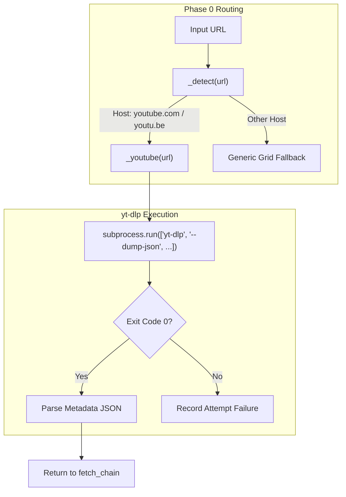
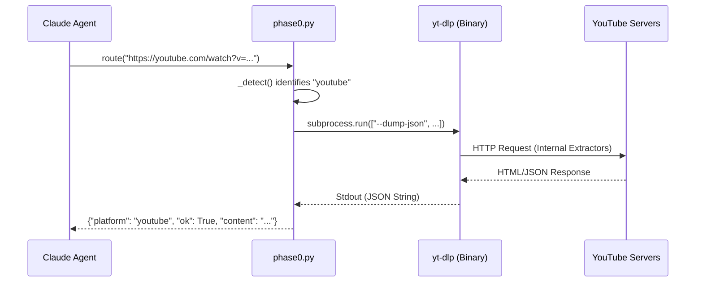

# Media Extraction (yt-dlp)

<details>
<summary>Relevant source files</summary>

The following files were used as context for generating this wiki page:

- [skills/insane-search/engine/phase0.py](skills/insane-search/engine/phase0.py)
- [skills/insane-search/references/media.md](skills/insane-search/references/media.md)
- [skills/insane-search/references/public-api.md](skills/insane-search/references/public-api.md)

</details>


This page describes how `insane-search` utilizes `yt-dlp` as a specialized engine for extracting metadata and content from video and audio platforms. While primarily known for YouTube, `yt-dlp` serves as a universal media extractor for over 1,800 platforms within the Phase 0 escalation logic.

## Overview and Integration

In the `insane-search` architecture, media extraction is handled as a **Phase 0** official route. This means that if a URL is identified as belonging to a supported media platform (like YouTube, TikTok, or SoundCloud), the system attempts to use `yt-dlp` before falling back to the generic WAF-evasion grid.

### Key Capabilities
*   **Metadata Extraction**: Retrieving structured JSON containing titles, uploaders, view counts, and descriptions via `--dump-json`.
*   **Subtitle/Caption Retrieval**: Fetching manual or auto-generated captions without downloading the video file.
*   **Playlist/Channel Scanning**: Rapidly listing all media items in a collection using `--flat-playlist`.
*   **Multi-Platform Search**: Utilizing internal extractors like `ytsearch` or `scsearch` to find content directly.

| Component | Role |
| :--- | :--- |
| `phase0.py` | Detects media URLs and dispatches to `yt-dlp`. |
| `yt-dlp` | External binary used for authenticated-like extraction without cookies. |
| `media.md` | Reference guide for the LLM to construct valid `yt-dlp` commands. |

Sources: [skills/insane-search/engine/phase0.py:67-69](), [skills/insane-search/references/media.md:1-4]()

---

## Implementation Details

The media extraction logic is encapsulated within `_youtube` (and generic media detection) inside `phase0.py`. The system prefers using the `yt-dlp` binary if available, falling back to `python3 -m yt_dlp`.

### Media Detection Logic
The `_detect` function identifies media hosts to trigger the `yt-dlp` pathway.


Sources: [skills/insane-search/engine/phase0.py:59-69](), [skills/insane-search/engine/phase0.py:165-188]()

### Metadata Extraction Command
The primary method for extraction is the `--dump-json` flag. This prevents actual media bitstream downloading while retrieving exhaustive technical and descriptive metadata.

```python
# Simplified implementation in phase0.py
cmd = ["yt-dlp", "--dump-json", "--no-playlist", "--no-check-certificate", url]
res = subprocess.run(cmd, capture_output=True, text=True, timeout=timeout)
```
Sources: [skills/insane-search/engine/phase0.py:173-178]()

---

## Data Flow: From URL to Structured Content

This diagram illustrates how a YouTube URL moves from the initial request through the `yt-dlp` wrapper to become structured data for the LLM.


Sources: [skills/insane-search/engine/phase0.py:165-195](), [skills/insane-search/references/media.md:18-22]()

---

## Subtitle and Caption Retrieval

`yt-dlp` is specifically leveraged to bypass the complexity of YouTube's internal timed-text APIs. The system uses specific flags to isolate captions:

1.  `--write-sub` / `--write-auto-sub`: Requests both manual and AI-generated captions.
2.  `--skip-download`: Ensures no video data is transferred.
3.  `--sub-lang "en,ko"`: Targets specific locales.

These are typically executed via the shell by the agent following the patterns in `media.md` when the initial metadata is insufficient.

| Flag | Purpose |
| :--- | :--- |
| `--write-comments` | Extracts top-level comments (requires specific extractor args). |
| `--flat-playlist` | Extracts metadata for all videos in a channel without visiting each page. |
| `ytsearchN:` | Internal prefix to perform searches directly through `yt-dlp`. |

Sources: [skills/insane-search/references/media.md:27-35](), [skills/insane-search/references/media.md:52-66]()

---

## Supported Platforms (Reference Index)

`yt-dlp` provides high-fidelity extractors for specific regions and types of media, which `insane-search` utilizes as official routes.

### Global Platforms
*   **Video**: YouTube, Vimeo, Twitch (VODs), TikTok (Public), Dailymotion.
*   **Audio**: SoundCloud (includes search), Apple Podcasts, TuneIn.

### Regional Platforms (South Korea)
The engine is optimized for Korean media extraction using `yt-dlp`'s specialized extractors:
*   **Naver TV / Chzzk**: `Naver`, `Naver:live`, `chzzk:video`.
*   **Broadcasters**: SBS, JTBC, Kakao.
*   **Community**: Soop (AfreecaTV), Weverse.

Sources: [skills/insane-search/references/media.md:70-104]()

---

## Error Handling and Fallbacks

In `phase0.py`, the `_youtube` function wraps the `yt-dlp` call in a try-except block. If `yt-dlp` fails (e.g., due to a 403 or regional block), the system records the failure in the `attempts` list and allows the `fetch_chain` to proceed to Phase 1 (Probes) or Phase 2 (Diversity Grid).

```python
try:
    # yt-dlp execution
    ...
except Exception as e:
    attempts.append(_attempt("youtube", "yt-dlp", False, 0, "", f"{type(e).__name__}"))
```
Sources: [skills/insane-search/engine/phase0.py:186-191]()
