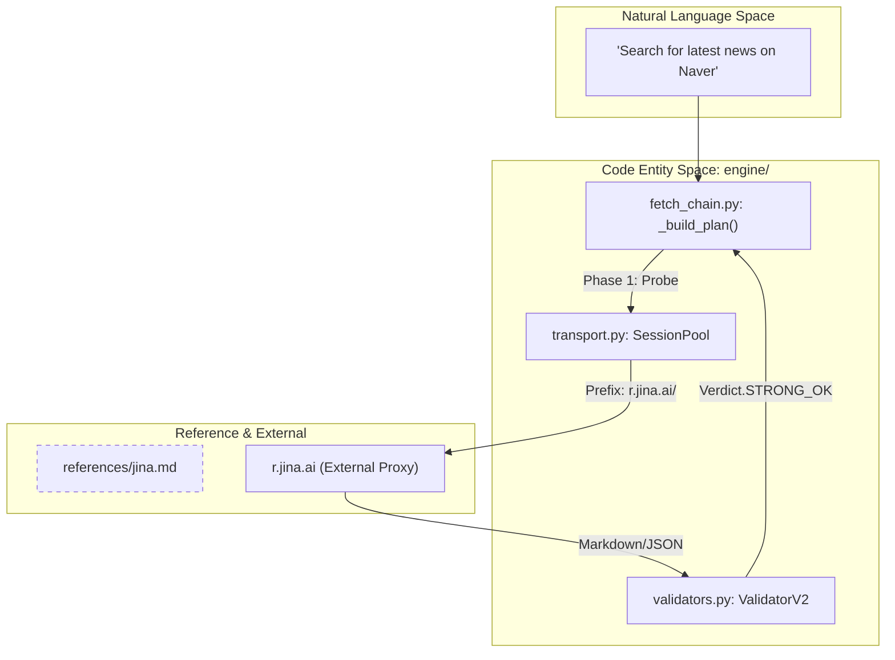
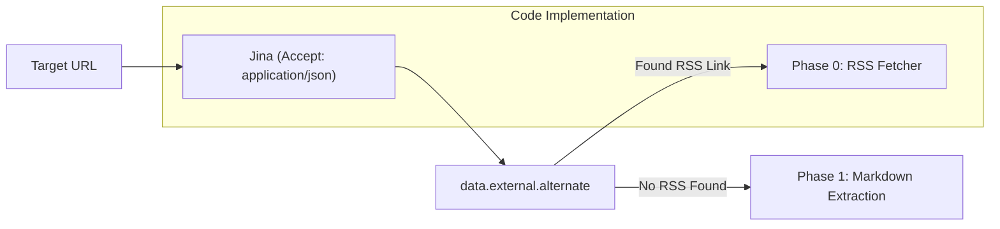

# Jina Reader Integration

Relevant source files

The following files were used as context for generating this wiki page:

- [skills/insane-search/references/jina.md](skills/insane-search/references/jina.md)

The Jina Reader integration serves as a primary lightweight probe mechanism within the `insane-search` Phase 1 escalation strategy. By utilizing the `r.jina.ai` proxy, the system offloads complex HTML-to-markdown conversion, JavaScript execution (SPA rendering), and RSS auto-discovery to a high-throughput, no-key service.

## Overview and Purpose

Jina Reader is integrated as a "no-key" utility that simplifies the retrieval of clean content from complex web pages. It is particularly effective for sites that require JavaScript execution but do not implement aggressive anti-proxy WAFs.

### Key Roles in insane-search
1.  **Phase 1 Lightweight Probe**: Used as an early-stage attempt to fetch content before escalating to heavy-duty headless browsers (Phase 3) [skills/insane-search/references/jina.md:1-5]().
2.  **Markdown Normalization**: Automatically converts raw HTML into LLM-friendly markdown, reducing token overhead [skills/insane-search/references/jina.md:3]().
3.  **RSS Auto-Discovery**: Leverages Jina's metadata extraction to find hidden RSS/Atom feeds for a given domain [skills/insane-search/references/jina.md:23]().
4.  **SPA Handling**: Manages Single Page Applications (SPAs) via Puppeteer-based rendering on Jina's infrastructure [skills/insane-search/references/jina.md:4]().

## Implementation Logic

The system interacts with Jina primarily through HTTP requests to the `https://r.jina.ai/` prefix.

### Data Flow: Content Retrieval
When a URL is routed through the Jina integration, the system constructs a request that can include various headers to control the output format and behavior.

| Feature | Header / Method | Purpose |
| :--- | :--- | :--- |
| **JSON Output** | `Accept: application/json` | Returns structured metadata including title and content [skills/insane-search/references/jina.md:18-21](). |
| **RSS Discovery** | `Accept: application/json` | Accesses `data.external.alternate` for feed links [skills/insane-search/references/jina.md:123-130](). |
| **CSS Targeting** | `X-Target-Selector` | Isolates specific article bodies, removing nav/footers [skills/insane-search/references/jina.md:28-31](). |
| **SPA Waiting** | `Accept: text/event-stream` | Streams the final rendered state after JS execution [skills/insane-search/references/jina.md:36-39](). |
| **Cache Control** | `X-No-Cache: true` | Forces a fresh fetch from the origin site [skills/insane-search/references/jina.md:73](). |

### System Entity Mapping: Jina Integration
The following diagram illustrates how the Jina reference relates to the broader `engine` logic during the fetch lifecycle.

**Title: Jina Integration Logic Flow**

Sources: [skills/insane-search/references/jina.md:1-5](), [skills/insane-search/references/jina.md:18-21]()

## RSS Auto-Discovery Pattern

One of the most powerful features of the Jina integration is its role as a bridge to Phase 0 (Official Public Endpoints). By requesting JSON format, `insane-search` can discover RSS feeds that are not immediately obvious from the URL structure.

**Title: RSS Discovery to Phase 0 Escalation**

Sources: [skills/insane-search/references/jina.md:23](), [skills/insane-search/references/jina.md:125-130]()

## Performance and Limits

The integration is optimized for high-volume probes without requiring individual API keys.

*   **Rate Limits**: Supports up to 500 Requests Per Minute (RPM) [skills/insane-search/references/jina.md:5]().
*   **Success Profile**: Highly effective for news sites (Naver News, Daum), tech blogs (Medium, Dev.to), and community boards (Clien, Ruliyweb) [skills/insane-search/references/jina.md:89-108]().
*   **Failure Profile**: Generally fails on sites with strict anti-bot WAFs (Coupang, Naver Shopping) or specific API-only requirements (X/Twitter, Reddit) [skills/insane-search/references/jina.md:110-121]().

## Advanced Usage in Probes

The integration supports passing cookies and targeting specific DOM elements, which allows the engine to bypass simple content gates or clean up noisy layouts.

| Technique | Implementation | Source |
| :--- | :--- | :--- |
| **Cookie Bridging** | `X-Set-Cookie: session=...` | [skills/insane-search/references/jina.md:60]() |
| **Screenshotting** | `X-Respond-With: screenshot` | [skills/insane-search/references/jina.md:44]() |
| **PDF Conversion** | Direct URL to `.pdf` | [skills/insane-search/references/jina.md:52-55]() |

Sources: [skills/insane-search/references/jina.md:1-130]()
