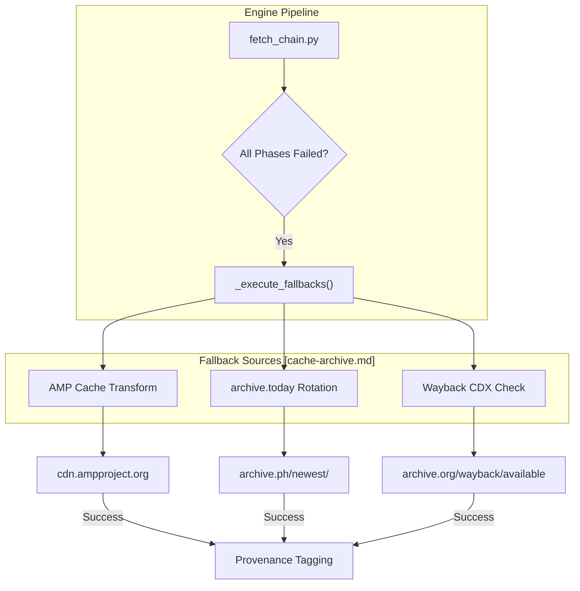
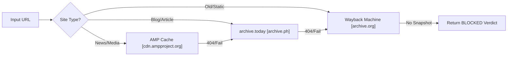

# Cache & Archive Fallbacks

Relevant source files

The following files were used as context for generating this wiki page:

- [skills/insane-search/references/cache-archive.md](skills/insane-search/references/cache-archive.md)

The `insane-search` engine utilizes third-party caches and web archives as sidecar sources when the origin server is unreachable, protected by aggressive WAFs, or has deleted the content. These fallbacks are treated as high-latency but high-reliability alternatives in the fetch pipeline.

## Overview of Fallback Sources

When a direct fetch fails across all phases (0 through 3), or when a site is known to have a paywall that is bypassed by crawlers, the system evaluates three primary sidecar sources.

| Source | Primary Use Case | Mechanism |
| :--- | :--- | :--- |
| **Google AMP Cache** | News and media sites with AMP support. | URL transformation to `cdn.ampproject.org`. |
| **archive.today** | Paywalled articles or recently deleted content. | Multi-domain rotation (e.g., `.ph`, `.is`). |
| **Wayback Machine** | Historical data or sites blocked by IP. | CDX API for availability and `web.archive.org` for retrieval. |

> **Note:** Traditional Google Search Cache (`webcache.googleusercontent.com`) was officially deprecated in July 2024 and is no longer used by the engine [skills/insane-search/references/cache-archive.md:72-74]().

## Google AMP Cache

The Google AMP Cache is the preferred first fallback for news and media platforms because it often serves the full content of an article even if the main site has a soft paywall or heavy JavaScript bot detection [skills/insane-search/references/cache-archive.md:10-12]().

### Implementation Logic
The engine transforms the origin URL into an AMP Cache URL by modifying the hostname and prepending the AMP CDN prefix.

1.  **Domain Transformation:** Replace all dots (`.`) in the hostname with dashes (`-`).
2.  **Path Construction:** Append the original hostname and path to the `/c/s/` endpoint.

**Example Transformation:**
*   **Origin:** `https://www.bbc.com/news/articles/123`
*   **AMP Cache:** `https://www-bbc-com.cdn.ampproject.org/c/s/www.bbc.com/news/articles/123`

Sources: [skills/insane-search/references/cache-archive.md:18-28]()

## archive.today (Archive.is)

`archive.today` is highly effective for content that has been manually archived by users to bypass paywalls. The system handles this source via a rotation strategy because the service frequently changes its primary TLD to avoid censorship or technical blocks [skills/insane-search/references/cache-archive.md:33-36]().

### Domain Rotation Strategy
The engine iterates through a list of known mirrors until a `200 OK` or `302 Found` response is received.

| Domain | Purpose |
| :--- | :--- |
| `archive.ph` | Current primary endpoint. |
| `archive.is` | Historical primary endpoint. |
| `archive.md` | Mirror. |
| `archive.vn` | Mirror. |
| `archive.li` | Mirror. |

Sources: [skills/insane-search/references/cache-archive.md:42-50]()

## Wayback Machine (Internet Archive)

The Wayback Machine is used as a last resort for older content. It provides a structured API (CDX) to check for the existence of a snapshot before attempting a full page load [skills/insane-search/references/cache-archive.md:56-60]().

### Data Flow: CDX API to Retrieval
The system first queries the availability API to minimize unnecessary bandwidth usage. If a snapshot exists, it retrieves the content using the `web.archive.org/web/{URL}` format [skills/insane-search/references/cache-archive.md:60-66]().

## Code Entity Map: Fallback Execution

The following diagram illustrates how the fallback logic integrates with the fetch execution flow.

**Fallback Decision Flow**

Sources: [skills/insane-search/references/cache-archive.md:77-83]()

## Execution Order and Success Conditions

The engine follows a strict priority list when attempting these fallbacks to optimize for content freshness and layout quality.

| Priority | Source | Success Condition | Failure Condition |
| :--- | :--- | :--- | :--- |
| 1 | **AMP Cache** | Site provides valid AMP metadata. | Non-AMP sites; content < 15s old. |
| 2 | **archive.today** | URL was previously archived by a user. | Never-archived URLs. |
| 3 | **Wayback Machine** | Public URL crawled by IA bot. | `robots.txt` blocks; SPA/JS-heavy apps. |

**System Logic Diagram: Source Selection**

Sources: [skills/insane-search/references/cache-archive.md:79-83]()
