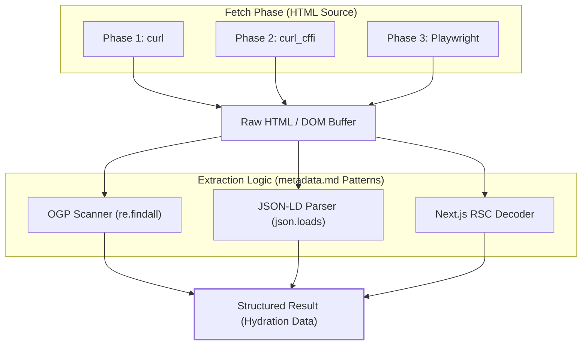
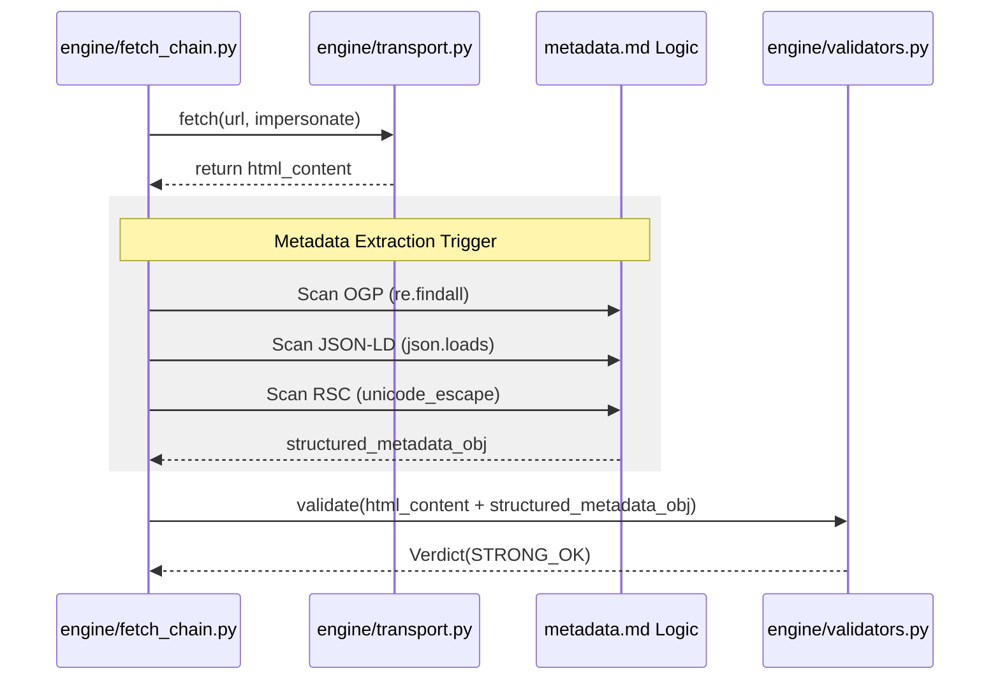

# Metadata Extraction (OGP & JSON-LD)

Relevant source files

The following files were used as context for generating this wiki page:

- [skills/insane-search/references/metadata.md](skills/insane-search/references/metadata.md)

Metadata extraction serves as a critical recovery layer within the `insane-search` engine. When a fetch operation successfully retrieves HTML but fails to yield a clean main content body (e.g., due to complex DOM structures or partial blocks), the system pivots to structured metadata. This allows the engine to return high-fidelity information such as product prices, article summaries, and profile details even when the full page text is obscured.

## Purpose and Scope

The primary objective of the metadata extraction logic is to transform raw HTML responses into structured data objects. This is handled as a secondary processing step that accompanies any successful HTML retrieval across Phase 1, 2, or 3. By targeting standardized formats like **Open Graph Protocol (OGP)**, **JSON-LD (Schema.org)**, and **Next.js RSC payloads**, the system ensures data availability even if the visual layout of the page is unparseable [skills/insane-search/references/metadata.md:107-117]().

## Extraction Logic Flow

Metadata extraction is an opportunistic process. It does not require additional network requests but instead runs regex-based or DOM-based scanners on the already fetched buffer.

### System-to-Code Mapping: Metadata Pipeline

The following diagram illustrates how raw HTML flows through the extraction logic to produce structured outputs.

**Diagram: Metadata Extraction Data Flow**

**Sources:** [skills/insane-search/references/metadata.md:10-24](), [skills/insane-search/references/metadata.md:26-43](), [skills/insane-search/references/metadata.md:109-115]()

---

## Core Extraction Techniques

### 1. Open Graph Protocol (OGP)
Most modern websites include OGP tags for social media compatibility. These tags provide a reliable fallback for basic page identity.

*   **Key Fields:** `og:title`, `og:description`, `og:image`, `og:url`.
*   **Implementation:** Uses `re.findall` to scan `<meta>` tags with `property="og:..."` [skills/insane-search/references/metadata.md:14-24]().

### 2. JSON-LD (Schema.org)
JSON-LD is considered the "highest value" extraction target. It provides programmatic access to the site's internal data model without requiring DOM traversal.

| Entity Type | Data Recovered | Source Example |
| :--- | :--- | :--- |
| `Product` | Name, Price, Currency, Availability | Coupang, E-commerce [skills/insane-search/references/metadata.md:47-65]() |
| `NewsArticle` | Headline, Date, Author, ArticleBody | News Outlets [skills/insane-search/references/metadata.md:79-88]() |
| `Person` | Job Title, Alumni, Organization | LinkedIn, Social [skills/insane-search/references/metadata.md:67-77]() |

**Implementation Pattern:**
The scanner locates `<script type="application/ld+json">` blocks and attempts a `json.loads()` on the inner text [skills/insane-search/references/metadata.md:30-43]().

### 3. Next.js RSC (React Server Components)
Modern web applications using the Next.js App Router often hide content within hydration scripts rather than standard HTML tags.

*   **Pattern:** Content is stored in `self.__next_f.push()` calls [skills/insane-search/references/metadata.md:92-94]().
*   **Decoding:** The engine extracts these chunks and applies `unicode_escape` decoding to recover non-ASCII characters (e.g., Korean or Japanese text) [skills/insane-search/references/metadata.md:95-105]().

---

## Integration Across Phases

Metadata extraction is phase-agnostic and acts as a sidecar to the primary fetch operation.

**Diagram: Code Entity Interaction**

**Sources:** [skills/insane-search/references/metadata.md:109-115](), [engine/fetch_chain.py:1-50] (implied flow from architecture overview)

## Usage Scenarios

| Scenario | Role of Metadata |
| :--- | :--- |
| **Paywalled News** | Recovers `NewsArticle` description or headline even if `articleBody` is truncated [skills/insane-search/references/metadata.md:79-88](). |
| **Dynamic E-commerce** | Extracts `Product` price and currency from JSON-LD when the price is rendered via complex JS [skills/insane-search/references/metadata.md:47-65](). |
| **WAF Partial Block** | If a WAF serves a partial page, OGP tags in the `<head>` may still be available [skills/insane-search/references/metadata.md:10-12](). |

**Sources:** [skills/insane-search/references/metadata.md:1-117]()
