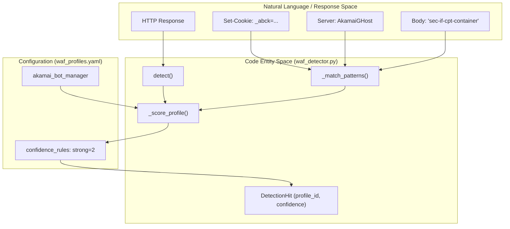
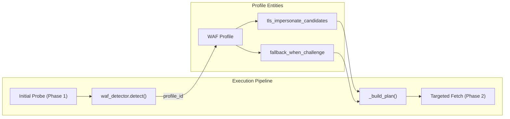

# WAF Profiles & Detection

Relevant source files

The following files were used as context for generating this wiki page:

- [skills/insane-search/engine/waf_detector.py](skills/insane-search/engine/waf_detector.py)
- [skills/insane-search/engine/waf_profiles.yaml](skills/insane-search/engine/waf_profiles.yaml)

The WAF Profiles & Detection subsystem is responsible for identifying Web Application Firewalls (WAFs) and anti-bot solutions using vendor-specific artifacts. Unlike traditional scrapers that rely on site-specific logic, `insane-search` adheres to the **No-Site-Name Rule**, identifying protection layers like Akamai, Cloudflare, or DataDome based on headers, cookies, and body patterns rather than the domain name [[skills/insane-search/engine/waf_profiles.yaml:1-9]()] [[skills/insane-search/engine/waf_detector.py:7-10]()].

These detections drive the **Diversity Grid**, allowing the engine to pivot its TLS fingerprints, URL transforms, and browser fallbacks based on the specific requirements of the detected vendor.

## WAF Detection Logic (`waf_detector.py`)

The `detect` function in `waf_detector.py` performs multi-signal analysis on a live response [[skills/insane-search/engine/waf_detector.py:182-187]()]. Instead of a binary "blocked" verdict, it returns a ranked list of `DetectionHit` objects containing a profile ID and a confidence score [[skills/insane-search/engine/waf_detector.py:3-5]()].

### Detection Process
1.  **Artifact Extraction**: The detector extracts cookies, headers, and the response body from the `curl_cffi` or `playwright` response [[skills/insane-search/engine/waf_detector.py:140-143]()].
2.  **Pattern Matching**: It uses `fnmatch` to support wildcards (e.g., `X-Akamai-*`) across headers and cookies [[skills/insane-search/engine/waf_detector.py:115-129]()].
3.  **Scoring**: Confidence is calculated based on `confidence_rules` defined in the profile. Typically, multiple signals (e.g., a specific cookie AND a specific header) result in a "strong" (0.9) confidence rating [[skills/insane-search/engine/waf_detector.py:170-179]()].
4.  **Fallback**: If no vendor profiles match, the system returns an `unknown_challenge` profile with low confidence (0.1), triggering conservative, broad-spectrum bypass attempts [[skills/insane-search/engine/waf_detector.py:201-207]()].

### Data Flow: Response to Profile Ranking
The following diagram illustrates how the `detect()` function bridges raw HTTP artifacts to structured WAF profiles.

**WAF Detection Flow**

Sources: [skills/insane-search/engine/waf_detector.py:132-180](), [skills/insane-search/engine/waf_profiles.yaml:19-28]()

## WAF Profiles (`waf_profiles.yaml`)

Profiles are the "knowledge base" of the engine. They define not just how to detect a WAF, but how to defeat it. Each profile specifies:
*   **Capabilities Needed**: Tags like `needs_real_tls_stack` (requiring `curl_cffi` or real Chrome) or `needs_js_exec` (requiring Playwright) [[skills/insane-search/engine/waf_profiles.yaml:29-31]()].
*   **TLS Candidates**: A prioritized list of JA3 fingerprints (Safari, Chrome, etc.) known to work with that vendor [[skills/insane-search/engine/waf_profiles.yaml:32-41]()].
*   **Avoid List**: Fingerprints empirically observed to trigger immediate 403s [[skills/insane-search/engine/waf_profiles.yaml:42-53]()].
*   **URL & Referer Strategies**: Vendor-specific preferences, such as using `google_search` as a referer for Cloudflare [[skills/insane-search/engine/waf_profiles.yaml:76-78]()].

### Integration with Fetch Grid
The following diagram shows how the `fetch_chain.py` uses the `waf_detector.py` output to re-plan the retrieval strategy.

**Strategy Re-Planning Grid**

Sources: [skills/insane-search/engine/waf_detector.py:182-207](), [skills/insane-search/engine/waf_profiles.yaml:10-13]()

## Detailed Configuration & Vendor Guides

For deeper technical details on the schema and specific vendor implementations, see the following child pages:

### [WAF Profile Schema & Configuration](#5.1)
Details the YAML structure, including `confidence_rules`, `capabilities_needed` tags, and how `url_transform_order` influences the diversity grid.
*   See: [WAF Profile Schema & Configuration](#5.1)

### [WAF Vendor Profiles: Akamai, Cloudflare, DataDome, PerimeterX](#5.2)
Deep dive into the specific artifacts and bypass strategies for major vendors, including the `_abck` cookie lifecycle for Akamai and `cf_clearance` bridging for Cloudflare.
*   See: [WAF Vendor Profiles: Akamai, Cloudflare, DataDome, PerimeterX](#5.2)

---
**Sources:**
*   [skills/insane-search/engine/waf_detector.py:1-215]()
*   [skills/insane-search/engine/waf_profiles.yaml:1-163]()
