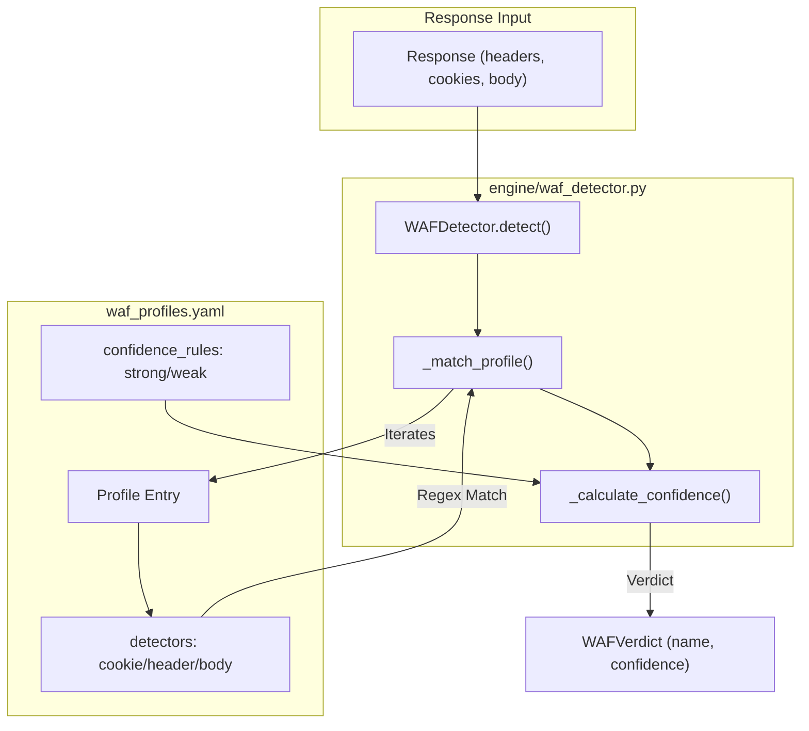
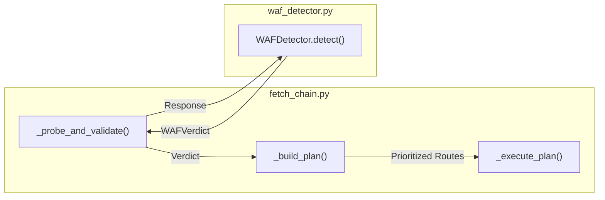

# WAF Profile Schema & Configuration

Relevant source files

The following files were used as context for generating this wiki page:

- [CHANGELOG.md](CHANGELOG.md)
- [skills/insane-search/engine/waf_profiles.yaml](skills/insane-search/engine/waf_profiles.yaml)

The `insane-search` engine utilizes a structured profile system to identify and bypass Web Application Firewalls (WAFs). These profiles, defined in `waf_profiles.yaml`, decouple site-specific logic from vendor-specific detection patterns. This system allows the engine to adapt its fetch strategy—including TLS fingerprints, URL transforms, and referer headers—based on the specific WAF product identified during a probe.

## Purpose and Scope

The WAF profiling system serves three primary functions:
1.  **Identification**: Detecting the presence of specific WAF vendors (e.g., Akamai, Cloudflare) through cookies, headers, and body markers.
2.  **Strategy Optimization**: Recommending TLS impersonation targets and referer strategies known to perform well against specific vendors.
3.  **Escalation Planning**: Defining whether a challenge requires lightweight JS execution (Playwright MCP) or a full browser stack (Playwright Real Chrome) based on the vendor's known capabilities.

All profiles must adhere to the **No-Site-Name Rule**: they must describe WAF product artifacts that appear across any site running that product, never site-specific selectors [skills/insane-search/engine/waf_profiles.yaml:3-8]().

## WAF Profile Schema

The schema is defined in `skills/insane-search/engine/waf_profiles.yaml` and consumed by the `WAFDetector` class in `engine/waf_detector.py`.

### Detector Definitions
Detectors are the primary mechanism for vendor identification. They are categorized into four types:
*   `cookie`: List of cookie names or patterns (e.g., `_abck`, `cf_clearance`).
*   `header`: HTTP response header keys or patterns (e.g., `X-Akamai-*`, `cf-ray`).
*   `server_contains`: Strings expected in the `Server` response header.
*   `body`: Unique strings found in the HTML body of challenge pages (e.g., "Just a moment...", "sec-if-cpt-container").

### Confidence Rules
The `confidence_rules` block determines the certainty of a match [skills/insane-search/engine/waf_profiles.yaml:25-28]():
*   **Strong**: Number of signals required to assign high confidence (typically 0.9).
*   **Weak**: Number of signals required for a low-confidence match (typically 0.6).

### Capability Tags
The `capabilities_needed` list informs the `FetchChain` about the technical requirements for a successful bypass:
*   `needs_real_tls_stack`: Indicates the WAF detects non-browser TLS stacks (like BoringSSL in standard Playwright/Chromium) and requires `curl_cffi` or a specialized browser [skills/insane-search/engine/waf_profiles.yaml:30-31]().
*   `needs_js_exec`: Indicates the challenge is not solvable via static fetching and requires a JavaScript runtime [skills/insane-search/engine/waf_profiles.yaml:72-73]().

### Strategy Lists
Profiles provide prioritized lists for the `DiversityGrid` scheduler:
*   **`tls_impersonate_candidates`**: Nested lists of browser fingerprints (e.g., `safari17_2_ios`, `chrome131`) grouped by family [skills/insane-search/engine/waf_profiles.yaml:32-41]().
*   **`tls_impersonate_avoid`**: Fingerprints empirically known to be blacklisted by the vendor [skills/insane-search/engine/waf_profiles.yaml:42-53]().
*   **`referer_strategies`**: Strategies like `self_root` or `google_search` [skills/insane-search/engine/waf_profiles.yaml:54-55]().
*   **`url_transform_order`**: Preferred URL mutations, such as `mobile_subdomain` (`www` -> `m`) [skills/insane-search/engine/waf_profiles.yaml:56-58]().

### Fallback Logic
The `fallback_when_challenge` field defines the escalation path if the initial `curl_cffi` grid fails:
*   `curl_grid_exhaust`: Continue trying all possible combinations in the grid.
*   `playwright_mcp`: Use the lightweight MCP browser.
*   `playwright_real_chrome`: Use the full-stack browser template.

**Sources:** [skills/insane-search/engine/waf_profiles.yaml:19-163](), [skills/insane-search/engine/waf_detector.py:1-50]()

---

## Data Flow: From Probe to Profile

The following diagram illustrates how a raw response is transformed into a WAF Profile match within the code.

### Detection Logic Flow
"This diagram maps the `WAFDetector.detect` logic to the YAML schema."

**Sources:** [skills/insane-search/engine/waf_detector.py:23-74](), [skills/insane-search/engine/waf_profiles.yaml:20-28]()

---

## Implementation Details

### WAFDetector Class
The `WAFDetector` class in `engine/waf_detector.py` is responsible for loading the YAML configuration and evaluating responses.

| Method | Role |
| :--- | :--- |
| `__init__` | Loads `waf_profiles.yaml` and initializes the `unknown_challenge` fallback [skills/insane-search/engine/waf_detector.py:12-21](). |
| `detect` | Orchestrates the detection by checking cookies, headers, and body content against all profiles [skills/insane-search/engine/waf_detector.py:23-52](). |
| `_match_profile` | Performs the low-level string and regex matching for a single profile [skills/insane-search/engine/waf_detector.py:54-74](). |
| `get_profile` | Retrieves the full configuration for a detected vendor name [skills/insane-search/engine/waf_detector.py:85-87](). |

### Integration with FetchChain
The `FetchChain` (in `fetch_chain.py`) uses the `WAFDetector` to pivot its strategy mid-flight.

1.  **Probe**: A lightweight request is made to the target.
2.  **Detect**: If the response is not `OK`, `WAFDetector.detect()` is called [skills/insane-search/engine/fetch_chain.py:134-135]().
3.  **Plan**: `_build_plan` consumes the WAF profile. If `needs_real_tls_stack` is present, the grid deprioritizes `tls_impersonate_avoid` targets and prioritizes `tls_impersonate_candidates` [skills/insane-search/engine/fetch_chain.py:180-210]().
4.  **Execute**: The engine iterates through the diversity grid using the optimized parameters.

**Sources:** [skills/insane-search/engine/fetch_chain.py:115-145](), [skills/insane-search/engine/fetch_chain.py:175-220](), [skills/insane-search/engine/waf_detector.py:23-52]()

---

## Fallback Strategies

When a WAF challenge is detected, the `fallback_when_challenge` list in the profile dictates the escalation.

| Strategy | Implementation | Use Case |
| :--- | :--- | :--- |
| `curl_grid_exhaust` | `DiversityGrid` iteration | Standard WAFs where a specific TLS/Header combo usually works (e.g., Akamai). |
| `playwright_mcp` | `executor.py` -> MCP | JS-heavy challenges that don't perform deep TLS fingerprinting (e.g., Cloudflare Turnstile) [skills/insane-search/engine/waf_profiles.yaml:80](). |
| `playwright_real_chrome` | `executor.py` -> `playwright_real_chrome.js` | Advanced WAFs requiring a real browser process and specific TLS behavior (e.g., DataDome, PerimeterX) [skills/insane-search/engine/waf_profiles.yaml:115, 130](). |

**Sources:** [skills/insane-search/engine/waf_profiles.yaml:59-61](), [skills/insane-search/engine/executor.py:45-65]()

## Unknown Challenges
If no profile matches with high confidence, the engine falls back to the `unknown_challenge` profile [skills/insane-search/engine/waf_profiles.yaml:139-163](). This profile uses a broad, conservative grid and escalates to `playwright_mcp` and then `playwright_real_chrome` to ensure maximum reach even against unidentified security layers.

**Sources:** [skills/insane-search/engine/waf_detector.py:18-21](), [skills/insane-search/engine/waf_profiles.yaml:139-158]()
