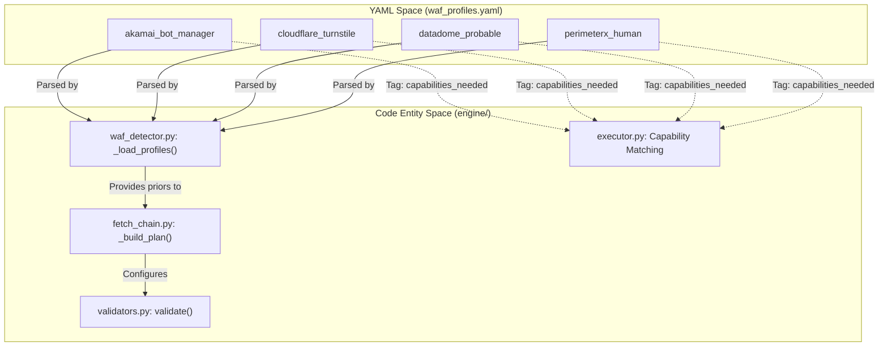
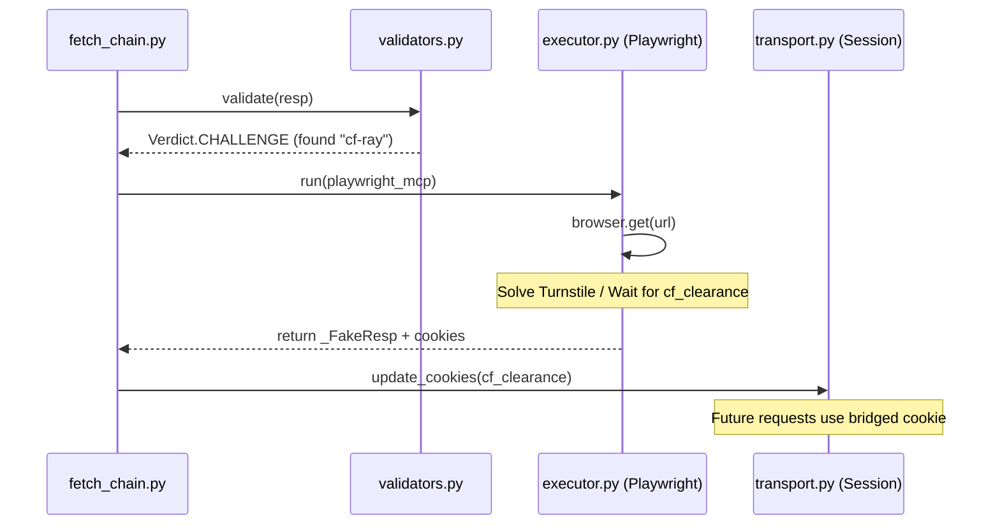

# WAF Vendor Profiles: Akamai, Cloudflare, DataDome, PerimeterX

Relevant source files

The following files were used as context for generating this wiki page:

- [skills/insane-search/engine/tests/test_u1.py](skills/insane-search/engine/tests/test_u1.py)
- [skills/insane-search/engine/validators.py](skills/insane-search/engine/validators.py)
- [skills/insane-search/engine/waf_profiles.yaml](skills/insane-search/engine/waf_profiles.yaml)
- [skills/insane-search/references/fallback.md](skills/insane-search/references/fallback.md)
- [skills/insane-search/references/tls-impersonate.md](skills/insane-search/references/tls-impersonate.md)

This page provides detailed technical profiles for major Web Application Firewall (WAF) vendors supported by `insane-search`. These profiles, defined in `waf_profiles.yaml`, drive the adaptive fetch grid by specifying detection markers, required browser capabilities, and TLS impersonation strategies.

## Overview of WAF Profiles

The system uses a non-site-specific approach to WAF handling. Profiles are keyed by the WAF product name (e.g., `akamai_bot_manager`) rather than the target domain, adhering to the **No-Site-Name Rule** [engine/waf_profiles.yaml:3-8]().

### Profile-to-Code Mapping
The following diagram illustrates how the YAML definitions in `waf_profiles.yaml` map to the execution logic in the Python engine.

**WAF Profile Entity Mapping**

Sources: [engine/waf_profiles.yaml:19-135](), [engine/fetch_chain.py:52-88](), [engine/validators.py:38-60]()

---

## Akamai Bot Manager

Akamai is characterized by high-sensitivity TLS fingerprinting and behavioral challenges that often require a full JavaScript environment.

### Detection Markers
*   **Cookies:** `_abck`, `bm_sz`, `ak_bmsc`, `bm_sv`, `bm_so` [engine/waf_profiles.yaml:21]().
*   **Headers:** `X-Akamai-*` [engine/waf_profiles.yaml:22]().
*   **Body:** `sec-if-cpt-container`, `Powered and protected by Akamai` [engine/waf_profiles.yaml:24]().

### Technical Implementation & Validation
The `_abck` cookie is a primary signal. A value containing `~-1~` indicates the sensor data has not been successfully validated by Akamai's edge [engine/validators.py:120-122]().
*   **Verdict:** Responses with unresolved `_abck` cookies return `Verdict.SUSPECT_OK` [engine/validators.py:101]().
*   **Non-Terminal:** Unlike `STRONG_OK`, `SUSPECT_OK` is non-terminal, meaning the fetch chain will continue to try other TLS/URL combinations [engine/validators.py:98-100]().

### Strategy
*   **Capabilities:** Requires `needs_real_tls_stack` and `needs_js_exec` [engine/waf_profiles.yaml:29-31]().
*   **TLS Candidates:** `safari` (specifically `safari260`) and `chrome` [engine/waf_profiles.yaml:37-39]().
*   **Avoid List:** `safari18_0`, `chrome107`, `chrome120`, `firefox` [engine/waf_profiles.yaml:45-53]().
*   **Fallback:** `playwright_real_chrome` [engine/waf_profiles.yaml:61]().

Sources: [engine/waf_profiles.yaml:19-65](), [engine/validators.py:120-122](), [engine/tests/test_u1.py:98-103]()

---

## Cloudflare Turnstile

Cloudflare is the most common WAF encountered. It relies heavily on its `cf_clearance` cookie bridge.

### Detection Markers
*   **Cookies:** `cf_clearance`, `__cf_bm` [engine/waf_profiles.yaml:68]().
*   **Headers:** `cf-ray`, `cf-cache-status` [engine/waf_profiles.yaml:69]().
*   **Body:** `Just a moment...`, `Checking your browser`, `cf-chl-bypass` [engine/waf_profiles.yaml:71]().

### Strategy
*   **Capabilities:** Requires `needs_js_exec`. Notably, Cloudflare's baseline often accepts standard Chromium TLS (BoringSSL), so `playwright_mcp` is frequently sufficient [engine/waf_profiles.yaml:73-80]().
*   **TLS Candidates:** `chrome`, `chrome_android` [engine/waf_profiles.yaml:75]().
*   **Referer:** Prefers `google_search` or `self_root` strategies [engine/waf_profiles.yaml:77-78]().

### Data Flow: Cookie Bridge
When a JS challenge is encountered, the system escalates to a browser to solve the challenge and bridge the cookies back to the `curl_cffi` session.

**Cloudflare Challenge Data Flow**

Sources: [engine/waf_profiles.yaml:66-82](), [references/tls-impersonate.md:110-128](), [engine/validators.py:43-45]()

---

## DataDome

DataDome focuses on behavioral analysis and is marked as `datadome_probable` in the engine to reflect its evolving detection surface [engine/waf_profiles.yaml:105-118]().

### Detection Markers
*   **Cookies:** `datadome` [engine/waf_profiles.yaml:107]().
*   **Body:** `DataDome` (Soft marker in `validators.py`) [engine/waf_profiles.yaml:108](), [engine/validators.py:58]().

### Strategy
*   **Capabilities:** Requires both `needs_real_tls_stack` and `needs_js_exec` [engine/waf_profiles.yaml:110-111]().
*   **TLS Candidates:** `safari` and `chrome` [engine/waf_profiles.yaml:113]().
*   **Fallback:** `playwright_real_chrome` is the recommended path for challenge resolution [engine/waf_profiles.yaml:115]().

Sources: [engine/waf_profiles.yaml:105-119](), [engine/validators.py:55-60]()

---

## PerimeterX (HUMAN)

Now known as HUMAN Bot Defender, this vendor uses a distinct cookie family from DataDome and requires separate handling to ensure the planner picks the correct fallback [engine/waf_profiles.yaml:120-134]().

### Detection Markers
*   **Cookies:** `_px3`, `_pxhd`, `_px2`, `pxcts` [engine/waf_profiles.yaml:122]().
*   **Body:** `px-captcha`, `Press & Hold to confirm you are a human` [engine/waf_profiles.yaml:123]().

### Strategy
*   **Capabilities:** Requires `needs_real_tls_stack` and `needs_js_exec` [engine/waf_profiles.yaml:125-126]().
*   **TLS Candidates:** `safari` and `chrome` [engine/waf_profiles.yaml:128]().
*   **Fallback:** Escalates to `playwright_real_chrome` [engine/waf_profiles.yaml:130]().

Sources: [engine/waf_profiles.yaml:120-135]()

---

## Summary of TLS Impersonation Targets

The following table summarizes the recommended `curl_cffi` impersonation targets used across profiles as of April 2026 [references/tls-impersonate.md:58-69]().

| Alias | Target Version | Primary Use Case |
| :--- | :--- | :--- |
| `safari` | `safari260` | Best for Korean sites (Coupang, FMKorea) |
| `chrome` | `chrome146` | General purpose (Cloudflare, Akamai) |
| `firefox` | `firefox135` | Alternative when Chrome/Safari fail |
| `chrome_android` | `chrome131_android` | Mobile API endpoints |
| `safari_ios` | `safari260_ios` | iOS Mobile emulation |

Sources: [references/tls-impersonate.md:62-69](), [engine/waf_profiles.yaml:37-41]()
