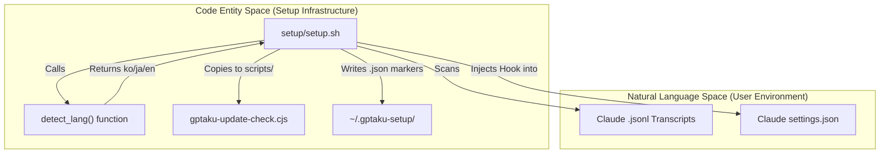
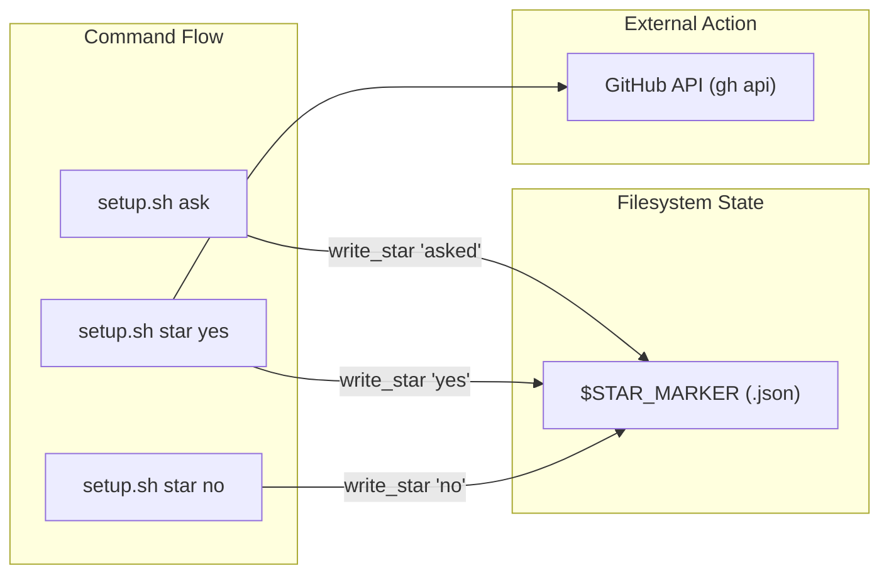

# Setup & Plugin Infrastructure

Relevant source files

The following files were used as context for generating this wiki page:

- [.claude-plugin/plugin.json](.claude-plugin/plugin.json)
- [setup/setup.sh](setup/setup.sh)

The `insane-search` plugin utilizes a robust initialization and maintenance infrastructure to ensure high availability, automatic updates, and a seamless user experience. This system is centered around the `setup/` directory and the `.claude-plugin/` manifest, which together handle environment validation, dependency management, and a non-intrusive update notification system.

## Plugin Manifest

The core identity of the plugin is defined in `.claude-plugin/plugin.json`. This file declares the plugin's capabilities, versioning, and the broad range of platforms it supports without requiring API keys.

| Field | Value / Purpose |
| :--- | :--- |
| **Name** | `insane-search` [ .claude-plugin/plugin.json:2 ]() |
| **Version** | `0.8.2` [ .claude-plugin/plugin.json:3 ]() |
| **Engine** | Phase 0→3 adaptive scheduler [ .claude-plugin/plugin.json:4 ]() |
| **Keywords** | `web-access`, `tls-impersonation`, `playwright`, `yt-dlp` [ .claude-plugin/plugin.json:12-41 ]() |

Sources: [ .claude-plugin/plugin.json:1-42 ]()

## Initialization & Lifecycle

The setup infrastructure is designed to be idempotent and non-blocking, ensuring that the plugin can be used immediately while background tasks handle environment preparation.

### First-Run Initialization
The `setup/setup.sh` script is the primary entry point for environment configuration. It performs several critical tasks:
1.  **Environment Validation**: Checks for the presence of `node` and `python3` [ setup/setup.sh:105-110 ]().
2.  **Hook Injection**: Injects the `gptaku-update-check.cjs` script into the Claude `settings.json` as a `SessionStart` hook [ setup/setup.sh:110-123 ]().
3.  **Language Detection**: Scans local Claude session transcripts (`.jsonl` files) using a heuristic voting system to determine the user's preferred language (Korean, Japanese, or English) for UI prompts [ setup/setup.sh:32-83 ]().
4.  **State Management**: Uses marker files in `~/.gptaku-setup/` to track setup status and user interactions (like repository starring) to ensure prompts are only shown once [ setup/setup.sh:24-27 ]().

For details, see [First-Run Setup Script](#6.1).

### Update Notification System
The plugin includes a dedicated update notifier, `gptaku-update-check.cjs`, which runs at the start of every Claude session.
*   **Git Integration**: Compares the local version against the marketplace HEAD using `git ls-remote`.
*   **Caching**: Implements a 24-hour cache to minimize network overhead.
*   **Concurrency**: Uses a per-session exclusive lock to prevent redundant checks.

For details, see [Update Notifier Hook](#6.2).

## System Integration Diagram

The following diagram illustrates how the setup script bridges the user's environment (Natural Language Space) to the operational plugin (Code Entity Space).

**Setup and Hook Injection Flow**

Sources: [ setup/setup.sh:22-27 ](), [ setup/setup.sh:32-34 ](), [ setup/setup.sh:109-123 ]()

## STAR_ASK State Machine

The plugin implements a "STAR_ASK" protocol to manage repository starring requests. This is handled via an idempotent state machine within `setup/setup.sh` to ensure the model only prompts the user when appropriate.

| State | Trigger | Action |
| :--- | :--- | :--- |
| **Initial** | First run | Script creates `$SETUP_MARKER` [ setup/setup.sh:126 ](). |
| **Asked** | `setup.sh ask` | Records `asked` in `$STAR_MARKER` and emits `STAR_ASK <lang>` [ setup/setup.sh:133-136 ](). |
| **Yes** | `setup.sh star yes` | Stars `fivetaku/insane-search` and `fivetaku/gptaku_plugins` via `gh api` [ setup/setup.sh:95-99 ](). |
| **No** | `setup.sh star no` | Records `no` in `$STAR_MARKER`; stars nothing [ setup/setup.sh:93-94 ](). |

**Star Decision Logic**

Sources: [ setup/setup.sh:87-101 ](), [ setup/setup.sh:133-136 ]()

## Sub-Pages

*   **[First-Run Setup Script](#6.1)**: Deep dive into environment validation, language heuristics, and the STAR_ASK mechanism.
*   **[Update Notifier Hook](#6.2)**: Technical details of the `gptaku-update-check.cjs` hook, including the locking protocol and marketplace synchronization.
