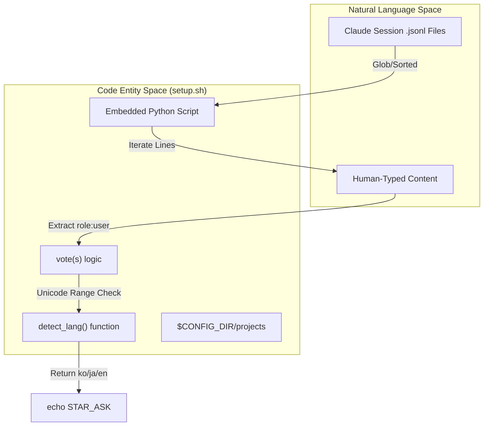
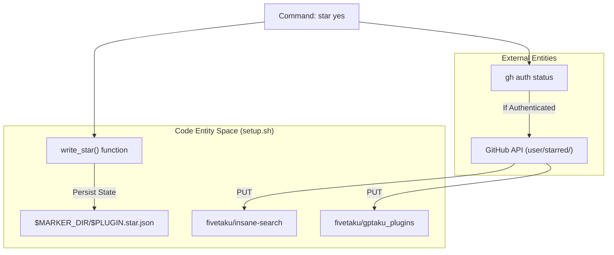

# First-Run Setup Script

Relevant source files

The following files were used as context for generating this wiki page:

- [setup/setup.sh](setup/setup.sh)

The `setup/setup.sh` script is a lightweight, idempotent utility responsible for initializing the `insane-search` environment. It handles dependency verification, injects the update-notifier hook into the Claude settings, and manages a one-time "star" request state machine using heuristic language detection.

## Purpose and Scope

The script is designed to run in two modes:
1.  **Silent Mode**: Triggered automatically during the first tool execution to ensure the environment is ready and the update-notifier is installed [setup/setup.sh:3-4]().
2.  **Ask Mode**: Triggered by specific command-line flows to prompt the user for a repository star, using local history to detect the user's preferred language [setup/setup.sh:5-11]().

### Core Implementation Logic

| Feature | Mechanism | Implementation |
| :--- | :--- | :--- |
| **Idempotency** | Marker Files | Uses `~/.gptaku-setup/insane-search.json` to skip setup on subsequent runs [setup/setup.sh:24-27, 104](). |
| **Hook Injection** | `settings.json` | Injects `gptaku-update-check.cjs` into Claude's `SessionStart` hooks [setup/setup.sh:110-123](). |
| **Language Detection** | JSONL Scanning | Heuristic scanning of Claude session transcripts to identify `ko`, `ja`, or `en` [setup/setup.sh:32-84](). |
| **State Machine** | STAR_ASK | Tracks `asked`, `yes`, and `no` states to ensure the user is only prompted once [setup/setup.sh:87-90, 133-136](). |

Sources: [setup/setup.sh:1-15](), [setup/setup.sh:24-27](), [setup/setup.sh:104-127]()

---

## Language Detection Heuristics

The script implements a `detect_lang` function that uses Python to perform a best-effort detection of the user's language by analyzing the last 20 Claude session transcripts [setup/setup.sh:32-39]().

### Detection Strategy
-   **Target**: Only scans `user` role messages to avoid skew from tool outputs or system prompts [setup/setup.sh:70-71]().
-   **Voting**: Uses a per-message voting system rather than per-character. This prevents large ASCII code blocks or logs from drowning out short, typed natural language turns [setup/setup.sh:42-45]().
-   **Unicode Ranges**:
    -   **Korean (ko)**: `0xAC00` to `0xD7A3` (Hangul Syllables) [setup/setup.sh:51]().
    -   **Japanese (ja)**: `0x3040` to `0x30FF` (Hiragana/Katakana) [setup/setup.sh:52]().
    -   **English (en)**: Standard Latin alphabet [setup/setup.sh:53]().

### Data Flow: Language Detection
"This diagram maps the natural language detection logic to the Python entities in the script."

Sources: [setup/setup.sh:32-84](), [setup/setup.sh:135-136]()

---

## Update Notifier Hook Injection

The script ensures that the `gptaku-update-check.cjs` utility is registered with the Claude desktop/CLI environment.

1.  **File Placement**: Copies the notifier script to `$HOME/.claude/scripts/` [setup/setup.sh:107-109]().
2.  **Settings Mutation**: Reads and parses `~/.claude/settings.json`.
3.  **Hook Registration**:
    -   Accesses `hooks.SessionStart` [setup/setup.sh:115-116]().
    -   Checks if a command containing `gptaku-update-check` already exists [setup/setup.sh:117]().
    -   If missing, pushes a new hook object with a 5-second timeout [setup/setup.sh:118-121]().

Sources: [setup/setup.sh:104-124]()

---

## STAR_ASK State Machine

The script manages the "Star on GitHub" interaction through a deterministic state machine to respect user privacy and prevent annoyance.

### State Transitions
| Input Command | Current Marker | Action | New State |
| :--- | :--- | :--- | :--- |
| `setup.sh ask` | None | Write marker, print `STAR_ASK <lang>` | `asked` |
| `setup.sh ask` | `asked` | No-op (Silent exit) | `asked` |
| `setup.sh star yes` | Any | Star `OWN_REPO` & `HUB_REPO` via `gh` CLI | `yes` |
| `setup.sh star no` | Any | Write marker | `no` |

### System Integration: Star Flow
"This diagram illustrates how the bash script interacts with the GitHub CLI and the local file system."

Sources: [setup/setup.sh:18-20](), [setup/setup.sh:87-101](), [setup/setup.sh:133-136]()

---

## Idempotency and Markers

To maintain a "non-blocking" first-run experience, the script relies on two primary marker files located in `$HOME/.gptaku-setup/`:

1.  **`insane-search.json`**: Created after the environment check and hook injection are successful [setup/setup.sh:125-126](). If this file exists, the main setup block is skipped [setup/setup.sh:104]().
2.  **`insane-search.star.json`**: Stores the current star decision (`asked`, `yes`, or `no`) and a timestamp [setup/setup.sh:88-89](). This ensures the `STAR_ASK` signal is only emitted once, even if the user does not respond to the initial prompt [setup/setup.sh:133-134]().

Sources: [setup/setup.sh:24-26](), [setup/setup.sh:104-105](), [setup/setup.sh:125-127](), [setup/setup.sh:133-136]()
