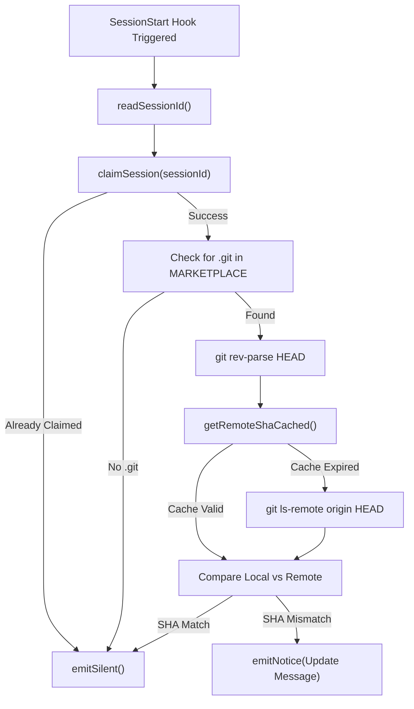
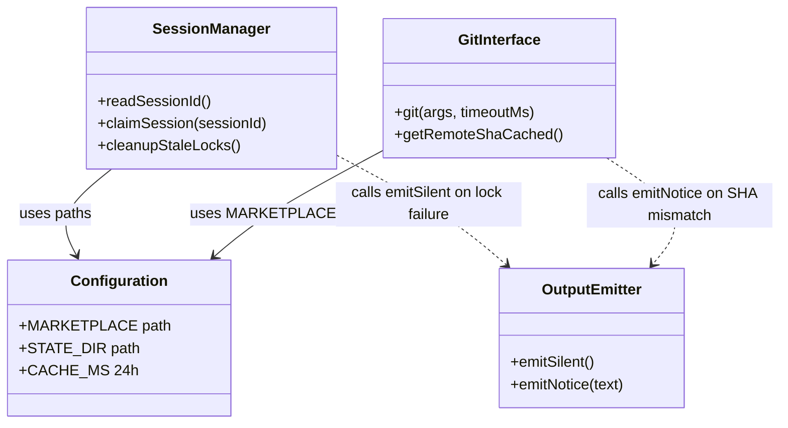

# Update Notifier Hook

Relevant source files

The following files were used as context for generating this wiki page:

- [setup/gptaku-update-check.cjs](setup/gptaku-update-check.cjs)

The Update Notifier Hook is a specialized `SessionStart` lifecycle hook implemented in `gptaku-update-check.cjs`. It ensures that users are notified when the `gptaku-plugins` marketplace (which contains `insane-search`) has updates available on the remote repository. To prevent performance degradation and redundant notifications across multiple plugins, it employs a 24-hour network cache and a per-session exclusive locking mechanism.

## Overview and Purpose

When Claude Code starts a new session, it executes configured hooks. `gptaku-update-check.cjs` is designed to run at the start of every session to check if the local marketplace installation is out of sync with the upstream repository [setup/gptaku-update-check.cjs:3-12]().

Key design constraints include:
- **Non-blocking Execution**: The hook must never break a session; it always exits with code `0` and valid JSON [setup/gptaku-update-check.cjs:14-14]().
- **Deduplication**: If multiple gptaku plugins are installed, only the first one to fire performs the check [setup/gptaku-update-check.cjs:11-12]().
- **Efficiency**: Expensive network operations (`git ls-remote`) are throttled via a 24-hour cache [setup/gptaku-update-check.cjs:29-30]().

### Data Flow: Update Detection Logic

The following diagram illustrates the logical flow from session initiation to the final output.

**Update Check Decision Flow**

Sources: [setup/gptaku-update-check.cjs:113-142]()

## Key Implementation Details

### Session Locking and Deduplication
Because `gptaku-update-check.cjs` is shared across all plugins in the `gptaku-plugins` ecosystem, multiple plugins might attempt to run the check simultaneously at session start. The `claimSession` function uses atomic file creation to ensure exclusivity.

- **Mechanism**: It attempts to write a lock file at `~/.claude/.gptaku-update/session-[ID].lock` using the `wx` flag (atomic exclusive create) [setup/gptaku-update-check.cjs:69-71]().
- **Cleanup**: During a successful claim, the hook also triggers `cleanupStaleLocks()`, which removes lock files older than 24 hours [setup/gptaku-update-check.cjs:80-89]().

### Caching Strategy
To avoid hitting GitHub/GitLab on every single session start, the remote SHA is cached.

- **Cache Location**: `~/.claude/.gptaku-update/check-cache.json` [setup/gptaku-update-check.cjs:29-29]().
- **TTL**: 24 hours (`24 * 60 * 60 * 1000` ms) [setup/gptaku-update-check.cjs:30-30]().
- **Network Operation**: If the cache is missing or expired, it executes `git ls-remote origin HEAD` with a 2.5-second timeout [setup/gptaku-update-check.cjs:101-104]().

### Output Protocol
The hook communicates with Claude Code via standard output using a specific JSON protocol.

| Function | Output JSON | Purpose |
| :--- | :--- | :--- |
| `emitSilent()` | `{"continue": true, "suppressOutput": true}` | Silently continues the session without showing any hook output [setup/gptaku-update-check.cjs:32-35](). |
| `emitNotice(text)` | `{"continue": true, "hookSpecificOutput": {...}}` | Displays a formatted notice to the user within the Claude interface [setup/gptaku-update-check.cjs:37-43](). |

Sources: [setup/gptaku-update-check.cjs:32-43]()

## Code Entity Map

The following diagram maps the logical components of the update process to the specific functions and constants defined in the script.

**Code Entity Relationship Map**

Sources: [setup/gptaku-update-check.cjs:20-111]()

## System Paths and Environment

The hook relies on specific directory structures within the user's home directory to persist state and locate the plugin marketplace.

| Variable/Path | Value / Resolution | Description |
| :--- | :--- | :--- |
| `CONFIG_DIR` | `process.env.CLAUDE_CONFIG_DIR` or `~/.claude` | Base directory for Claude Code configuration [setup/gptaku-update-check.cjs:26-26](). |
| `MARKETPLACE` | `CONFIG_DIR/plugins/marketplaces/gptaku-plugins` | Location where the git-based marketplace is cloned [setup/gptaku-update-check.cjs:27-27](). |
| `STATE_DIR` | `CONFIG_DIR/.gptaku-update` | Directory for lock files and the remote SHA cache [setup/gptaku-update-check.cjs:28-28](). |

Sources: [setup/gptaku-update-check.cjs:25-30]()
