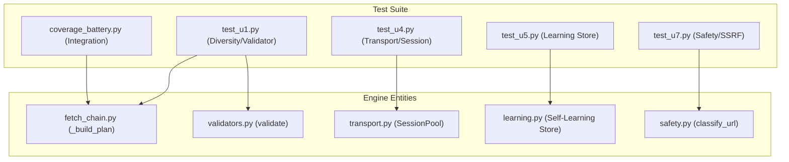

# Testing

<details>
<summary>Relevant source files</summary>

The following files were used as context for generating this wiki page:

- [skills/insane-search/engine/__init__.py](skills/insane-search/engine/__init__.py)
- [skills/insane-search/engine/learning.py](skills/insane-search/engine/learning.py)
- [skills/insane-search/engine/templates/.gitignore](skills/insane-search/engine/templates/.gitignore)
- [skills/insane-search/engine/templates/package.json](skills/insane-search/engine/templates/package.json)
- [skills/insane-search/engine/tests/test_smoke.py](skills/insane-search/engine/tests/test_smoke.py)
- [skills/insane-search/engine/tests/test_u1.py](skills/insane-search/engine/tests/test_u1.py)
- [skills/insane-search/engine/tests/test_u4.py](skills/insane-search/engine/tests/test_u4.py)
- [skills/insane-search/engine/tests/test_u5.py](skills/insane-search/engine/tests/test_u5.py)
- [skills/insane-search/engine/tests/test_u7.py](skills/insane-search/engine/tests/test_u7.py)
- [skills/insane-search/engine/url_transforms.py](skills/insane-search/engine/url_transforms.py)
- [skills/insane-search/engine/validators.py](skills/insane-search/engine/validators.py)
- [skills/insane-search/tests/coverage_battery.py](skills/insane-search/tests/coverage_battery.py)

</details>


The `insane-search` test suite is designed to ensure the reliability of the fetch engine's adaptive escalation logic and the continued validity of platform-specific retrieval techniques. The suite is split between deterministic unit tests in `engine/tests/` and a live integration "coverage battery" in `tests/`.

The testing philosophy emphasizes:
1.  **Deterministic Engine Logic**: Verifying that the grid scheduler and response validator behave correctly without needing a network.
2.  **Live Platform Verification**: Proving that the public-access routes for sites like Reddit, X, and YouTube remain functional despite platform changes.
3.  **Safety & Bias Compliance**: Automated linting to enforce the "No-Site-Name Rule" and SSRF protections.

### Test Suite Architecture

The following diagram illustrates the relationship between the test components and the core engine entities they exercise.

**Test-to-Engine Mapping**

Sources: [skills/insane-search/engine/tests/test_u1.py:1-10](), [skills/insane-search/engine/tests/test_u5.py:1-6](), [skills/insane-search/tests/coverage_battery.py:1-22]()

---

## Unit Tests

Unit tests (U1 through U7) provide high-speed, mostly network-free verification of the engine's internal state machines. These tests lock in fixes for critical behaviors such as grid diversity and WAF detection accuracy.

*   **Grid & Validator (U1)**: Validates that `_build_plan` correctly rotates TLS families and URL transforms under a budget [skills/insane-search/engine/tests/test_u1.py:52-62](). It also ensures the `validate` function correctly handles ambiguous states like unresolved Akamai `_abck` cookies [skills/insane-search/engine/tests/test_u1.py:98-103]().
*   **Transport & Sessions (U4)**: Exercises the `SessionPool` for host-based session reuse and the browser-to-curl cookie bridge [skills/insane-search/engine/tests/test_u4.py:26-37]().
*   **Self-Learning (U5)**: Tests the persistence, TTL pruning, and strike-based eviction of the `learning.py` store [skills/insane-search/engine/tests/test_u5.py:66-74]().
*   **Safety & SSRF (U7)**: Confirms that `classify_url` blocks loopback, private IPs, and malicious redirects [skills/insane-search/engine/tests/test_u7.py:18-34]().

For details, see [Unit Tests](#7.1).

**Sources:** [skills/insane-search/engine/tests/test_u1.py:1-10](), [skills/insane-search/engine/tests/test_u4.py:1-6](), [skills/insane-search/engine/tests/test_u5.py:1-6](), [skills/insane-search/engine/tests/test_u7.py:1-5]()

---

## Coverage Battery & Integration Tests

The Coverage Battery (`coverage_battery.py`) is a live integration suite that serves as an "evidence artifact" for the tool's retrieval capabilities. Unlike the engine unit tests, this battery is permitted to use site-specific names to verify that the retrieval patterns documented in `SKILL.md` haven't rotted.

| Platform | Methods Tested | Source Entity |
| :--- | :--- | :--- |
| **Reddit** | RSS, JSON (iPhone UA), JSON (curl_cffi) | `reddit_routes` |
| **X (Twitter)** | Syndication, Tweet-Result, oEmbed | `x_routes` |
| **YouTube** | yt-dlp metadata extraction | `youtube_routes` |
| **Hacker News** | Firebase API, Algolia API | `hn_routes` |

The battery captures the status code, byte size, and a content sample for every route, providing a clear PASS/FAIL report across the entire platform matrix [skills/insane-search/tests/coverage_battery.py:35-44]().

For details, see [Coverage Battery & Integration Tests](#7.2).

**Sources:** [skills/insane-search/tests/coverage_battery.py:67-142](), [skills/insane-search/engine/tests/test_smoke.py:96-110]()

---

## Smoke Tests & Linting

Beyond unit and integration tests, the codebase utilizes smoke tests and specialized linters to maintain architectural integrity.

### Smoke Tests
The `test_smoke.py` file performs benign online checks against `example.com` and `httpbin.org` to verify the end-to-end "shape" of a fetch trace, ensuring that metadata is correctly populated even on failed attempts [skills/insane-search/engine/tests/test_smoke.py:112-119]().

### Bias Check (Linter)
The `bias_check.py` script (exercised in CI) enforces the **No-Site-Name Rule**. It scans the `engine/` directory for hardcoded brand substrings or site-specific URL patterns, ensuring that the engine remains a generic WAF-bypass grid while site-specific knowledge is relegated to `references/` or Phase 0 [skills/insane-search/engine/tests/test_u1.py:7-8]().

**Validator Logic Flow (Unit Tested)**
```mermaid
graph TD
    "Response" --> H["HARD Markers?"]
    H -- "Yes" --> "Verdict.CHALLENGE"
    H -- "No" --> S["Status Code?"]
    S -- "429" --> "Verdict.RATE_LIMITED"
    S -- "401/404" --> "Verdict.AUTH/NOT_FOUND"
    S -- "200" --> JSON["Is JSON?"]
    JSON -- "Yes" --> "Verdict.WEAK_OK"
    JSON -- "No" --> SEL["Selector Match?"]
    SEL -- "Yes" --> "Verdict.STRONG_OK"
    SEL -- "No" --> SIZE["Small Body?"]
    SIZE -- "Yes" --> "Verdict.CHALLENGE"
    SIZE -- "No" --> "Verdict.WEAK_OK"
```
Sources: [skills/insane-search/engine/validators.py:69-81](), [skills/insane-search/engine/tests/test_u1.py:89-165]()
