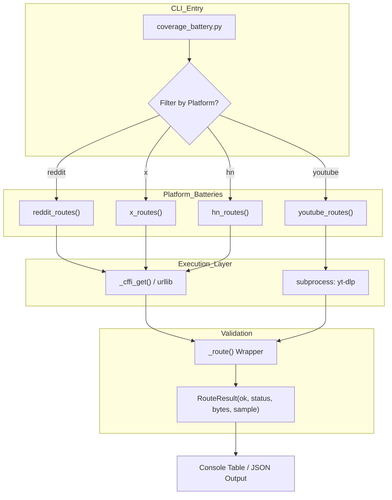

# Coverage Battery & Integration Tests

Relevant source files

The following files were used as context for generating this wiki page:

- [skills/insane-search/tests/coverage_battery.py](skills/insane-search/tests/coverage_battery.py)

The **Coverage Battery** is a network-live testing suite designed to verify the viability of specific retrieval routes for high-traffic platforms. While the core engine provides a generic WAF-evasion grid, many platforms (e.g., X/Twitter, Reddit, YouTube) offer official or semi-official public endpoints that are more reliable than scraping but prone to silent "rotting" (API changes or new blocks).

This suite serves as an evidence artifact to ensure that the Phase 0 platform-specific logic documented in the system remains functional and that no route has degraded over time [skills/insane-search/tests/coverage_battery.py:6-13]().

## Purpose and Scope

The `coverage_battery.py` script exercises end-to-end fetch scenarios. Unlike unit tests, these are **integration tests** that require an active internet connection and valid external dependencies like `curl_cffi` and `yt-dlp` [skills/insane-search/tests/coverage_battery.py:15-17]().

### Key Objectives
1.  **Detect Route Rot:** Catch when a previously working endpoint (like Reddit's `.json` feed) begins returning 403 or 429 errors [skills/insane-search/tests/coverage_battery.py:8-13]().
2.  **Verify Multi-Phase Coverage:** Ensure that for a single platform (e.g., X/Twitter), all available methods—syndication, oEmbed, and CDN-based JSON—are tested [skills/insane-search/tests/coverage_battery.py:101-129]().
3.  **Validate Skill Examples:** The script tests the exact `urllib` or `curl_cffi` snippets provided to the LLM in `SKILL.md` to ensure the agent is receiving working code [skills/insane-search/tests/coverage_battery.py:76-87]().

## System Architecture: Test Flow

The battery bypasses the standard `fetch_chain.py` logic to test the raw underlying endpoints directly. This allows developers to isolate whether a failure is due to the platform's API changing or the engine's scheduling logic.

### Natural Language to Code Entity Mapping

| System Concept | Code Entity | File Path |
| :--- | :--- | :--- |
| **Result Schema** | `RouteResult` (dataclass) | [skills/insane-search/tests/coverage_battery.py:35-44]() |
| **Media Extraction** | `youtube_routes` / `yt-dlp` | [skills/insane-search/tests/coverage_battery.py:132-142]() |
| **RSS/JSON Probes** | `reddit_routes` | [skills/insane-search/tests/coverage_battery.py:67-98]() |
| **Syndication/oEmbed** | `x_routes` | [skills/insane-search/tests/coverage_battery.py:101-129]() |
| **Search/API Probes** | `hn_routes` (Algolia/Firebase) | [skills/insane-search/tests/coverage_battery.py:145-155]() |

### Coverage Execution Flow

The following diagram illustrates how the `coverage_battery.py` orchestrates tests across different network protocols and platform handlers.

"Coverage Battery Execution Logic"

**Sources:** [skills/insane-search/tests/coverage_battery.py:19-31](), [skills/insane-search/tests/coverage_battery.py:56-63]().

## Key Functions & Implementation

### Result Tracking: `RouteResult`
Every test attempt returns a `RouteResult` object, which captures:
*   `ok`: Boolean indicating if the data was successfully retrieved and validated (e.g., contains expected JSON keys or HTML tags) [skills/insane-search/tests/coverage_battery.py:39]().
*   `status`: The HTTP status code returned [skills/insane-search/tests/coverage_battery.py:40]().
*   `sample`: A small snippet of the retrieved content for visual confirmation [skills/insane-search/tests/coverage_battery.py:42]().
*   `elapsed_s`: Latency of the request [skills/insane-search/tests/coverage_battery.py:44]().

### Transport: `_cffi_get`
The battery primarily uses `curl_cffi` to mimic browser TLS fingerprints, which is the same transport used in the main engine's Phase 2 [skills/insane-search/tests/coverage_battery.py:50-53](). It also includes tests using standard `urllib` to verify "lightweight" Phase 1 scenarios [skills/insane-search/tests/coverage_battery.py:77-81]().

### Platform Implementation Details

| Platform | Methods Tested | Validation Logic |
| :--- | :--- | :--- |
| **Reddit** | RSS, JSON (iPhone UA), JSON (CFFI) | Checks for `<title>` tags in RSS or `{` start in JSON [skills/insane-search/tests/coverage_battery.py:70-93](). |
| **X (Twitter)** | Syndication, Tweet-Result, oEmbed | Searches for `__NEXT_DATA__` or specific JSON keys like `text` [skills/insane-search/tests/coverage_battery.py:104-124](). |
| **YouTube** | `yt-dlp --dump-json` | Validates JSON parseability and presence of `subtitles` [skills/insane-search/tests/coverage_battery.py:133-141](). |
| **Hacker News** | Firebase, Algolia | Checks for array starts `[` and hit counts [skills/insane-search/tests/coverage_battery.py:146-155](). |

**Sources:** [skills/insane-search/tests/coverage_battery.py:67-155]().

## Running the Battery

The battery supports three modes of operation:
1.  **Full Suite:** Runs every platform defined in the script.
    `python3 tests/coverage_battery.py` [skills/insane-search/tests/coverage_battery.py:19]().
2.  **Targeted Test:** Runs only specified platforms.
    `python3 tests/coverage_battery.py reddit x` [skills/insane-search/tests/coverage_battery.py:20]().
3.  **Machine Readable:** Outputs results in JSON format for CI/CD integration.
    `python3 tests/coverage_battery.py --json` [skills/insane-search/tests/coverage_battery.py:21]().

## Adding New Platform Coverage

To add a new platform to the coverage battery, follow this pattern:

1.  **Define a Route Function:** Create a function (e.g., `github_routes()`) that returns a `list[RouteResult]` [skills/insane-search/tests/coverage_battery.py:67]().
2.  **Implement Sub-Routes:** Use the `_route` wrapper to execute different retrieval strategies (e.g., API vs. Web Scrape) [skills/insane-search/tests/coverage_battery.py:56-63]().
3.  **Add Validation:** Ensure the `ok` flag is only set if the content is actually useful (e.g., check for specific JSON fields or non-empty HTML bodies) [skills/insane-search/tests/coverage_battery.py:113-114]().
4.  **Register in Main:** Append the new function to the execution list in the `main()` block of the script.

**Sources:** [skills/insane-search/tests/coverage_battery.py:56-155]().
