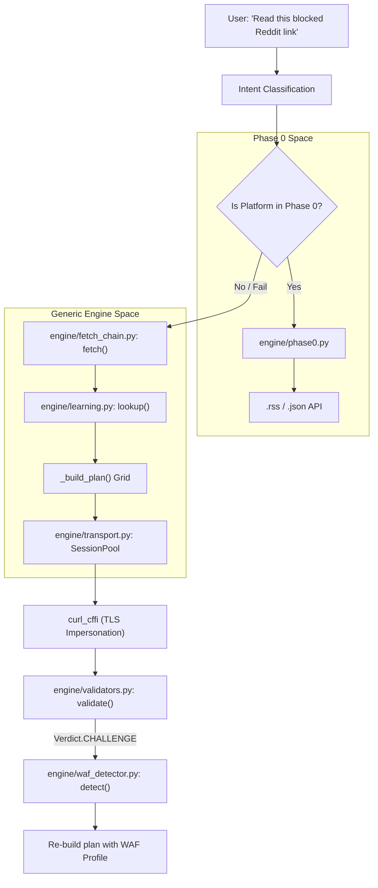
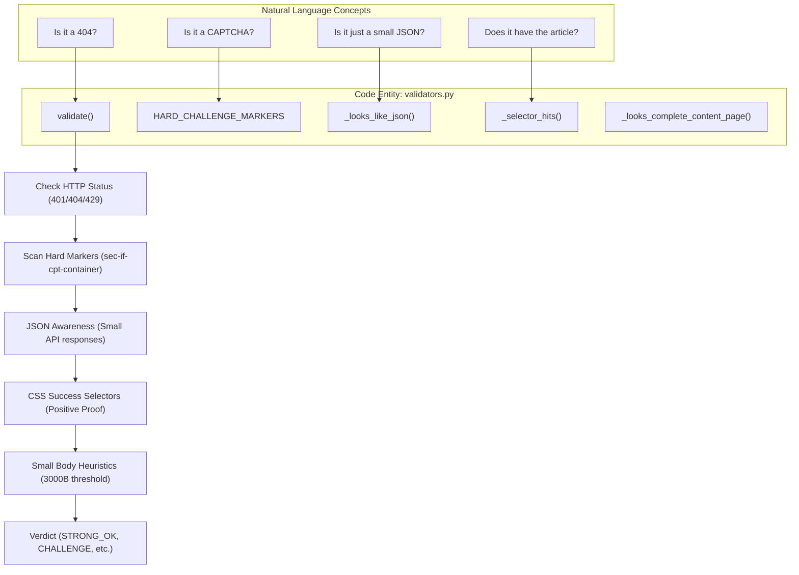

# Glossary

Relevant source files

The following files were used as context for generating this wiki page:

- [CHANGELOG.md](CHANGELOG.md)
- [skills/insane-search/SKILL.md](skills/insane-search/SKILL.md)
- [skills/insane-search/engine/bias_check.py](skills/insane-search/engine/bias_check.py)
- [skills/insane-search/engine/fetch_chain.py](skills/insane-search/engine/fetch_chain.py)
- [skills/insane-search/engine/learning.py](skills/insane-search/engine/learning.py)
- [skills/insane-search/engine/safety.py](skills/insane-search/engine/safety.py)
- [skills/insane-search/engine/tests/test_u1.py](skills/insane-search/engine/tests/test_u1.py)
- [skills/insane-search/engine/tests/test_u5.py](skills/insane-search/engine/tests/test_u5.py)
- [skills/insane-search/engine/transport.py](skills/insane-search/engine/transport.py)
- [skills/insane-search/engine/validators.py](skills/insane-search/engine/validators.py)
- [skills/insane-search/engine/waf_profiles.yaml](skills/insane-search/engine/waf_profiles.yaml)
- [skills/insane-search/references/fallback.md](skills/insane-search/references/fallback.md)
- [skills/insane-search/references/tls-impersonate.md](skills/insane-search/references/tls-impersonate.md)

This page defines the technical terms, abbreviations, and domain-specific concepts used throughout the `insane-search` codebase. It serves as a reference for onboarding engineers to understand the internal language and implementation mechanics of the bypass engine.

## Core Concepts & Terms

### No-Site-Name Rule (R3)
A strict architectural constraint enforced by `bias_check.py` [skills/insane-search/engine/bias_check.py:1-11](). It mandates that the generic fetch engine must remain domain-agnostic. No site-specific logic, CSS selectors, or brand names are allowed in the core engine files (except `phase0.py`). This prevents the engine from rotting as site structures change and ensures the bypass logic remains general-purpose.

### Phase 0→3 Escalation
The adaptive pipeline used to retrieve content by escalating through increasingly heavy methods.
*   **Phase 0**: Official public endpoints (RSS, JSON, oEmbed) [skills/insane-search/engine/phase0.py:42-45]().
*   **Phase 1**: Lightweight probes using standard `curl_cffi` or Jina Reader.
*   **Phase 2**: TLS Impersonation grid using `curl_cffi` families [skills/insane-search/engine/fetch_chain.py:185-192]().
*   **Phase 3**: Headless browser execution (Playwright) [skills/insane-search/references/fallback.md:106-115]().

### The Diversity Grid
The core scheduling logic in `_build_plan` [skills/insane-search/engine/fetch_chain.py:174-181]() that materializes a matrix of `(TLS Family × URL Transform × Referer Strategy)`. It ensures that even with a small attempt budget, the engine touches diverse bypass categories instead of exhausting attempts on a single failing strategy [skills/insane-search/engine/fetch_chain.py:13-17]().

### TLS Impersonation (JA3/JA4)
A technique where `curl_cffi` mimics the TLS handshake signature (fingerprint) of a real browser to bypass WAFs that block non-browser clients [skills/insane-search/references/tls-impersonate.md:3-5]().

---

## Technical Definitions Table

| Term | Definition | Code Pointer |
|:---|:---|:---|
| **`_abck`** | A critical Akamai Bot Manager cookie. If it contains `~-1~`, it is "unresolved" (flagged as bot) [skills/insane-search/engine/validators.py:120-122](). | `validators.py` |
| **`cf_clearance`** | A Cloudflare cookie issued after a user passes a JS challenge. Bridged from Playwright back to the Session Pool [skills/insane-search/engine/transport.py:9-12](). | `transport.py` |
| **`Verdict`** | An Enum classifying the result of a fetch (e.g., `STRONG_OK`, `CHALLENGE`, `SUSPECT_OK`) [skills/insane-search/engine/validators.py:69-80](). | `validators.py` |
| **`Transform`** | A domain-agnostic URL mutation, such as `mobile_subdomain` (adding `m.`) or `am_prefix` [skills/insane-search/engine/url_transforms.py:42-43](). | `url_transforms.py` |
| **`SessionPool`** | A thread-safe cache of `curl_cffi` sessions keyed by `(host, impersonate)` to maintain cookies and warm connections [skills/insane-search/engine/transport.py:43-46](). | `transport.py` |
| **`SSRF Guard`** | Safety logic in `classify_url` that prevents fetching private/internal IPs, including DNS-rebinding defense [skills/insane-search/engine/safety.py:37-39](). | `safety.py` |
| **`Self-Learning`** | Persistence of successful routes in `learned.json` to prioritize them on subsequent visits to the same host [skills/insane-search/engine/learning.py:1-6](). | `learning.py` |

---

## Data Flow & System Interaction

The following diagram illustrates how a request moves from a Natural Language intent into the code entities that execute the fetch.

### From Intent to Execution
Title: Intent to Code Entity Mapping

Sources: [skills/insane-search/SKILL.md:95-101](), [skills/insane-search/engine/fetch_chain.py:3-9](), [skills/insane-search/engine/phase0.py:42-45](), [skills/insane-search/engine/learning.py:122-125]()

---

## Validation & Detection Logic

The engine uses a multi-layered validation system to determine if a response is "real" content or a WAF block page.

### Response Validation Pipeline
Title: Validation Flow (Natural Language to Validator v2)

Sources: [skills/insane-search/engine/validators.py:1-23](), [skills/insane-search/engine/validators.py:40-50](), [skills/insane-search/engine/validators.py:159-171](), [skills/insane-search/engine/validators.py:192-198]()

---

## Glossary of Key Code Symbols

### `FetchResult`
The unified return object from the engine.
*   `ok`: Boolean indicating terminal success (`STRONG_OK` or `WEAK_OK`) [skills/insane-search/engine/fetch_chain.py:85-86]().
*   `trace`: A list of `Attempt` objects documenting every TLS/URL combination tried [skills/insane-search/engine/fetch_chain.py:90]().
*   `untried_routes`: If `ok=False`, this lists strategies the engine didn't get to, signalling the agent to continue (R6) [skills/insane-search/engine/fetch_chain.py:99]().

### `WAF Profile`
Defined in `waf_profiles.yaml`. It contains vendor-specific instructions:
*   `capabilities_needed`: Tags like `needs_real_tls_stack` (triggers Playwright) [skills/insane-search/engine/fetch_chain.py:227-230]().
*   `tls_impersonate_avoid`: Fingerprints known to be blocked by that specific WAF [skills/insane-search/engine/fetch_chain.py:18-19]().

### `Strike-based Eviction`
A policy in `learning.py` where a learned route is deleted from `learned.json` only after `EVICT_AFTER_FAILS` (default: 2) consecutive real blocks (`CHALLENGE`, `BLOCKED`). Transient errors like `429` do not count as strikes [skills/insane-search/engine/learning.py:32-37]().

Sources: [skills/insane-search/engine/fetch_chain.py:83-117](), [skills/insane-search/engine/learning.py:32-37](), [skills/insane-search/engine/validators.py:69-80]()
