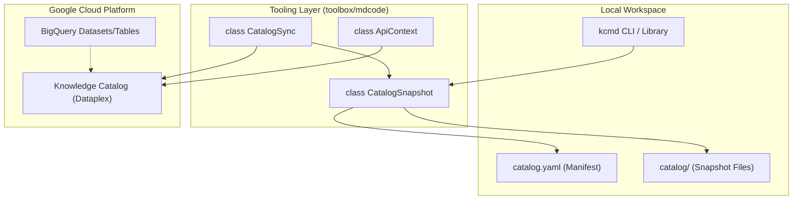
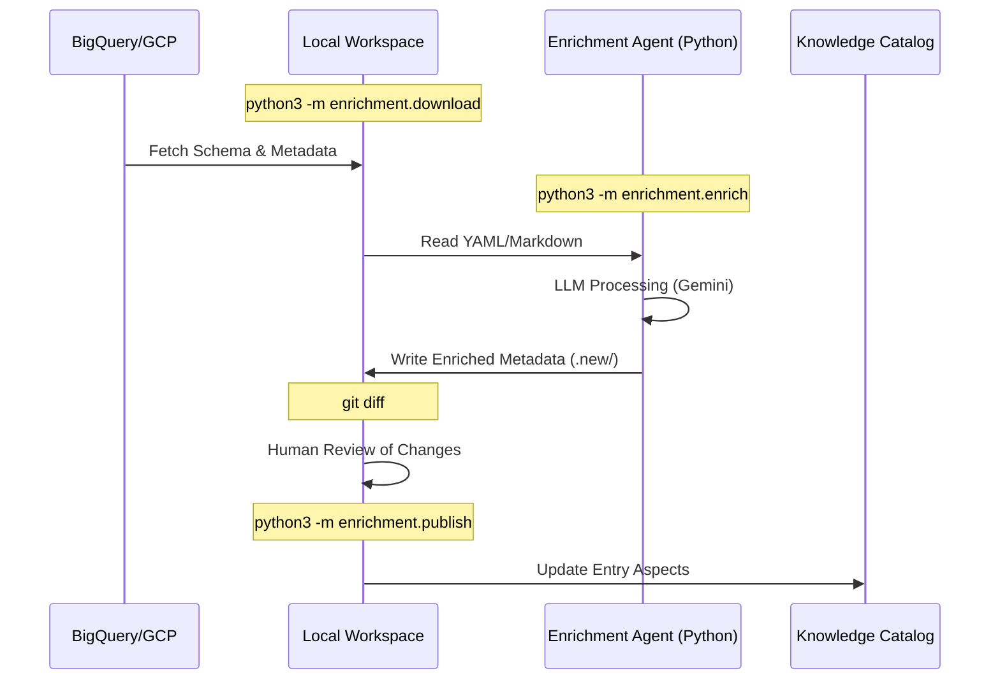

# Repository Structure and Getting Started

<details>
<summary>Relevant source files</summary>

The following files were used as context for generating this wiki page:

- [CODE_OF_CONDUCT.md](CODE_OF_CONDUCT.md)
- [CONTRIBUTING.md](CONTRIBUTING.md)
- [LICENSE.md](LICENSE.md)
- [README.md](README.md)
- [samples/README.md](samples/README.md)
- [samples/enrichment/README.md](samples/enrichment/README.md)
- [toolbox/README.md](toolbox/README.md)
- [toolbox/mdcode/src/libts/gcp/context.ts](toolbox/mdcode/src/libts/gcp/context.ts)
- [toolbox/mdcode/src/libts/tsconfig.json](toolbox/mdcode/src/libts/tsconfig.json)

</details>


The Knowledge Catalog repository provides a comprehensive suite of tools, agents, and samples designed for AI-powered metadata management and context engineering. At its core, it enables a **Metadata as Code (MaC)** workflow, allowing data stewards and AI agents to manage Google Cloud Dataplex (Knowledge Catalog) resources using source-controlled artifacts like YAML and Markdown [README.md:1-5]().

## Repository Layout

The repository is organized into four primary functional areas:

| Directory | Component | Description |
| :--- | :--- | :--- |
| `toolbox/` | **Core Tooling** | Contains the TypeScript-based `kcmd` CLI and library for bi-directional metadata synchronization [toolbox/README.md:5-8](). |
| `agents/` | **Enrichment Agents** | Houses Python and TypeScript agents that use LLMs to automatically generate and improve metadata [toolbox/README.md:9-12](). |
| `okf/` | **Open Knowledge Format** | Reference implementations and specifications for a vendor-neutral metadata exchange format. |
| `samples/` | **Demos & Examples** | End-to-end workflows demonstrating discovery and enrichment scenarios [samples/README.md:1-15](). |

### Logical Component Relationship

The following diagram illustrates how the core components interact to manage metadata between local environments and Google Cloud.

**System Architecture and Code Entity Mapping**

**Sources:** [toolbox/README.md:5-8](), [toolbox/mdcode/src/libts/gcp/context.ts:10-42]()

---

## Prerequisites and Authentication

### Software Requirements
* **Node.js**: Required for `toolbox/` components. The TypeScript library is configured for `es2022` with `nodenext` module resolution [toolbox/mdcode/src/libts/tsconfig.json:1-15]().
* **Python 3.x**: Required for `agents/enrichment`, `okf/`, and Python samples [samples/enrichment/README.md:41-45]().
* **Google Cloud SDK (gcloud)**: Essential for authentication and project configuration.

### Authentication Setup
The tools rely on Application Default Credentials (ADC) and the `gcloud` configuration to interact with GCP APIs. The `ApiContext` class in the TypeScript library programmatically invokes `gcloud` commands to retrieve tokens and project IDs [toolbox/mdcode/src/libts/gcp/context.ts:6-10]().

Specifically, `ApiContext.default()` executes the following commands to initialize the environment:
* `gcloud -q config get-value project` [toolbox/mdcode/src/libts/gcp/context.ts:6-34]()
* `gcloud -q config get-value compute/region` [toolbox/mdcode/src/libts/gcp/context.ts:7-35]()
* `gcloud -q auth application-default print-access-token` [toolbox/mdcode/src/libts/gcp/context.ts:8-36]()

Run the following commands to prepare your environment:
```bash
# Set your active project
export CLOUD_PROJECT=<your-project-id>
gcloud config set core/project $CLOUD_PROJECT

# Authenticate for API access
gcloud auth application-default login
gcloud auth application-default set-quota-project $CLOUD_PROJECT
```
**Sources:** [samples/enrichment/README.md:33-39](), [toolbox/mdcode/src/libts/gcp/context.ts:31-42]()

---

## Getting Started with kcmd (Toolbox)

The `kcmd` tool is the primary interface for managing metadata snapshots as code [toolbox/README.md:5-7]().

### 1. Installation and Build
Navigate to the `toolbox/mdcode` directory to install dependencies and compile the tool. The TypeScript configuration outputs compiled code to `toolbox/build/ts/kcmd` [toolbox/mdcode/src/libts/tsconfig.json:3-3]().

### 2. Synchronization Workflow
The `kcmd` tool provides a bi-directional sync workflow:
* **Pull**: Downloads the latest metadata from Dataplex into local YAML/Markdown files.
* **Push**: Uploads local changes back to the Knowledge Catalog service.

---

## Getting Started with Enrichment Agents

The enrichment agents provide an automated way to populate the metadata managed by `kcmd` [toolbox/README.md:9-12]().

### Enrichment Workflow
The typical lifecycle involves downloading state, running the agent to generate documentation, and then publishing the results [samples/enrichment/README.md:56-89]().

**Enrichment Data Flow**

**Sources:** [samples/enrichment/README.md:60-89](), [toolbox/README.md:9-13]()

### Running the Python Sample
The sample includes a utility to create dummy data for testing the enrichment flow [samples/enrichment/README.md:47-54]().

```bash
cd samples/enrichment/src
source env.sh --install

# 1. Setup sample data
python3 ../sample/data/create_data.py

# 2. Download current state
python3 -m enrichment.download \
  --dir ../sample/metadata.initial \
  --dataset ${KC_ENRICH_SAMPLE_PROJECT}.kc_enrich_sample_data

# 3. Generate enrichment
python3 -m enrichment.enrich \
  --dir ../sample/metadata.initial \
  --output-dir ../sample/metadata.new \
  --config-dir ../sample/config

# 4. Review and Publish
git diff --no-index ../sample/metadata.initial ../sample/metadata.new
python3 -m enrichment.publish --dir ../sample/metadata.new
```
**Sources:** [samples/enrichment/README.md:41-89]()

## Contributing
Contributions must be accompanied by a Contributor License Agreement (CLA) [CONTRIBUTING.md:15-21](). All submissions require code review via GitHub pull requests [CONTRIBUTING.md:27-32](). Developers should ensure code adheres to existing styles and passes unit tests (e.g., `npm run test` in TypeScript directories) [CONTRIBUTING.md:10-12]().

**Sources:** [CONTRIBUTING.md:1-32]()
