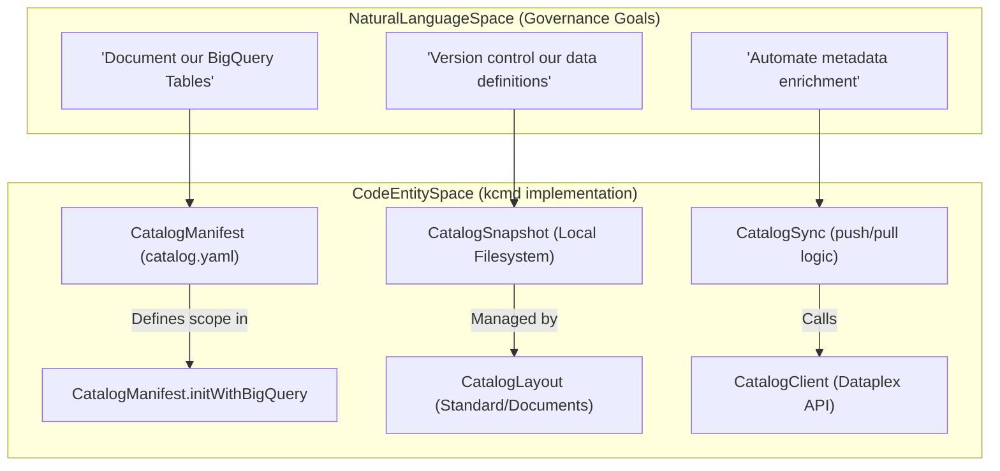
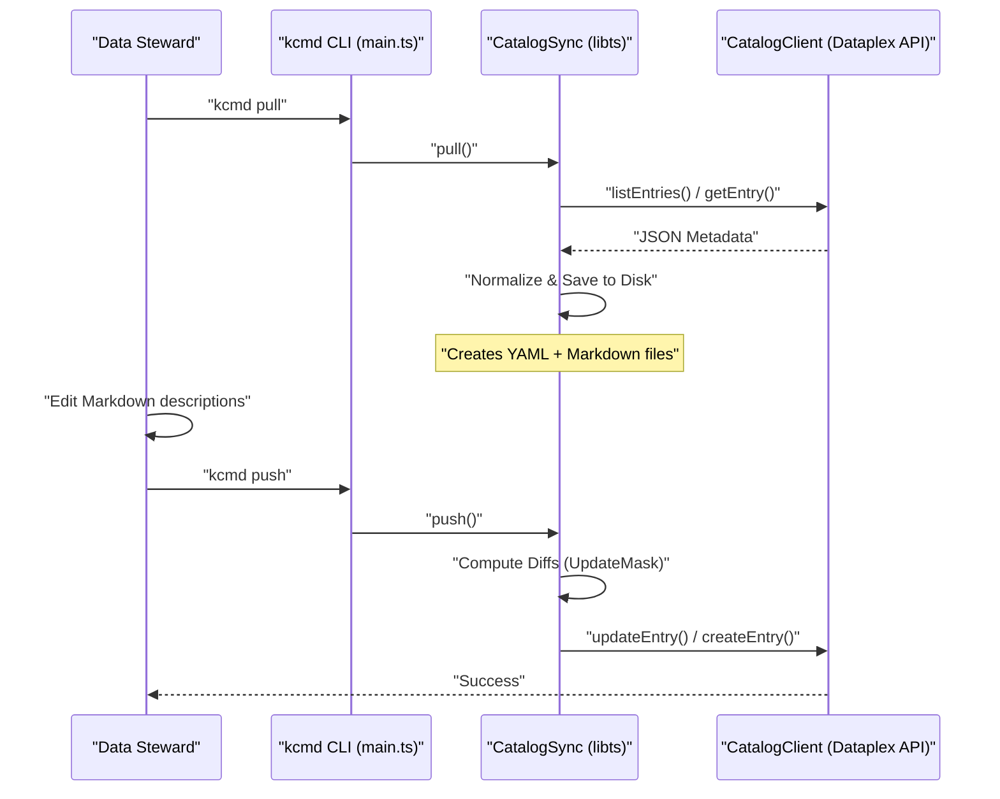

# Core Concepts: Metadata as Code and Knowledge Catalog

Relevant source files

The following files were used as context for generating this wiki page:

- [toolbox/mdcode/README.md](toolbox/mdcode/README.md)
- [toolbox/mdcode/docs/concept.md](toolbox/mdcode/docs/concept.md)
- [toolbox/mdcode/docs/design.md](toolbox/mdcode/docs/design.md)
- [toolbox/mdcode/docs/plan.md](toolbox/mdcode/docs/plan.md)
- [toolbox/mdcode/docs/spec.md](toolbox/mdcode/docs/spec.md)
- [toolbox/mdcode/package-lock.json](toolbox/mdcode/package-lock.json)
- [toolbox/mdcode/package.json](toolbox/mdcode/package.json)
- [toolbox/mdcode/src/tool/commands.ts](toolbox/mdcode/src/tool/commands.ts)
- [toolbox/mdcode/src/tool/main.ts](toolbox/mdcode/src/tool/main.ts)

This page explains the foundational concepts of the Knowledge Catalog repository, focusing on the "Metadata as Code" (MaC) philosophy, the underlying Dataplex data model, and how the `kcmd` tool facilitates a modern data governance lifecycle.

## What is Knowledge Catalog?

**Knowledge Catalog** (formerly Dataplex) is a Google Cloud platform designed for AI-powered data cataloging and metadata management [toolbox/mdcode/README.md:1-3](). It creates a dynamic knowledge graph of both structured (e.g., BigQuery tables) and unstructured data to provide semantic context for AI agents [toolbox/mdcode/README.md:3-5]().

### The Data Model: Entries, Aspects, and Types

Knowledge Catalog organizes metadata using a hierarchical and extensible model:

| Component | Description |
| :--- | :--- |
| **Entry** | A fundamental unit representing a data asset (e.g., a table, dataset, or entry group) [toolbox/mdcode/docs/spec.md:21-21](). |
| **Aspect** | A group of related metadata attributes attached to an Entry. Aspects allow for extensibility, enabling both system-defined and user-defined metadata [toolbox/mdcode/docs/spec.md:22-22](). |
| **EntryType / AspectType** | Templates that define the schema and requirements for Entries and Aspects respectively. |
| **EntryLink** | Defines relationships between different Entries, forming the edges of the knowledge graph [toolbox/mdcode/docs/concept.md:20-21](). |
| **EntryGroup** | A logical container for Entries, often aligned with a specific project or business domain [toolbox/mdcode/docs/spec.md:24-24](). |

**Sources:** [toolbox/mdcode/README.md:1-5](), [toolbox/mdcode/docs/concept.md:20-21](), [toolbox/mdcode/docs/spec.md:21-24]()

## Metadata as Code (MaC)

Metadata as Code is a core capability designed to provide data stewards and engineers with a source-code-based experience for metadata management [toolbox/mdcode/docs/concept.md:5-8](). Instead of managing metadata exclusively through a UI, MaC treats metadata as versioned artifacts (YAML and Markdown) within a developer's repository [toolbox/mdcode/docs/concept.md:8-11]().

### Core Tenets of MaC
*   **Human & Agent Readable:** Optimized for both manual review and automated processing by AI agents [toolbox/mdcode/docs/concept.md:30-33]().
*   **Bi-directional Sync:** Supports downloading state from the cloud to local files (`pull`) and publishing local changes back to the service (`push`) [toolbox/mdcode/docs/concept.md:41-44]().
*   **Version Control Integration:** Enables the use of standard Git workflows for diffing, branching, and CI/CD-based deployments of metadata [toolbox/mdcode/docs/concept.md:76-85]().
*   **Unstructured Content Support:** Large text fields in aspects are represented as "sidecar" Markdown files to leverage IDE features like previews [toolbox/mdcode/docs/concept.md:22-24]().

**Sources:** [toolbox/mdcode/docs/concept.md:5-85]()

## The kcmd Workflow

The `kcmd` CLI tool implements the MaC lifecycle. It bridges the gap between the Cloud's "Knowledge Catalog" and the local "Code Entity Space."

### From Natural Language to Code Entities
The following diagram illustrates how high-level governance goals translate into specific code structures within the `kcmd` ecosystem.

**Governance to Code Mapping**

**Sources:** [toolbox/mdcode/src/tool/commands.ts:25-48](), [toolbox/mdcode/src/tool/commands.ts:61-67](), [toolbox/mdcode/docs/concept.md:19-27](), [toolbox/mdcode/docs/design.md:18-25]()

### Data Governance Lifecycle
The standard workflow for managing metadata using `kcmd` follows these steps:

1.  **Initialize (`init`):** Define the scope of metadata (e.g., a BigQuery dataset) in a `catalog.yaml` manifest [toolbox/mdcode/src/tool/main.ts:10-13]().
2.  **Download (`pull`):** Fetch the current state from Dataplex and save it as local YAML/Markdown files [toolbox/mdcode/src/tool/commands.ts:61-70]().
3.  **Enrich:** Use an AI agent or manual editing to update the local files (e.g., adding descriptions or tags) [toolbox/mdcode/docs/concept.md:58-62]().
4.  **Review (`status`):** Use `kcmd status` or standard tools like `git diff` to inspect changes before they go live [toolbox/mdcode/docs/design.md:90-91]().
5.  **Publish (`push`):** Sync the validated local changes back to the Knowledge Catalog service [toolbox/mdcode/src/tool/commands.ts:82-90]().

**System Interaction Diagram**

**Sources:** [toolbox/mdcode/src/tool/main.ts:26-54](), [toolbox/mdcode/src/tool/commands.ts:61-100](), [toolbox/mdcode/docs/design.md:86-91]()

## Key Implementation Classes

| Class | File Path | Role |
| :--- | :--- | :--- |
| `CatalogManifest` | [toolbox/mdcode/src/libts/manifest.ts]() | Handles `catalog.yaml` parsing and initialization [toolbox/mdcode/src/tool/commands.ts:28-30](). |
| `CatalogSnapshot` | [toolbox/mdcode/src/libts/snapshot.ts]() | Manages the local directory structure and file I/O [toolbox/mdcode/src/tool/commands.ts:63-63](). |
| `CatalogSync` | [toolbox/mdcode/src/libts/sync.ts]() | Orchestrates the `pull` and `push` logic, including conflict resolution [toolbox/mdcode/src/tool/commands.ts:66-69](). |
| `CatalogClient` | [toolbox/mdcode/src/libts/gcp/dataplex.ts]() | Wrapper for the Google Cloud Dataplex API [toolbox/mdcode/src/tool/commands.ts:65-65](). |
| `ApiContext` | [toolbox/mdcode/src/libts/gcp/context.ts]() | Manages authentication and project configuration [toolbox/mdcode/src/tool/commands.ts:26-26](). |
| `CatalogLayout` | [toolbox/mdcode/src/libts/layout.ts]() | Abstract class for physical file representation (Standard vs Documents) [toolbox/mdcode/docs/design.md:65-70](). |

**Sources:** [toolbox/mdcode/src/tool/commands.ts:6-9](), [toolbox/mdcode/src/tool/commands.ts:25-100](), [toolbox/mdcode/docs/design.md:18-25]()
