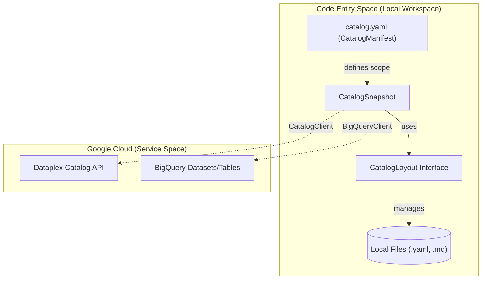
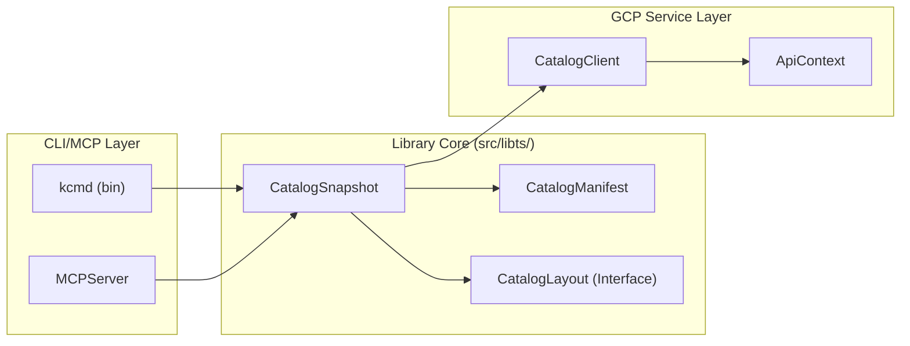

# kcmd: Metadata as Code CLI and Library

Relevant source files

The following files were used as context for generating this wiki page:

- [toolbox/mdcode/README.md](toolbox/mdcode/README.md)
- [toolbox/mdcode/package-lock.json](toolbox/mdcode/package-lock.json)
- [toolbox/mdcode/package.json](toolbox/mdcode/package.json)
- [toolbox/mdcode/src/libts/snapshot.ts](toolbox/mdcode/src/libts/snapshot.ts)

**Metadata as Code** is a core Knowledge Catalog (Dataplex) capability that provides data stewards, producers, and AI agents with a source code artifact-based workflow for metadata management and context engineering [toolbox/mdcode/README.md:3-5](). The `kcmd` tool enables users to author, manage, and enrich metadata artifacts using developer-friendly practices like version control and CI/CD [toolbox/mdcode/README.md:1-5]().

The tool is distributed as a TypeScript library, a Command Line Interface (CLI), and a Model Context Protocol (MCP) server [toolbox/mdcode/README.md:13-14]().

### Core Workflow and Architecture

The system operates on a local workspace containing a `catalog.yaml` manifest and a `catalog/` directory containing the metadata snapshot [toolbox/mdcode/README.md:22-30]().

The diagram below illustrates how `kcmd` bridges the gap between local developer environments (Code Entity Space) and the Google Cloud Dataplex service (Natural Language/Service Space).

**System Architecture: Local Workspace to Dataplex Service**

Sources: [toolbox/mdcode/src/libts/snapshot.ts:14-30](), [toolbox/mdcode/src/libts/snapshot.ts:138-142](), [toolbox/mdcode/README.md:18-30]()

---

### Component Overview

#### CLI and MCP Server
The `kcmd` CLI provides commands to initialize workspaces (`init`), pull metadata from the cloud (`pull`), and push local changes back to the service (`push`) [toolbox/mdcode/README.md:138-166](). It also includes an MCP server implementation, allowing AI agents to interact with the catalog through standardized tools like `modify-entry` or `list-entries` [toolbox/mdcode/README.md:170-194]().
*   For details, see [CLI Commands and MCP Server](#2.1).

#### Catalog Manifest (`catalog.yaml`)
The manifest file, managed by the `CatalogManifest` class, acts as the configuration hub. It defines the `scope` (e.g., a BigQuery dataset), `aliases` for aspect types, and `snapshot`/`publishing` rules for entry and aspect types [toolbox/mdcode/src/libts/snapshot.ts:32-44](), [toolbox/mdcode/README.md:34-58]().
*   For details, see [Catalog Manifest (catalog.yaml)](#2.2).

#### Synchronization Engine (`CatalogSync`)
The synchronization logic handles the bi-directional flow of metadata. During `pull` operations, the system stores Dataplex entries into the local snapshot [toolbox/mdcode/src/libts/snapshot.ts:181-184](). During `push`, it fetches local representations and prepares them for the Dataplex API [toolbox/mdcode/src/libts/snapshot.ts:186-188]().
*   For details, see [Synchronization Engine (CatalogSync)](#2.3).

#### Snapshot and Source Abstractions
The `CatalogSnapshot` class is the central coordinator for local metadata state [toolbox/mdcode/src/libts/snapshot.ts:14-22](). It manages the relationship between the `CatalogManifest` and the underlying `CatalogLayout` [toolbox/mdcode/src/libts/snapshot.ts:24-30](). It also builds a local map of `entryTypes` and `aspectTypes` from the Dataplex service to validate local changes [toolbox/mdcode/src/libts/snapshot.ts:137-176]().
*   For details, see [CatalogSnapshot and Source Abstractions](#2.4).

#### Storage Layouts
Metadata storage is abstracted via the `CatalogLayout` interface [toolbox/mdcode/src/libts/snapshot.ts:22](). The system supports hierarchical organization mirroring resource hierarchies [toolbox/mdcode/README.md:11-12](). Sidecar files (e.g., `.overview.md`) allow long-form content to be managed as Markdown alongside structured YAML metadata [toolbox/mdcode/README.md:82-92]().
*   For details, see [Storage Layouts: Standard and Documents](#2.5).

#### GCP API Client Layer
The library includes a `CatalogClient` for interacting with Dataplex [toolbox/mdcode/src/libts/snapshot.ts:138](). It uses an `ApiContext` to manage authentication, typically relying on `gcloud` credentials in local environments [toolbox/mdcode/README.md:168]().
*   For details, see [GCP API Client Layer](#2.6).

#### Testing Infrastructure
The project uses `bun` for testing [toolbox/mdcode/package.json:18-19](). The test suite includes scenario-based tests and utilizes `memfs` for an in-memory virtual filesystem to validate snapshot and layout operations without disk I/O [toolbox/mdcode/package-lock.json:27]().
*   For details, see [Testing Infrastructure and Scenario Framework](#2.7).

---

### Key Classes and Relationships

The following diagram maps the primary classes in the `kcmd` library to their roles in the Metadata as Code lifecycle.

**Class Map: Library Core to CLI Interface**

Sources: [toolbox/mdcode/src/libts/snapshot.ts:14-30](), [toolbox/mdcode/src/libts/snapshot.ts:138](), [toolbox/mdcode/package.json:6-8]()
