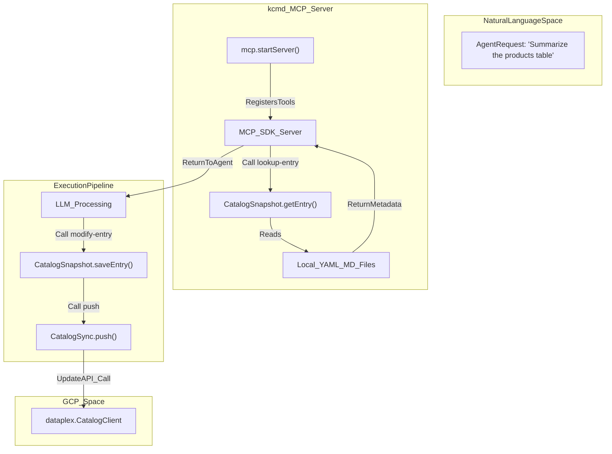
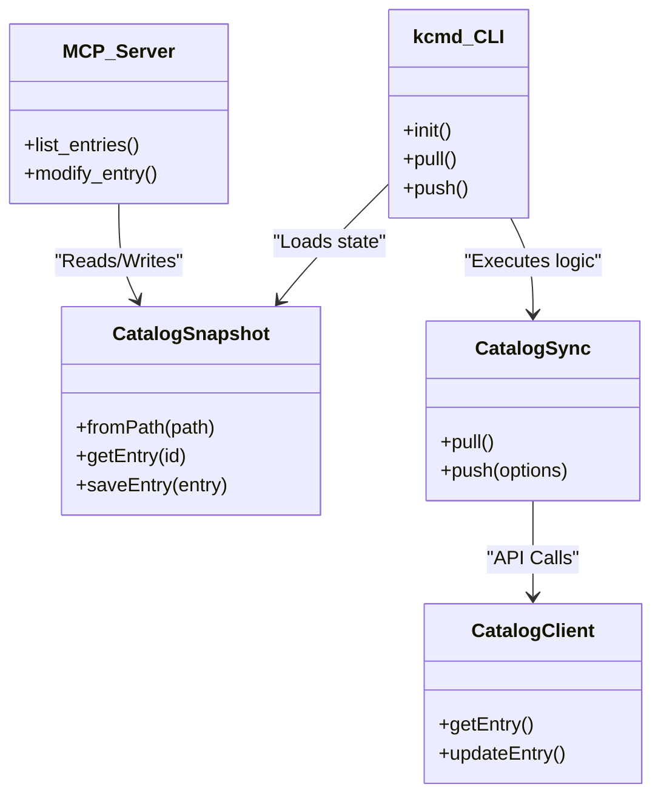

# CLI Commands and MCP Server

Relevant source files

The following files were used as context for generating this wiki page:

- [toolbox/mdcode/README.md](toolbox/mdcode/README.md)
- [toolbox/mdcode/docs/concept.md](toolbox/mdcode/docs/concept.md)
- [toolbox/mdcode/package-lock.json](toolbox/mdcode/package-lock.json)
- [toolbox/mdcode/package.json](toolbox/mdcode/package.json)
- [toolbox/mdcode/src/tool/commands.ts](toolbox/mdcode/src/tool/commands.ts)
- [toolbox/mdcode/src/tool/main.ts](toolbox/mdcode/src/tool/main.ts)

The `kcmd` tool is the primary interface for the Metadata as Code (MaC) workflow. It is distributed as a standalone binary and provides two main modes of operation: a standard Command Line Interface (CLI) for human users and automated pipelines, and a Model Context Protocol (MCP) server that exposes catalog operations as tools for AI agents.

## CLI Commands

The CLI is built using the `cac` library [toolbox/mdcode/src/tool/main.ts:4-9]() and serves as a wrapper around the `CatalogSync` and `CatalogSnapshot` classes. It facilitates the initialization of local workspaces and the bi-directional synchronization of metadata with the Google Cloud Dataplex Knowledge Catalog.

### Command Reference

| Command | Description | Key Options |
| :--- | :--- | :--- |
| `init` | Initializes a new `catalog.yaml` manifest and workspace. | `--entry-group`, `--bigquery-dataset`, `--kb`, `--pull` |
| `pull` | Downloads metadata from the Catalog service to the local `catalog/` directory. | N/A |
| `push` | Uploads local modifications to the Catalog service. | `--force`, `--validate-only` |
| `mcp` | Starts the MCP server for agentic tool use. | `--path` |

#### `init`
Initializes a local metadata repository. It supports three primary source types:
*   **BigQuery Datasets**: Targeted using `--bigquery-dataset <project>.<dataset>` [toolbox/mdcode/src/tool/main.ts:12-12]().
*   **Entry Groups**: Targeted using `--entry-group <project>.<location>.<id>` [toolbox/mdcode/src/tool/main.ts:11-11]().
*   **Knowledge Bases**: Targeted using `--kb <project>.<location>.<id>` [toolbox/mdcode/src/tool/main.ts:13-13]().

The command generates a `catalog.yaml` manifest in the current directory [toolbox/mdcode/src/tool/commands.ts:50-51](). If the `--pull` flag is provided, it immediately triggers a synchronization after initialization [toolbox/mdcode/src/tool/commands.ts:53-55]().

#### `pull`
The `pull` command instantiates a `CatalogSync` object and invokes its `pull()` method [toolbox/mdcode/src/tool/commands.ts:61-79](). It fetches entries and aspects from the remote source defined in the manifest and updates the local filesystem snapshot.

#### `push`
The `push` command synchronizes local changes back to GCP [toolbox/mdcode/src/tool/commands.ts:82-100]().
*   `--validate-only`: Uses the Dataplex API's validation mode to check for errors without committing changes [toolbox/mdcode/src/tool/commands.ts:21-21]().
*   `--force`: Overwrites remote changes even if a conflict is detected (via ETag mismatch) [toolbox/mdcode/src/tool/commands.ts:20-20]().

**Sources:** [toolbox/mdcode/src/tool/main.ts:1-80](), [toolbox/mdcode/src/tool/commands.ts:1-101](), [toolbox/mdcode/README.md:135-166]()

---

## MCP Server Interface

The `kcmd mcp` command starts a server implementing the Model Context Protocol [toolbox/mdcode/src/tool/main.ts:57-67](). This allows AI agents (like those in the Gemini CLI or Claude Desktop) to interact with the metadata catalog using a standardized set of tools.

### Tool Definitions

The MCP server exposes the following tools to the agent's context:

| Tool Name | Implementation | Purpose |
| :--- | :--- | :--- |
| `pull` | `sync.pull()` | Refreshes the local snapshot from the cloud service. |
| `push` | `sync.push()` | Publishes local edits made by the agent back to the cloud. |
| `list-entries` | `snapshot.entries()` | Provides the agent with a list of available metadata assets. |
| `lookup-entry` | `snapshot.getEntry()` | Retrieves full YAML/Markdown content for a specific entry. |
| `modify-entry` | `snapshot.saveEntry()` | Allows the agent to write updates to the local snapshot. |

### Data Flow: Agent to Catalog

The following diagram illustrates how a natural language request from an AI agent is translated into code-level operations within the `kcmd` architecture.

**Agent Interaction Data Flow**

**Sources:** [toolbox/mdcode/src/tool/main.ts:57-67](), [toolbox/mdcode/README.md:170-195](), [toolbox/mdcode/package.json:20-20]()

---

## Implementation Details

### CLI Orchestration
The CLI logic is separated into a command definition file (`main.ts`) and a handler file (`commands.ts`).
1.  **Context Initialization**: Every command starts by creating an `ApiContext` using `context.ApiContext.default()`, which handles `gcloud` authentication [toolbox/mdcode/src/tool/commands.ts:26-26]().
2.  **Snapshot Loading**: Commands like `pull` and `push` load the local state into a `CatalogSnapshot` object using `CatalogSnapshot.fromPath('.')` [toolbox/mdcode/src/tool/commands.ts:63-63]().
3.  **Sync Execution**: The `CatalogSync` class is the engine that manages the diffing and API orchestration [toolbox/mdcode/src/tool/commands.ts:66-69]().

### MCP Server Lifecycle
The MCP server is initialized via `mcp.startServer(path)` [toolbox/mdcode/src/tool/main.ts:61-61](). It uses the `@modelcontextprotocol/sdk` to establish a JSON-RPC connection over standard I/O [toolbox/mdcode/package.json:27-27]().

**CLI to Library Mapping**

**Sources:** [toolbox/mdcode/src/tool/commands.ts:61-101](), [toolbox/mdcode/src/tool/main.ts:1-80](), [toolbox/mdcode/README.md:104-131]()
