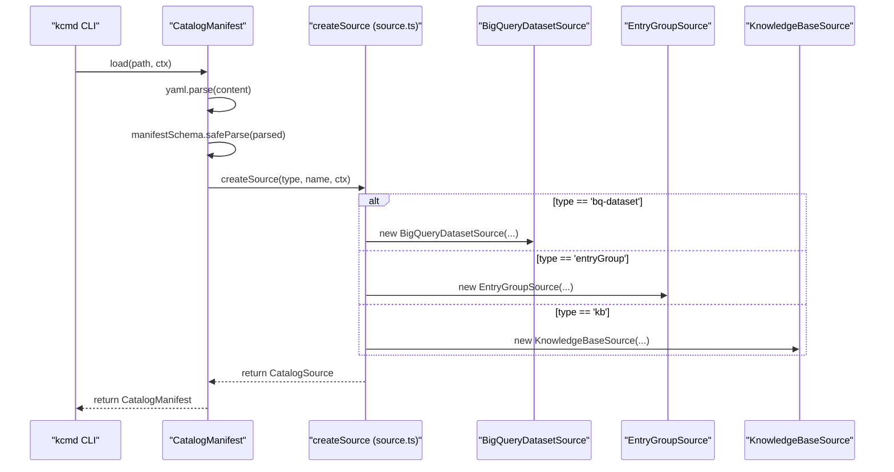
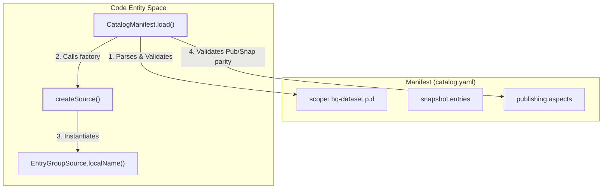

# Catalog Manifest (catalog.yaml)

Relevant source files

The following files were used as context for generating this wiki page:

- [toolbox/mdcode/demo/README.md](toolbox/mdcode/demo/README.md)
- [toolbox/mdcode/src/libts/manifest.ts](toolbox/mdcode/src/libts/manifest.ts)
- [toolbox/mdcode/src/libts/source.ts](toolbox/mdcode/src/libts/source.ts)
- [toolbox/mdcode/src/libts/sources/entrygroup.ts](toolbox/mdcode/src/libts/sources/entrygroup.ts)
- [toolbox/mdcode/tests/scenarios/pull_bq.yaml](toolbox/mdcode/tests/scenarios/pull_bq.yaml)
- [toolbox/mdcode/tests/scenarios/pull_bq_filtered.yaml](toolbox/mdcode/tests/scenarios/pull_bq_filtered.yaml)
- [toolbox/mdcode/tests/scenarios/push_custom.yaml](toolbox/mdcode/tests/scenarios/push_custom.yaml)

The `catalog.yaml` file is the central configuration manifest for a `kcmd` workspace. It defines the **scope** of metadata management (which GCP resources are being tracked), the **snapshot** configuration (what metadata types are pulled from the cloud), and the **publishing** rules (which fields are allowed to be pushed back to the Knowledge Catalog).

## Manifest Structure

The manifest is written in YAML and is validated using a Zod schema defined in the `kcmd` library [toolbox/mdcode/src/libts/manifest.ts:11-21]().

### Scope Formats

The `scope` field determines the `CatalogSource` implementation used for the workspace [toolbox/mdcode/src/libts/manifest.ts:78-111](). It can be a single string or an array of strings (specifically for multi-dataset BigQuery support) [toolbox/mdcode/src/libts/manifest.ts:80-100]().

| Source Type | Scope Format | Description |
| :--- | :--- | :--- |
| **BigQuery** | `bq-dataset.<project>.<dataset>` | Tracks a BigQuery dataset, its tables, and views [toolbox/mdcode/src/libts/source.ts:14](). |
| **Entry Group** | `entryGroup.<project>.<location>.<id>` | Tracks a specific Dataplex Entry Group [toolbox/mdcode/src/libts/source.ts:13](). |
| **Knowledge Base** | `kb.<project>.<location>.<id>` | Tracks a Knowledge Base (specialized Entry Group for docs) [toolbox/mdcode/src/libts/source.ts:15](). |

### Configuration Blocks

The manifest contains two primary configuration blocks that control data flow between the local filesystem and the GCP APIs:

1.  **`snapshot`**: Defines the "read" scope. It lists the Entry Types and Aspect Types that `kcmd pull` should fetch and store locally [toolbox/mdcode/src/libts/manifest.ts:13-16]().
2.  **`publishing`**: Defines the "write" scope. It restricts `kcmd push` to only modify specific Entry Types or Aspect Types, preventing accidental overwrites of system-managed metadata [toolbox/mdcode/src/libts/manifest.ts:17-20]().

**Validation Rule**: Any type listed in `publishing` **must** also be present in the `snapshot` section to ensure the tool has a local baseline before attempting an update [toolbox/mdcode/src/libts/manifest.ts:142-162]().

Sources: [toolbox/mdcode/src/libts/manifest.ts:11-31](), [toolbox/mdcode/src/libts/manifest.ts:78-111](), [toolbox/mdcode/src/libts/source.ts:12-16]()

---

## Data Flow: Manifest to Source

The `CatalogManifest` class uses the `scope` string to instantiate a concrete `CatalogSource`. This mapping is handled by the `createSource` factory function [toolbox/mdcode/src/libts/source.ts:70-85]().

### Manifest Initialization Diagram
This diagram shows how the `CatalogManifest` and `CatalogSource` entities are constructed from the `catalog.yaml` file during a `CatalogSnapshot.load` or `CatalogManifest.load` call.

Sources: [toolbox/mdcode/src/libts/manifest.ts:69-111](), [toolbox/mdcode/src/libts/source.ts:70-85](), [toolbox/mdcode/src/libts/source.ts:12-16]()

---

## Snapshot Configuration and Type Resolution

When a manifest is loaded, the configuration defines which metadata entries are included in the local workspace.

### Filtering Logic
The `snapshot` block allows users to filter which entries are pulled from the source based on their `entryType`. For example, a manifest can be configured to only pull `bigquery-table` entries while ignoring the parent `bigquery-dataset` entry [toolbox/mdcode/tests/scenarios/pull_bq_filtered.yaml:37-39]().

### Type Validation
The manifest loader validates that all entry and aspect types follow a 3-part naming convention (e.g., `project.location.type`) [toolbox/mdcode/src/libts/manifest.ts:116-131]().

Sources: [toolbox/mdcode/src/libts/manifest.ts:113-132](), [toolbox/mdcode/tests/scenarios/pull_bq_filtered.yaml:35-50]()

---

## Publishing and Validation Rules

The manifest enforces strict rules on what can be modified locally and pushed to the cloud.

### Ingested vs. User-Managed Entries
The `CatalogSource` interface includes an `ingestedEntries` boolean [toolbox/mdcode/src/libts/source.ts:22]().
*   **Ingested (e.g., BigQuery)**: Entries are managed by a system crawler. `ingestedEntries` is set to `true` [toolbox/mdcode/src/libts/sources/entrygroup.ts:26]().
*   **User-Managed (e.g., Custom Entry Groups)**: Users can manage entries directly. The `EntryGroupSource` determines this by checking if the entry group ID starts with `@` (reserved for system groups) [toolbox/mdcode/src/libts/sources/entrygroup.ts:26]().

### Local Name Mapping
The manifest relies on the `CatalogSource` to translate between complex Dataplex resource names and human-friendly local filenames.

| Source | Local Name Logic | Example |
| :--- | :--- | :--- |
| **BigQuery** | `<project>.<dataset>.<tableId>` | `p.d.t1` [toolbox/mdcode/tests/scenarios/pull_bq.yaml:36-41]() |
| **Entry Group** | `<entryId>` | `custom-entry` [toolbox/mdcode/src/libts/sources/entrygroup.ts:38-46]() |

### Code-to-Entity Mapping: Manifest Enforcement
This diagram associates manifest-defined constraints with the code entities that enforce them.

Sources: [toolbox/mdcode/src/libts/manifest.ts:69-166](), [toolbox/mdcode/src/libts/source.ts:70-85](), [toolbox/mdcode/src/libts/sources/entrygroup.ts:38-46]()

---

## Open Knowledge Format (OKF) Integration

The `catalog.yaml` manifest is also used to publish OKF wiki bundles. In this mode, the manifest typically points to an `entryGroup` or `kb` scope [toolbox/mdcode/demo/README.md:133-134]().

*   **Documents Layout**: When using the `kb` source, `kcmd` uses the `DocumentsLayout`, mapping each `.md` file in the `catalog/` directory to a Dataplex entry [toolbox/mdcode/demo/README.md:127-129]().
*   **Frontmatter Mapping**: Metadata such as `title`, `description`, and `tags` defined in the markdown frontmatter are pushed to Dataplex alongside the markdown body, which is stored in the `dataplex-types.global.overview` aspect [toolbox/mdcode/demo/README.md:129-130]().

Sources: [toolbox/mdcode/demo/README.md:121-153]()
