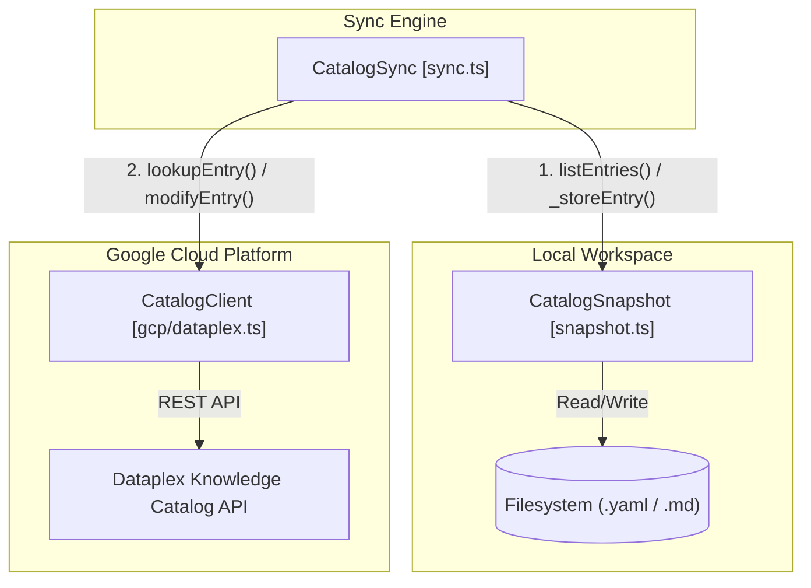
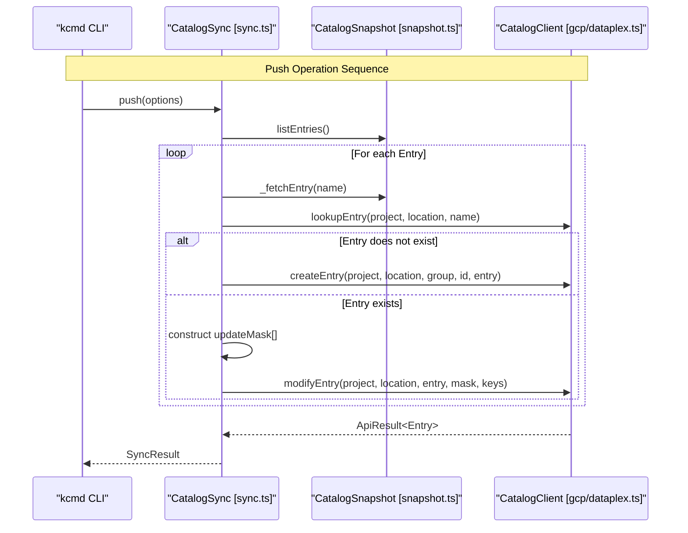

# Synchronization Engine (CatalogSync)

Relevant source files

The following files were used as context for generating this wiki page:

- [toolbox/mdcode/src/libts/sync.ts](toolbox/mdcode/src/libts/sync.ts)
- [toolbox/mdcode/tests/scenarios/pull_bq.yaml](toolbox/mdcode/tests/scenarios/pull_bq.yaml)
- [toolbox/mdcode/tests/scenarios/pull_bq_filtered.yaml](toolbox/mdcode/tests/scenarios/pull_bq_filtered.yaml)
- [toolbox/mdcode/tests/scenarios/push_bq.yaml](toolbox/mdcode/tests/scenarios/push_bq.yaml)

The `CatalogSync` class is the core orchestration engine responsible for bidirectional synchronization between the local Metadata as Code (MaC) workspace and the Google Cloud Dataplex Knowledge Catalog service. It manages the lifecycles of fetching remote state into local files (`pull`) and publishing local modifications back to the cloud (`push`).

## Overview of CatalogSync

The engine operates by bridging the `CatalogClient` (API layer) and the `CatalogSnapshot` (local state manager). It ensures that metadata transitions between these environments while respecting the configurations defined in the `catalog.yaml` manifest.

### Core Data Flow
The following diagram illustrates how `CatalogSync` orchestrates data between the Dataplex API and the local filesystem via the `CatalogSnapshot`.

**Diagram: CatalogSync Orchestration Flow**

**Sources:** [toolbox/mdcode/src/libts/sync.ts:21-28](), [toolbox/mdcode/src/libts/gcp/dataplex.ts:58-62]()

---

## The Pull Lifecycle

The `pull` operation synchronizes the local snapshot with the remote Catalog service. It iterates through the entries defined by the manifest's source and persists them locally.

### Implementation Details
1.  **Entry Discovery**: It retrieves an iterator of entries from the manifest's source (e.g., a BigQuery dataset or an Entry Group) [toolbox/mdcode/src/libts/sync.ts:33]().
2.  **Filtering**: It checks if the entry's type matches the allowed types defined in the snapshot configuration [toolbox/mdcode/src/libts/sync.ts:36-38]().
3.  **Detailed Lookup**: For each entry, it performs a `lookupEntry` call via the `CatalogClient` to fetch full metadata, including specific aspects defined in the snapshot [toolbox/mdcode/src/libts/sync.ts:45-46]().
4.  **Persistence**: The fetched entry is passed to `CatalogSnapshot._storeEntry()`, which handles the physical writing to the disk according to the configured `CatalogLayout` [toolbox/mdcode/src/libts/sync.ts:54]().

**Sources:** [toolbox/mdcode/src/libts/sync.ts:31-61](), [toolbox/mdcode/tests/scenarios/pull_bq.yaml:32-42](), [toolbox/mdcode/tests/scenarios/pull_bq_filtered.yaml:37-42]()

---

## The Push Lifecycle

The `push` operation publishes local changes to the Dataplex service. It distinguishes between new entries that need creation and existing entries that require modification.

### Entry Creation vs. Modification
For every entry found in the local snapshot, the engine performs a lookup to determine its existence in the cloud [toolbox/mdcode/src/libts/sync.ts:82]().

| Scenario | Logic | API Method |
| :--- | :--- | :--- |
| **Entry Missing** | Parses the resource name to extract `entryGroup` and `entryId`, then creates the resource [toolbox/mdcode/src/libts/sync.ts:84-86](). | `createEntry` |
| **Entry Exists** | Constructs an `updateMask` and `aspectKeys` to perform a partial update [toolbox/mdcode/src/libts/sync.ts:93-112](). | `modifyEntry` |

### Update Mask Construction
To avoid overwriting service-managed metadata, `CatalogSync` constructs an explicit `updateMask`.
*   **Aspects**: If the local entry has aspects, the `aspects` field is added to the mask [toolbox/mdcode/src/libts/sync.ts:94-97]().
*   **Source Metadata**: If the manifest source is not "ingested" (meaning it's user-managed), fields like `entry_source` and `parent_entry` are added to the mask [toolbox/mdcode/src/libts/sync.ts:99-106]().

**Sources:** [toolbox/mdcode/src/libts/sync.ts:64-119](), [toolbox/mdcode/tests/scenarios/push_bq.yaml:37-47]()

---

## Technical Mapping: Logic to Code Entities

The following diagram maps the logical synchronization steps to the specific class methods and API calls implemented in the TypeScript library.

**Diagram: Logical to Code Entity Mapping**

**Sources:** [toolbox/mdcode/src/libts/sync.ts:64-119](), [toolbox/mdcode/src/libts/gcp/dataplex.ts:99-132]()

---

## Error Handling and Concurrency

### Optimistic Concurrency
While the current implementation focuses on `modifyEntry` [toolbox/mdcode/src/libts/sync.ts:112](), the underlying Dataplex API supports ETags for optimistic concurrency. The `CatalogSync` class is designed to handle the results of these calls via the `ApiResult` interface, which captures HTTP status codes and error messages [toolbox/mdcode/src/libts/sync.ts:113-115]().

### Error Reporting
Sync operations return a `SyncResult` object.
*   **Success**: `{ success: true }` [toolbox/mdcode/src/libts/sync.ts:56, 118]()
*   **Failure**: `{ success: false, details: string }` containing the error message from the GCP API or local filesystem errors [toolbox/mdcode/src/libts/sync.ts:7-10, 59, 88, 114]().

### Known Limitations (TODOs)
*   **Conflict Resolution**: The engine currently does not automatically resolve conflicts where both local and remote versions have changed [toolbox/mdcode/src/libts/sync.ts:41]().
*   **Deletions**: Local deletions are not yet propagated to the server (and vice versa for service-side deletions) [toolbox/mdcode/src/libts/sync.ts:42, 75]().
*   **Type Discovery**: The engine needs to populate type info if it encounters a type it hasn't seen before during a pull [toolbox/mdcode/src/libts/sync.ts:40]().

**Sources:** [toolbox/mdcode/src/libts/sync.ts:7-10, 40-42, 74-77, 113-115]()
