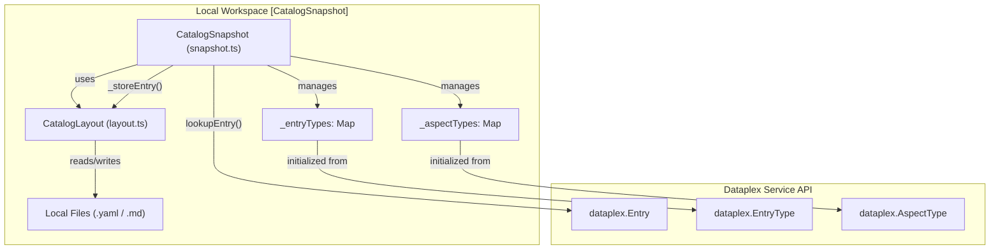
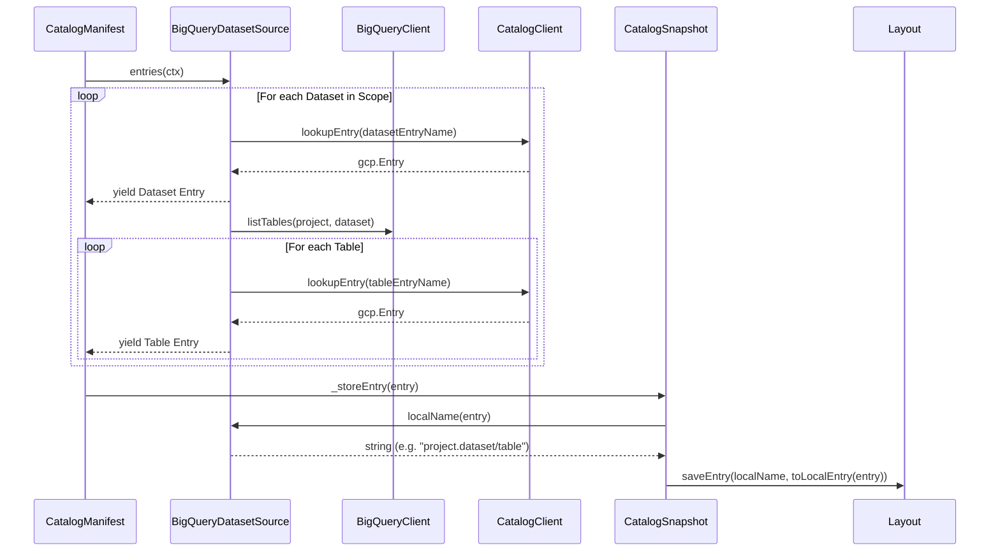

# CatalogSnapshot and Source Abstractions

Relevant source files

The following files were used as context for generating this wiki page:

- [toolbox/mdcode/src/libts/manifest.ts](toolbox/mdcode/src/libts/manifest.ts)
- [toolbox/mdcode/src/libts/snapshot.ts](toolbox/mdcode/src/libts/snapshot.ts)
- [toolbox/mdcode/src/libts/source.ts](toolbox/mdcode/src/libts/source.ts)
- [toolbox/mdcode/src/libts/sources/bq-dataset.ts](toolbox/mdcode/src/libts/sources/bq-dataset.ts)
- [toolbox/mdcode/src/libts/sources/entrygroup.ts](toolbox/mdcode/src/libts/sources/entrygroup.ts)
- [toolbox/mdcode/tests/scenarios/push_custom.yaml](toolbox/mdcode/tests/scenarios/push_custom.yaml)

The Knowledge Catalog system utilizes a provider-based architecture to interface with different metadata origins. The `CatalogSnapshot` class serves as the central manager for local state, while the `CatalogSource` interface abstracts the complexities of different GCP resource hierarchies (BigQuery, Dataplex Entry Groups, Knowledge Bases) into a unified stream of entries.

## CatalogSnapshot

The `CatalogSnapshot` class is the primary implementation of the local catalog interface. It manages the lifecycle of metadata stored on disk, including type resolution, entry lookup, and local modifications before they are synchronized back to the cloud.

### Key Responsibilities
*   **Type Management**: Resolves and caches `EntryType` and `AspectType` definitions from Dataplex to ensure local metadata conforms to cloud schemas. It populates `_entryTypes` and `_aspectTypes` maps during initialization [toolbox/mdcode/src/libts/snapshot.ts:19-20](), [toolbox/mdcode/src/libts/snapshot.ts:137-176]().
*   **Local State Persistence**: Interfaces with `CatalogLayout` (created via `createLayout`) to save and load entries from the filesystem [toolbox/mdcode/src/libts/snapshot.ts:28-29]().
*   **CRUD Operations**: Provides methods to `listEntries`, `lookupEntry`, `updateEntry`, `createEntry`, and `deleteEntry` within the local workspace [toolbox/mdcode/src/libts/snapshot.ts:55-133]().
*   **Ingestion Guardrails**: Prevents the creation or deletion of entries if the underlying source has `ingestedEntries` set to true (e.g., BigQuery), where Dataplex manages the entry lifecycle automatically [toolbox/mdcode/src/libts/snapshot.ts:112-114](), [toolbox/mdcode/src/libts/snapshot.ts:128-130]().

### Metadata Mapping: Code to Service
The following diagram illustrates how `CatalogSnapshot` bridges the gap between local YAML files and the Dataplex Service API.

**Entity Mapping: Local Workspace to Dataplex Service**

Sources: [toolbox/mdcode/src/libts/snapshot.ts:14-22](), [toolbox/mdcode/src/libts/snapshot.ts:181-184](), [toolbox/mdcode/src/libts/snapshot.ts:137-176]()

## CatalogSource Interface

The `CatalogSource` interface defines the contract for any metadata provider. It is responsible for enumerating entries and translating between local "friendly" names and fully qualified GCP resource names.

### Interface Definition
The interface requires the following properties and methods:
*   `type`: The source type string (e.g., `bq-dataset`, `entryGroup`, `kb`) [toolbox/mdcode/src/libts/source.ts:20]().
*   `name`: The resource identifier for the source [toolbox/mdcode/src/libts/source.ts:21]().
*   `ingestedEntries`: A boolean indicating if the entries are managed by an automated crawler (e.g., BigQuery) [toolbox/mdcode/src/libts/source.ts:22]().
*   `layout`: The `Layouts` enum value (STANDARD or DOCUMENTS) [toolbox/mdcode/src/libts/source.ts:23]().
*   `entries(ctx)`: An async generator that yields `gcp.Entry` objects from the cloud [toolbox/mdcode/src/libts/source.ts:25]().
*   `localName(entry)`: Converts a service-side entry name to a local file path identifier [toolbox/mdcode/src/libts/source.ts:26]().
*   `serviceName(localName)`: Converts a local identifier back to a fully qualified service name [toolbox/mdcode/src/libts/source.ts:27]().

Sources: [toolbox/mdcode/src/libts/source.ts:19-28]()

## Concrete Source Implementations

### BigQueryDatasetSource
This source treats BigQuery datasets and tables as Dataplex entries. It navigates the BigQuery hierarchy and maps it to the Dataplex `@bigquery` system entry group.

*   **Logic**: It first yields the dataset entry, then iterates through all tables within that dataset using `BigQueryClient.listTables` [toolbox/mdcode/src/libts/sources/bq-dataset.ts:29-54]().
*   **Naming Convention**: 
    *   Dataset: `<project>.<dataset>` [toolbox/mdcode/src/libts/sources/bq-dataset.ts:78]().
    *   Table: `<project>.<dataset>/<tableId>` [toolbox/mdcode/src/libts/sources/bq-dataset.ts:70]().
*   **Service Name Construction**: Maps local names back to Dataplex entries within the `bigquery.googleapis.com` resource namespace [toolbox/mdcode/src/libts/sources/bq-dataset.ts:95-103]().

### EntryGroupSource
A generic source for any Dataplex Entry Group.
*   **Ingestion Detection**: It determines if entries are ingested by checking if the Entry Group ID starts with `@` [toolbox/mdcode/src/libts/sources/entrygroup.ts:26]().
*   **Iteration**: Uses `CatalogClient.listEntries` to fetch all entries in the group [toolbox/mdcode/src/libts/sources/entrygroup.ts:33]().

### KnowledgeBaseSource
A specialized implementation for Knowledge Bases. While it extends the same logic as `EntryGroupSource`, it is initialized with `Layouts.DOCUMENTS` to support Markdown-based metadata [toolbox/mdcode/src/libts/source.ts:80-81]().

**Data Flow: Source Enumeration to Snapshot**

Sources: [toolbox/mdcode/src/libts/sources/bq-dataset.ts:25-57](), [toolbox/mdcode/src/libts/snapshot.ts:181-184](), [toolbox/mdcode/src/libts/manifest.ts:79-111]()

## Summary of Source Types

| Source Type | Implementation Class | Layout | Ingested | Scope Format |
| :--- | :--- | :--- | :--- | :--- |
| `bq-dataset` | `BigQueryDatasetSource` | `STANDARD` | `true` | `bq-dataset.<project>.<dataset>` |
| `entryGroup` | `EntryGroupSource` | `STANDARD` | Varies (starts with `@`) | `entryGroup.<project>.<loc>.<group>` |
| `kb` | `KnowledgeBaseSource` | `DOCUMENTS` | `false` | `kb.<project>.<loc>.<group>` |

Sources: [toolbox/mdcode/src/libts/source.ts:12-16](), [toolbox/mdcode/src/libts/sources/bq-dataset.ts:10-15](), [toolbox/mdcode/src/libts/sources/entrygroup.ts:10-27](), [toolbox/mdcode/src/libts/manifest.ts:106-111]()
