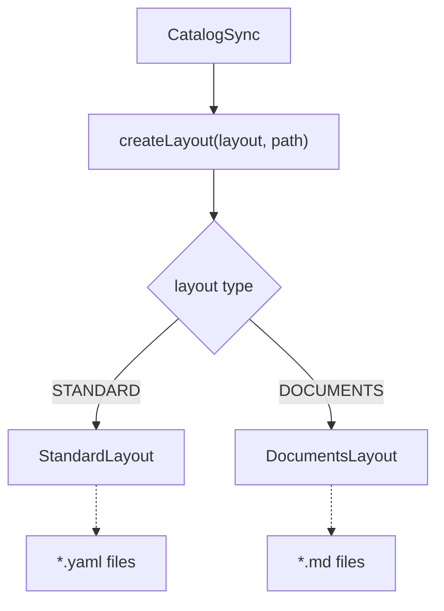
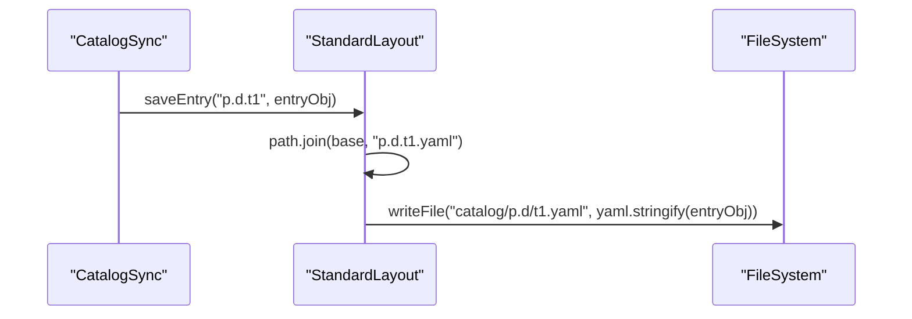
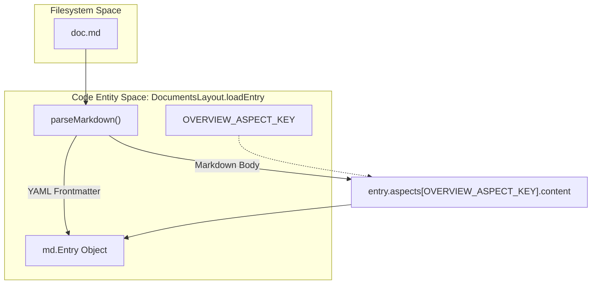

# Storage Layouts: Standard and Documents

Relevant source files

The following files were used as context for generating this wiki page:

- [toolbox/mdcode/src/libts/layout.ts](toolbox/mdcode/src/libts/layout.ts)
- [toolbox/mdcode/src/libts/layouts/documents.ts](toolbox/mdcode/src/libts/layouts/documents.ts)
- [toolbox/mdcode/src/libts/layouts/standard.ts](toolbox/mdcode/src/libts/layouts/standard.ts)
- [toolbox/mdcode/tests/scenarios/pull_kb.yaml](toolbox/mdcode/tests/scenarios/pull_kb.yaml)
- [toolbox/mdcode/tests/scenarios/push_kb.yaml](toolbox/mdcode/tests/scenarios/push_kb.yaml)

The Knowledge Catalog CLI (`kcmd`) uses a pluggable layout system to manage how metadata entries are persisted on the local filesystem. This abstraction allows the same synchronization logic to support both structured data assets (like BigQuery tables) and unstructured knowledge bases (like Markdown documentation).

## The CatalogLayout Interface

The `CatalogLayout` interface defines the contract for mapping Dataplex entries to local files. It abstracts the file format, directory structure, and naming conventions.

| Method | Description |
| :--- | :--- |
| `init()` | Scans the local directory to build an internal index of entries. |
| `entryExists(name)` | Checks if a specific entry exists in the local index. |
| `listEntries()` | Returns a list of all entry names currently managed by the layout. |
| `loadEntry(name)` | Reads a local file and parses it into a `md.Entry` object. |
| `saveEntry(name, entry)` | Serializes a `md.Entry` and writes it to the appropriate local path. |
| `deleteEntry(name)` | Removes the local file associated with an entry. |

**Sources:** [toolbox/mdcode/src/libts/layout.ts:14-22]()

### Layout Selection Logic
The `createLayout` factory function instantiates the correct implementation based on the `layout` property in `catalog.yaml`.

Title: Layout Factory Flow

**Sources:** [toolbox/mdcode/src/libts/layout.ts:25-35]()

---

## StandardLayout (YAML)

The `StandardLayout` is designed for structured data assets. It persists each Dataplex entry as a standalone YAML file.

### Implementation Details
- **File Discovery**: During `init()`, it performs a recursive glob search for `**/*.yaml` [toolbox/mdcode/src/libts/layouts/standard.ts:29-33]().
- **Indexing**: It parses each YAML file and uses the `name` field within the metadata as the primary key for its internal map `_index` [toolbox/mdcode/src/libts/layouts/standard.ts:16-16](), [toolbox/mdcode/src/libts/layouts/standard.ts:35-46]().
- **Persistence**: Entries are saved using the entry name as the filename (e.g., `p.d.t1.yaml`) [toolbox/mdcode/src/libts/layouts/standard.ts:68-74]().

### Data Flow: Standard Pull
When pulling BigQuery metadata, the system generates nested file paths reflecting the dataset/table hierarchy.

Title: StandardLayout Serialization

**Sources:** [toolbox/mdcode/src/libts/layouts/standard.ts:68-74](), [toolbox/mdcode/tests/scenarios/push_kb.yaml:52-57]()

---

## DocumentsLayout (Markdown)

The `DocumentsLayout` is optimized for Knowledge Bases. It treats Markdown files as the primary source of truth, using YAML frontmatter for metadata and the Markdown body for the "Overview" aspect.

### File Structure and Frontmatter
A document file consists of a YAML block delimited by `---` followed by Markdown content. The `parseMarkdown` function handles this separation [toolbox/mdcode/src/libts/layouts/documents.ts:185-220]().

| Component | Source in `md.Entry` |
| :--- | :--- |
| **Frontmatter** | Resource fields (title, description, labels) and Type [toolbox/mdcode/src/libts/layouts/documents.ts:199-217](). |
| **Markdown Body** | `dataplex-types.global.overview` aspect content [toolbox/mdcode/src/libts/layouts/documents.ts:88-94](). |

**Sources:** [toolbox/mdcode/src/libts/layouts/documents.ts:185-220]()

### Synthetic Index Entries
To maintain a navigable hierarchy in Dataplex, `DocumentsLayout` automatically synthesizes "index" entries for directories that contain files but lack an `index.md`.

- **`_synthesizeIndexEntries()`**: Iterates through all discovered `.md` files and ensures every parent directory has an entry named `index` [toolbox/mdcode/src/libts/layouts/documents.ts:140-161]().
- **Parent-Child Linking**: The layout automatically derives the `resource.parent` field based on the directory structure during `loadEntry` via `deriveParentLocalName` [toolbox/mdcode/src/libts/layouts/documents.ts:76-81](), [toolbox/mdcode/src/libts/layouts/documents.ts:169-183]().

### Data Flow: Document Parsing
Title: DocumentsLayout Parsing (loadEntry)

**Sources:** [toolbox/mdcode/src/libts/layouts/documents.ts:57-96](), [toolbox/mdcode/src/libts/layouts/documents.ts:185-220](), [toolbox/mdcode/src/libts/layouts/documents.ts:11-11]()

---

## Comparison of Layout Behaviors

| Feature | StandardLayout | DocumentsLayout |
| :--- | :--- | :--- |
| **File Extension** | `.yaml` [toolbox/mdcode/src/libts/layouts/standard.ts:29]() | `.md` [toolbox/mdcode/src/libts/layouts/documents.ts:35]() |
| **Primary Identifier** | `name` field inside YAML [toolbox/mdcode/src/libts/layouts/standard.ts:39]() | File path relative to root [toolbox/mdcode/src/libts/layouts/documents.ts:164-167]() |
| **Overview Aspect** | Stored as structured YAML | Extracted as Markdown body [toolbox/mdcode/src/libts/layouts/documents.ts:92]() |
| **Directory Handling** | Flat or nested based on name | Mirrors folder structure [toolbox/mdcode/src/libts/layouts/documents.ts:99-100]() |
| **Sidecar Support** | N/A | Frontmatter acts as sidecar |

### Naming Conventions
- **Standard**: If an entry name is `p.d.t1`, it is saved as `p.d.t1.yaml` [toolbox/mdcode/src/libts/layouts/standard.ts:69]().
- **Documents**: If a file is at `dir/sub.md`, the entry name is derived as `dir/sub` [toolbox/mdcode/src/libts/layouts/documents.ts:164-167](). Synthetic index files are named `index` or `dir/index` [toolbox/mdcode/src/libts/layouts/documents.ts:156]().

**Sources:** [toolbox/mdcode/src/libts/layouts/standard.ts:12-85](), [toolbox/mdcode/src/libts/layouts/documents.ts:16-162](), [toolbox/mdcode/tests/scenarios/pull_kb.yaml:37-47]()
