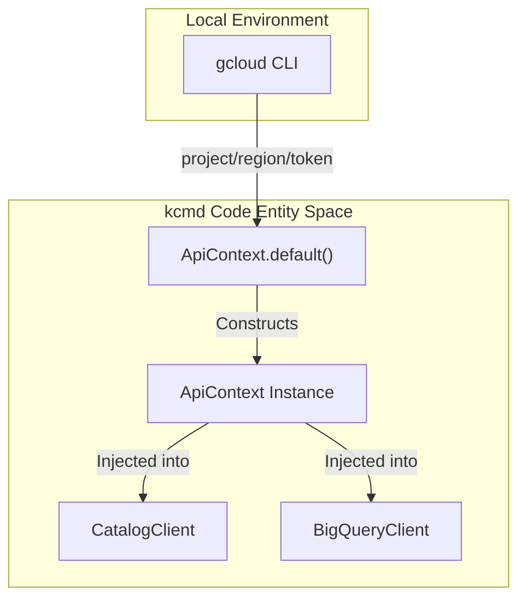
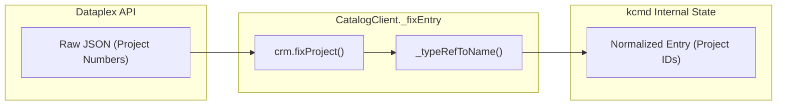
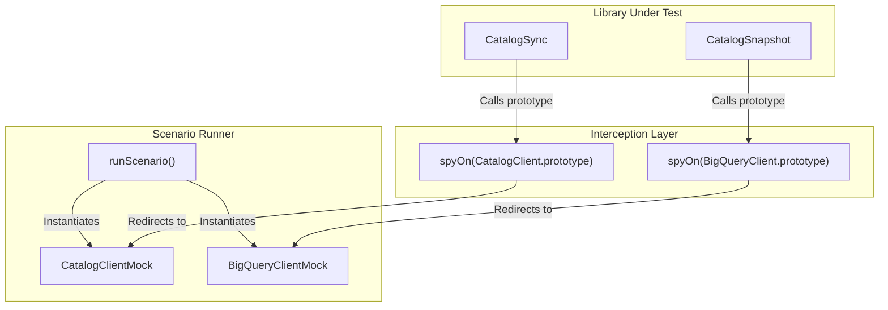

# GCP API Client Layer

Relevant source files

The following files were used as context for generating this wiki page:

- [samples/README.md](samples/README.md)
- [toolbox/README.md](toolbox/README.md)
- [toolbox/mdcode/src/libts/gcp/context.ts](toolbox/mdcode/src/libts/gcp/context.ts)
- [toolbox/mdcode/src/libts/gcp/dataplex.ts](toolbox/mdcode/src/libts/gcp/dataplex.ts)
- [toolbox/mdcode/src/libts/tsconfig.json](toolbox/mdcode/src/libts/tsconfig.json)
- [toolbox/mdcode/tests/libts/mocks.ts](toolbox/mdcode/tests/libts/mocks.ts)
- [toolbox/mdcode/tests/libts/scenarios.ts](toolbox/mdcode/tests/libts/scenarios.ts)
- [toolbox/mdcode/tests/scenarios/push_new_entry.yaml](toolbox/mdcode/tests/scenarios/push_new_entry.yaml)

The GCP API Client Layer provides the foundational communication interface between the Knowledge Catalog toolkit (`kcmd`) and Google Cloud Platform services. It abstracts raw REST calls into typed TypeScript classes, manages authentication via the `gcloud` CLI, and implements a normalization pipeline to ensure consistency across metadata resources.

## ApiContext: Authentication and Configuration

The `ApiContext` class serves as the central provider for GCP credentials and configuration. It retrieves the active project ID, compute region, and OAuth2 access tokens by executing `gcloud` CLI commands.

*   **Initialization**: The `ApiContext.default()` method initializes the context by calling `gcloud config get-value project`, `gcloud config get-value compute/region`, and `gcloud auth application-default print-access-token` [toolbox/mdcode/src/libts/gcp/context.ts:31-41]().
*   **Token Management**: It provides a `refresh()` method to rotate tokens when they expire by re-invoking the `gcloud auth` command [toolbox/mdcode/src/libts/gcp/context.ts:44-46]().
*   **Logging**: If the `GCP_LOG` environment variable is set, the context logs all API interactions for debugging [toolbox/mdcode/src/libts/gcp/context.ts:25-29]().

### Data Flow: Authentication Context
Title: ApiContext Authentication Flow

Sources: [toolbox/mdcode/src/libts/gcp/context.ts:4-47]()

## CatalogClient (Dataplex API Wrapper)

The `CatalogClient` class provides a high-level wrapper around the Google Cloud Dataplex (Knowledge Catalog) v1 API. It handles the lifecycle of `Entry`, `EntryGroup`, `EntryType`, and `AspectType` resources.

### Key Methods
| Method | Purpose | API Endpoint |
| :--- | :--- | :--- |
| `getEntry` | Retrieves a specific entry with basic or custom aspect views [toolbox/mdcode/src/libts/gcp/dataplex.ts:82-97](). | `GET /v1/{name}` |
| `lookupEntry` | Finds an entry using its resource name (e.g., BQ table path) [toolbox/mdcode/src/libts/gcp/dataplex.ts:99-114](). | `GET /v1/{container}:lookupEntry` |
| `modifyEntry` | Atomic update of an entry and its aspects using an `updateMask` [toolbox/mdcode/src/libts/gcp/dataplex.ts:116-132](). | `POST /v1/{container}:modifyEntry` |
| `listEntries` | Paginated generator for all entries within an Entry Group [toolbox/mdcode/src/libts/gcp/dataplex.ts:153-178](). | `GET /v1/{parent}/entries` |
| `createEntry` | Creates a new entry in a specific Entry Group [toolbox/mdcode/src/libts/gcp/dataplex.ts:180-194](). | `POST /v1/{parent}/entries` |

Sources: [toolbox/mdcode/src/libts/gcp/dataplex.ts:58-208]()

## Data Normalization Pipeline (`_fixEntry`)

A critical component of the client layer is the `_fixEntry` function. The Dataplex API often returns resource names using project numbers instead of project IDs, which creates inconsistencies in local YAML files.

The `_fixEntry` pipeline performs the following:
1.  **Project ID Resolution**: Converts project numbers to project IDs in `entry.name`, `entry.entryType`, and `entry.entrySource.resource` using the Cloud Resource Manager (CRM) client [toolbox/mdcode/src/libts/gcp/dataplex.ts:214-218]().
2.  **Type Reference Conversion**: Normalizes aspect keys. If an aspect key is provided as a short name, it converts it to a full resource path using `_typeRefToName` [toolbox/mdcode/src/libts/gcp/dataplex.ts:222-226]().
3.  **Consistency**: This function is called automatically inside every retrieval method (`getEntry`, `lookupEntry`, `listEntries`, `updateEntry`, `modifyEntry`, `createEntry`) before the data reaches the `CatalogSync` engine [toolbox/mdcode/src/libts/gcp/dataplex.ts:93,110,128,147,172,190]().

### Data Flow: Entry Normalization
Title: Entry Normalization Pipeline

Sources: [toolbox/mdcode/src/libts/gcp/dataplex.ts:213-230]()

## BigQueryClient

The `BigQueryClient` provides specialized access to BigQuery metadata, primarily used by the `BigQueryDatasetSource` to discover tables and datasets for cataloging.

*   **`getDataset`**: Fetches dataset metadata including location and description [toolbox/mdcode/tests/libts/mocks.ts:163-171]().
*   **`listTables`**: An `AsyncGenerator` that iterates through all tables within a specific project and dataset [toolbox/mdcode/tests/libts/mocks.ts:172-178]().

Sources: [toolbox/mdcode/tests/libts/mocks.ts:145-179]()

## Testing and Mocking Layer

For unit testing and scenario execution, the layer provides mock implementations that bypass network calls.

*   **`CatalogClientMock`**: Implements an in-memory registry of entries, entry groups, and types. It simulates API behaviors like `updateMask` logic for `entrySource` and `aspects`, and returns `404 Not Found` errors when resources are missing [toolbox/mdcode/tests/libts/mocks.ts:8-142]().
*   **`BigQueryClientMock`**: Simulates BigQuery dataset and table listings using internal `mockDatasets` and `mockTables` maps [toolbox/mdcode/tests/libts/mocks.ts:145-179]().
*   **Scenario Integration**: During tests, `spyOn` is used to intercept calls to the real `CatalogClient.prototype` and `BigQueryClient.prototype` methods, redirecting them to the `currentCatalogMock` or `currentBigQueryMock` defined in the test scenario [toolbox/mdcode/tests/libts/scenarios.ts:16-197]().

### Code Entity Association: Mocks and Scenarios
Title: Test Mock Injection

Sources: [toolbox/mdcode/tests/libts/mocks.ts:8-179](), [toolbox/mdcode/tests/libts/scenarios.ts:20-197]()
