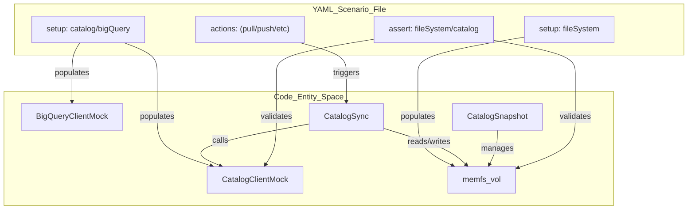
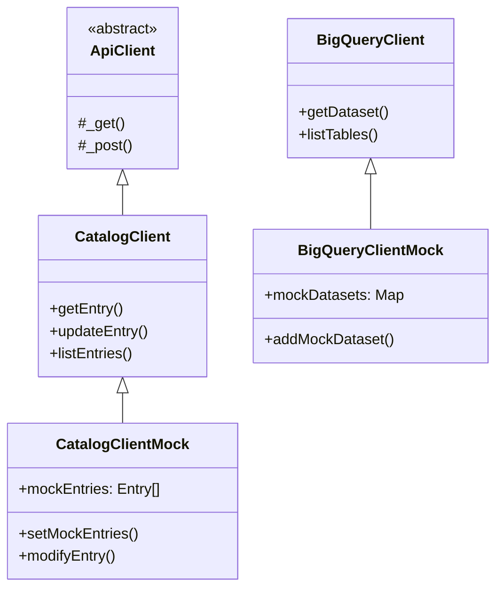

# Testing Infrastructure and Scenario Framework

<details>
<summary>Relevant source files</summary>

The following files were used as context for generating this wiki page:

- [toolbox/mdcode/src/libts/gcp/dataplex.ts](toolbox/mdcode/src/libts/gcp/dataplex.ts)
- [toolbox/mdcode/tests/libts/mocks.ts](toolbox/mdcode/tests/libts/mocks.ts)
- [toolbox/mdcode/tests/libts/scenarios.ts](toolbox/mdcode/tests/libts/scenarios.ts)
- [toolbox/mdcode/tests/scenarios/create_entry_hierarchy.yaml](toolbox/mdcode/tests/scenarios/create_entry_hierarchy.yaml)
- [toolbox/mdcode/tests/scenarios/pull_basic.yaml](toolbox/mdcode/tests/scenarios/pull_basic.yaml)
- [toolbox/mdcode/tests/scenarios/pull_bq.yaml](toolbox/mdcode/tests/scenarios/pull_bq.yaml)
- [toolbox/mdcode/tests/scenarios/pull_bq_filtered.yaml](toolbox/mdcode/tests/scenarios/pull_bq_filtered.yaml)
- [toolbox/mdcode/tests/scenarios/pull_multi.yaml](toolbox/mdcode/tests/scenarios/pull_multi.yaml)
- [toolbox/mdcode/tests/scenarios/push_filtered.yaml](toolbox/mdcode/tests/scenarios/push_filtered.yaml)
- [toolbox/mdcode/tests/scenarios/push_new_entry.yaml](toolbox/mdcode/tests/scenarios/push_new_entry.yaml)

</details>


The Knowledge Catalog repository utilizes a specialized scenario-based testing framework designed to validate the end-to-end lifecycle of metadata synchronization (pull and push) without requiring access to live Google Cloud Platform (GCP) resources. This is achieved through a combination of YAML-defined test cases, in-memory mock clients for Dataplex and BigQuery, and a virtualized filesystem.

## Scenario-Based Testing Architecture

The framework operates by loading a scenario definition from a YAML file, initializing mock environments based on that definition, executing a sequence of `kcmd` actions, and asserting the final state of both the local filesystem and the remote mock catalog.

### Data Flow and Execution Logic

The test runner, implemented in `toolbox/mdcode/tests/libts/scenarios.ts`, orchestrates the following flow:

1.  **Environment Initialization**: Resets the `memfs` volume and initializes `CatalogClientMock` and `BigQueryClientMock` [toolbox/mdcode/tests/libts/scenarios.ts:21-29]().
2.  **State Setup**: Populates the mock clients with entries, entry types, and aspect types defined in the scenario's `setup` block [toolbox/mdcode/tests/libts/scenarios.ts:32-61](). It also populates the virtual filesystem with a `catalog.yaml` and any existing metadata files [toolbox/mdcode/tests/libts/scenarios.ts:64-69]().
3.  **Action Execution**: Sequentially executes actions such as `pull`, `push`, `createEntry`, or `updateEntry` against the `CatalogSync` engine or `CatalogSnapshot` [toolbox/mdcode/tests/libts/scenarios.ts:97-121]().
4.  **Assertion**: Compares the resulting state of the virtual filesystem and the mock Dataplex registry against the expectations defined in the `assert` block [toolbox/mdcode/tests/libts/scenarios.ts:124-149]().

### Code Entity Association: Scenario Runner

The following diagram illustrates how the YAML scenario components map to internal TypeScript classes and the `memfs` virtual environment.

**Scenario Component Mapping**

Sources: [toolbox/mdcode/tests/libts/scenarios.ts:20-152](), [toolbox/mdcode/tests/libts/mocks.ts:8-180]()

## Mock Infrastructure

The framework relies on two primary mock classes that extend the production API clients to intercept network calls.

### CatalogClientMock
Located in `toolbox/mdcode/tests/libts/mocks.ts`, this class overrides the `CatalogClient` defined in `toolbox/mdcode/src/libts/gcp/dataplex.ts`. It maintains internal registries for:
*   `mockEntries`: An array of `gcp.Entry` objects [toolbox/mdcode/tests/libts/mocks.ts:9]().
*   `mockEntryGroups`, `mockEntryTypes`, `mockAspectTypes`: Maps keyed by resource name [toolbox/mdcode/tests/libts/mocks.ts:10-12]().

Key methods like `getEntry`, `lookupEntry`, and `modifyEntry` are implemented to query and update these internal registries instead of making HTTP requests [toolbox/mdcode/tests/libts/mocks.ts:61-101]().

### BigQueryClientMock
This class mocks the `BigQueryClient` to simulate the discovery of datasets and tables. It uses internal maps (`mockDatasets`, `mockTables`) to return metadata during the `pull` lifecycle when the manifest scope is set to a BigQuery dataset [toolbox/mdcode/tests/libts/mocks.ts:145-179]().

### Prototype Spying
To ensure that even objects constructed deep within the library (e.g., inside `CatalogSync`) use the mock data, the runner uses `spyOn` to redirect `CatalogClient.prototype` methods to the active `currentCatalogMock` instance [toolbox/mdcode/tests/libts/scenarios.ts:166-200]().

**Mock Implementation Hierarchy**

Sources: [toolbox/mdcode/tests/libts/mocks.ts:8-180](), [toolbox/mdcode/src/libts/gcp/dataplex.ts:58-208]()

## Writing and Running Scenarios

Test scenarios are stored as YAML files in `toolbox/mdcode/tests/scenarios/`.

### Scenario Structure
A typical scenario includes:
1.  **`setup`**: Defines the initial state of the GCP project (Dataplex entries and BigQuery tables) and the local filesystem (the `catalog.yaml` manifest) [toolbox/mdcode/tests/scenarios/pull_bq.yaml:3-30]().
2.  **`actions`**: A list of operations to perform. Supported actions include `pull`, `push`, `createEntry`, `updateEntry`, and `deleteEntry` [toolbox/mdcode/tests/libts/scenarios.ts:99-117]().
3.  **`assert`**: Defines the expected state. It can check if files exist, contain specific strings, or if the mock catalog entries match a specific structure [toolbox/mdcode/tests/scenarios/pull_bq.yaml:34-42]().

### Example: Pull Filtering
The following scenarios demonstrate how to test that operations respect filtering defined in the `catalog.yaml`:

| File | Purpose |
| :--- | :--- |
| `toolbox/mdcode/tests/scenarios/pull_bq_filtered.yaml` | Validates that if the snapshot only includes `bigquery-table`, the parent `bigquery-dataset` entry is not created on disk [toolbox/mdcode/tests/scenarios/pull_bq_filtered.yaml:37-49](). |
| `toolbox/mdcode/tests/scenarios/push_filtered.yaml` | Validates that the `publishing` filter in `catalog.yaml` prevents specific aspects from being updated in the remote catalog [toolbox/mdcode/tests/scenarios/push_filtered.yaml:42-47](). |

### Running Tests
The scenarios are executed using the Bun test runner.
*   **Run all scenarios**: `bun test`
*   **Run specific scenarios**: Use the `TEST_GLOB` environment variable.
    ```bash
    TEST_GLOB="**/pull_bq.yaml" bun test
    ```
Sources: [toolbox/mdcode/tests/libts/scenarios.ts:154-162](), [toolbox/mdcode/tests/scenarios/pull_bq_filtered.yaml:1-50]()

## Key Classes Summary

| Class | Role | Implementation Detail |
| :--- | :--- | :--- |
| `CatalogClientMock` | Intercepts Dataplex API calls | Uses `Map` and `Array` to simulate a Dataplex registry [toolbox/mdcode/tests/libts/mocks.ts:8-142](). |
| `BigQueryClientMock` | Intercepts BigQuery API calls | Simulates `getDataset` and `listTables` [toolbox/mdcode/tests/libts/mocks.ts:145-179](). |
| `vol` (from `memfs`) | Virtual Filesystem | Allows testing file I/O (YAML generation/parsing) without disk side-effects [toolbox/mdcode/tests/libts/scenarios.ts:27-69](). |
| `CatalogSync` | Synchronization Logic | The primary subject of testing; coordinates data movement between mock clients and `memfs` [toolbox/mdcode/tests/libts/scenarios.ts:93-105](). |

Sources: [toolbox/mdcode/tests/libts/mocks.ts:1-180](), [toolbox/mdcode/tests/libts/scenarios.ts:1-152]()
