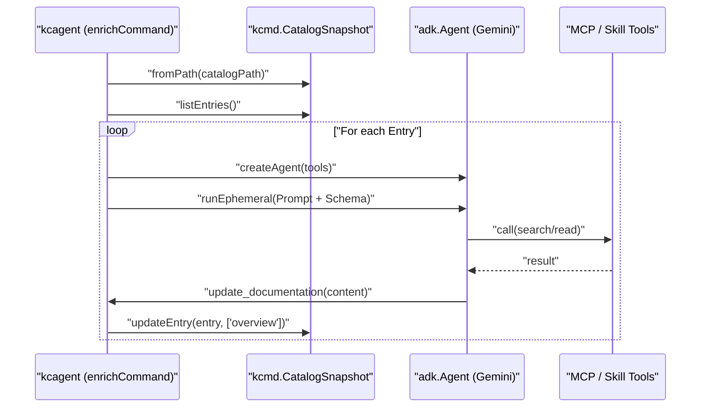

# Enrichment Agents

<details>
<summary>Relevant source files</summary>

The following files were used as context for generating this wiki page:

- [toolbox/enrichment/README.md](toolbox/enrichment/README.md)
- [toolbox/enrichment/package-lock.json](toolbox/enrichment/package-lock.json)
- [toolbox/enrichment/package.json](toolbox/enrichment/package.json)
- [toolbox/enrichment/src/agent/enrich/agent.ts](toolbox/enrichment/src/agent/enrich/agent.ts)
- [toolbox/enrichment/src/agent/enrich/command.ts](toolbox/enrichment/src/agent/enrich/command.ts)
- [toolbox/enrichment/src/agent/tools.ts](toolbox/enrichment/src/agent/tools.ts)
- [toolbox/enrichment/tsconfig.json](toolbox/enrichment/tsconfig.json)

</details>


The Knowledge Catalog repository provides two distinct implementations of enrichment agents designed to augment data asset metadata using Large Language Models (LLMs). These agents automate the extraction of information from various sources—such as Google Drive, BigQuery usage history, and source code repositories—to produce rich documentation and technical context for the catalog.

Both implementations leverage the **Metadata as Code (mdcode)** paradigm by interacting with the `kcmd` tool to manage local metadata snapshots and publish updates to the Dataplex Knowledge Catalog.

### System Overview

The enrichment agents bridge the gap between unstructured organizational knowledge and structured catalog metadata.

| Agent Implementation | Language | Primary Use Case | Entrypoint |
|:---|:---|:---|:---|
| **Python Enrichment Agent** | Python | Complex, multi-stage pipelines with specialized modes (Table, Doc, Overlay). | `agent_runner.py` |
| **TypeScript Enrichment Agent** | TypeScript | Tool-centric, agentic workflows using MCP and ADK skills. | `kcagent` CLI |

Sources: [agents/enrichment/README.md:9-20](), [toolbox/enrichment/README.md:3-12]().

---

### Enrichment Workflow Architecture

The following diagram illustrates how the enrichment agents sit between external knowledge sources and the Knowledge Catalog via the `kcmd` interface.

**Diagram: Enrichment Agent Data Flow**
```mermaid
graph TD
  subgraph "External_Sources"
    [GD] "Google Drive / Docs"
    [BQ_IS] "BigQuery INFORMATION_SCHEMA"
    [GH] "GitHub Repo (via MCP)"
    [FB] "User Feedback Proposals"
  end

  subgraph "Enrichment_Agents"
    direction TB
    [PA] "Python Agent (agents/enrichment)"
    [TA] "TypeScript Agent (toolbox/enrichment)"
  end

  subgraph "Metadata_as_Code_mdcode"
    [KCMD] "kcmd CLI"
    [LocalFiles] "Local Workspace (YAML/Markdown)"
  end

  subgraph "Cloud_Catalog"
    [DPX] "Dataplex Knowledge Catalog"
  end

  [GD] & [BQ_IS] & [GH] & [FB] --> [PA] & [TA]
  [PA] & [TA] -- "shell out / lib call" --> [KCMD]
  [KCMD] -- "pull / push" --> [DPX]
  [KCMD] -- "manages" --> [LocalFiles]
  [PA] & [TA] -- "write updates" --> [LocalFiles]
```
Sources: [agents/enrichment/README.md:16-19](), [toolbox/enrichment/src/agent/enrich/command.ts:39-40](), [toolbox/enrichment/README.md:18-27]().

---

### agents/enrichment: Python Enrichment Agent

The Python implementation is a high-performance enrichment pipeline that uses multi-stage LLM agents (powered by Vertex AI Gemini) to process metadata. It is structured around three specific operational modes:

*   **Table Mode**: Enriches BigQuery table metadata by routing relevant Drive documents and usage patterns to specific tables.
*   **Doc Mode**: Summarizes large collections of documents into a Knowledge Base format.
*   **Context Overlay Mode**: Creates non-destructive metadata layers on top of read-only system entries.

It integrates deeply with `kcmd` to discover assets and persists its logic in an interactive REPL for human-in-the-loop refinement.

For details, see [agents/enrichment: Python Enrichment Agent](#3.1).

Sources: [agents/enrichment/README.md:21-55](), [agents/enrichment/src/agent_runner.py:65-79]().

---

### toolbox/enrichment: TypeScript kcagent

The TypeScript implementation, primarily located in `toolbox/enrichment`, focuses on an extensible, tool-based approach using the **Model Context Protocol (MCP)** and the **Agent Development Kit (ADK)**. 

The `kcagent` CLI orchestrates an `enrichCommand` loop in `toolbox/enrichment/src/agent/enrich/command.ts` [16-113]() that iterates through entries in a `kcmd.CatalogSnapshot` [40-42](). For each entry, it initializes an `adk.Agent` [77-81]() equipped with:
*   **MCP Tools**: Loaded via `loadMcpTools` from an `mcp.json` configuration [36]().
*   **Skills**: Reusable agentic logic loaded from a `skills/` directory via `loadSkills` [37]().
*   **Built-in Tools**: Specifically the `update_documentation` `adk.FunctionTool` [51-75]() which maps LLM outputs back to the `dataplex-types.global.overview` aspect [68-71]().

For details, see [toolbox/enrichment: TypeScript kcagent and md-fileset](#3.2).

**Diagram: kcagent Execution Logic**

Sources: [toolbox/enrichment/src/agent/enrich/command.ts:16-113](), [toolbox/enrichment/src/agent/enrich/agent.ts:89-108](), [toolbox/enrichment/src/agent/tools.ts:16-92]().

---

### Key Components Comparison

| Feature | Python Agent (`agents/enrichment`) | TypeScript Agent (`toolbox/enrichment`) |
|:---|:---|:---|
| **Core Library** | `google-adk` (Python), `google-genai` | `@google/adk` (JS/TS), `kcmd` |
| **CLI Entrypoint** | `agent_runner.py` | `kcagent` |
| **Tooling** | Hardcoded tool modules (e.g., `drive_tools.py`) | Dynamic MCP server loading (`mcp.json`) |
| **State Management** | Shells out to `kcmd` binary | Uses `kcmd` as a library dependency |
| **Output Target** | `catalog.yaml` and sidecar files | `CatalogSnapshot` entry updates |

Sources: [agents/enrichment/README.md:58-80](), [toolbox/enrichment/src/agent/enrich/command.ts:5-8](), [toolbox/enrichment/README.md:116-126](), [toolbox/enrichment/package.json:23-27]().
