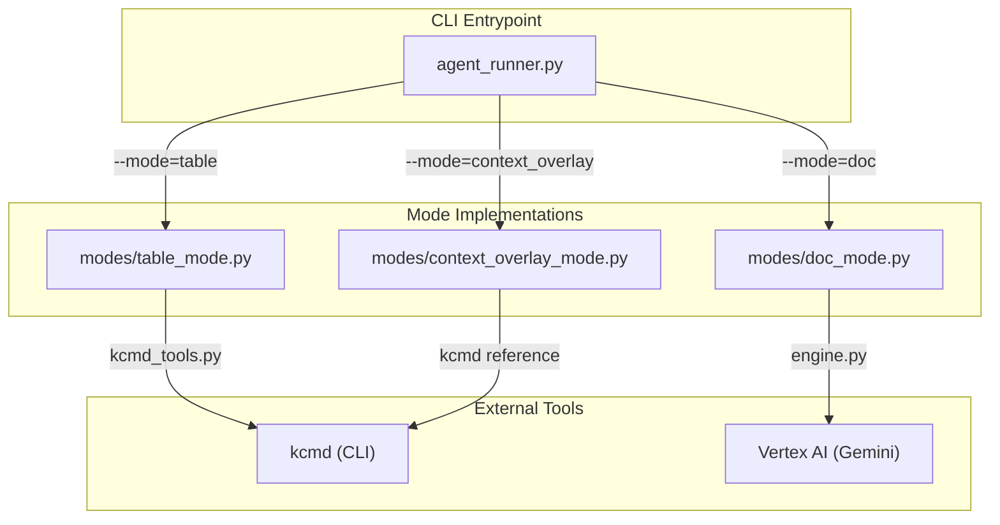
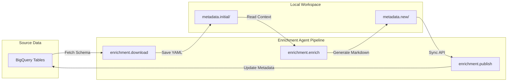

# agents/enrichment: Python Enrichment Agent

<details>
<summary>Relevant source files</summary>

The following files were used as context for generating this wiki page:

- [samples/enrichment/README.md](samples/enrichment/README.md)

</details>


The Python Enrichment Agent (`agents/enrichment`) is a command-line tool designed to generate **Metadata as Code (MaC)** artifacts for Knowledge Catalog (Dataplex). It extracts domain knowledge from source materials—such as Google Docs, local Markdown files, BigQuery usage history, and GitHub repositories—to produce YAML and Markdown files that describe data assets.

The agent operates on a "pull-enrich-publish" workflow. It interacts with the catalog through `kcmd`, populating a local workspace with enriched metadata that can be reviewed before being pushed to the cloud [samples/enrichment/README.md:8-17]().

## System Architecture

The agent is structured around three primary operational modes, a multi-stage LLM pipeline, and a suite of tool integrations for sourcing context.

### Enrichment Modes

The agent dispatches to one of three flows based on the `--mode` flag [agents/enrichment/src/agent_runner.py:3-14]():

| Mode | Purpose | Primary Output |
| :--- | :--- | :--- |
| `table` | Enriches BigQuery dataset tables grounded in Drive/local docs. | Enriched table overviews and `queries` aspects in `bq-dataset` format. |
| `doc` | Crawls documents to build a knowledge base from scratch. | Knowledge-base entries in `STANDARD` layout. |
| `context_overlay` | Creates non-destructive "overlays" for 1P BigQuery tables. | Overlay entries in an editable entry group, referencing read-only tables. |

### Logic Flow and Code Entity Mapping

The following diagram illustrates how the `agent_runner.py` entrypoint coordinates with specific mode implementations and the `kcmd` CLI.

**Agent Orchestration Flow**

Sources: [agents/enrichment/src/agent_runner.py:26-36](), [agents/enrichment/src/modes/table_mode.py:1-13](), [agents/enrichment/src/modes/doc_mode.py:1-4](), [agents/enrichment/src/modes/context_overlay_mode.py:1-26]()

## Workflow: Download, Enrich, Publish

The enrichment process typically follows a four-step lifecycle as demonstrated in the sample implementation [samples/enrichment/README.md:56-90]():

1.  **Download**: Initialize a local metadata snapshot from a source (e.g., BigQuery dataset) using `enrichment.download` [samples/enrichment/README.md:60-66]().
2.  **Enrich**: Run the `enrichment.enrich` module to process the local snapshot, using LLMs to generate descriptions and documentation based on provided configurations [samples/enrichment/README.md:68-75]().
3.  **Review**: Use standard tools like `git diff` to inspect the generated changes in the local directory [samples/enrichment/README.md:77-82]().
4.  **Publish**: Sync the finalized local metadata back to the Knowledge Catalog using `enrichment.publish` [samples/enrichment/README.md:84-89]().

**Sample Data Pipeline**

Sources: [samples/enrichment/README.md:60-89](), [agents/enrichment/src/agent_runner.py:11-19]()

## Key Features

### Metadata as Code Integration
The agent relies on `kcmd_tools.py` to manage the local metadata workspace. For example, in `table` mode, it uses `kcmd init --bigquery-dataset` and `kcmd pull` to discover existing schemas before adding `.overview.md` sidecar files [agents/enrichment/src/modes/table_mode.py:3-9]().

### Multi-Source Context Grounding
Enrichment is grounded in several context sources:
*   **Google Drive/Docs**: Recursive crawling and summarization of documents [agents/enrichment/src/modes/doc_mode.py:1-4]().
*   **BigQuery Usage**: Extraction of query patterns and SQL examples from `INFORMATION_SCHEMA` via `bq_usage_tools.py` [agents/enrichment/src/agent_runner.py:144-156]().
*   **GitHub Repositories**: Agentic exploration of source code via the GitHub MCP server to create "component cards" [agents/enrichment/src/agent_runner.py:59-67]().
*   **User Feedback**: High-priority JSON proposals that override LLM-generated content [agents/enrichment/src/agent_runner.py:176-180]().

### Interactive Refinement
After the initial generation, users can enter an interactive REPL (`--interactive`) to refine the output using natural language instructions. This process reuses the already-loaded context to avoid redundant document processing [agents/enrichment/src/agent_runner.py:51-54]().

## Sub-Component Overview

### [LLM Engine and Agent Pipeline](#3.1.1)
The core intelligence resides in `engine.py`, which defines a multi-stage pipeline. It includes the `EnumerationAgent` for identifying entries, the `EntryWriterAgent` for generating detailed Markdown, and a `RelevanceRouterAgent` to match documents to data assets.
For details, see [LLM Engine and Agent Pipeline](#3.1.1).

### [Tools: Drive, BigQuery, GitHub, Feedback, and kcmd](#3.1.2)
The agent uses a modular tool system. `drive_tools.py` handles document fetching and caching, `bq_usage_tools.py` analyzes SQL history, and `github_tools.py` provides an agentic interface to source code repositories.
For details, see [Tools: Drive, BigQuery, GitHub, Feedback, and kcmd](#3.1.2).

### [Evaluation Framework](#3.1.3)
Located in `agents/enrichment/eval/`, this framework provides both "golden-free" (dynamic) and "golden-based" scoring. It measures metrics such as structural validity, hallucination rates, and redundancy.
For details, see [Evaluation Framework](#3.1.3).

## Directory Structure
```
agents/enrichment/
├── src/
│   ├── agent_runner.py      # Main entrypoint
│   ├── engine.py            # LLM agents and pipeline logic
│   ├── common.py            # Shared utilities (retry logic, direct API calls)
│   ├── modes/               # Mode-specific orchestration
│   └── tools/               # External service integrations
└── eval/                    # Evaluation toolkit
```
Sources: [agents/enrichment/README.md:60-90]()
