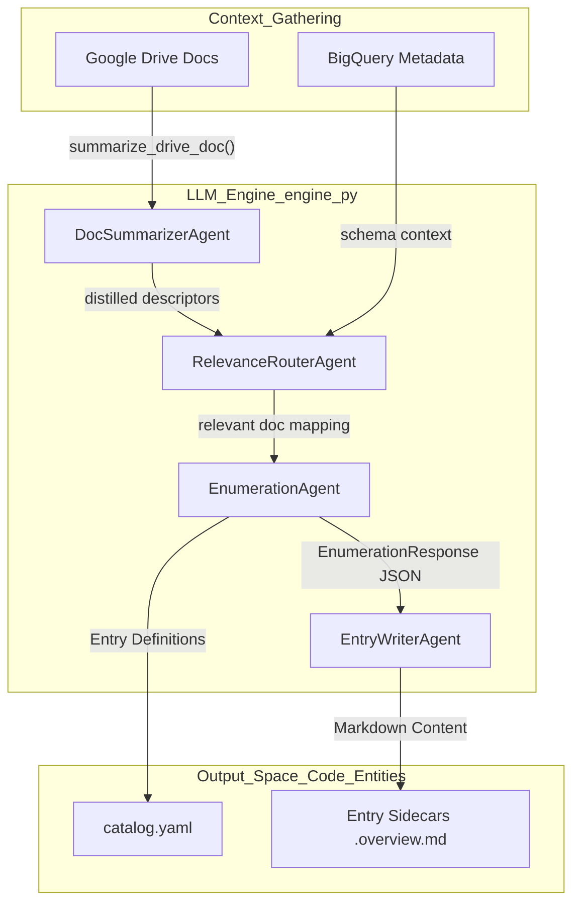

# LLM Engine and Agent Pipeline

<details>
<summary>Relevant source files</summary>

The following files were used as context for generating this wiki page:

- [samples/enrichment/README.md](samples/enrichment/README.md)

</details>


The enrichment agent utilizes a multi-stage LLM pipeline to transform unstructured context (Google Docs, BigQuery schemas, and usage metadata) into structured Knowledge Catalog entries. This pipeline is defined in `engine.py` and is designed to be model-agnostic, leveraging Pydantic schemas for structured output and a specialized Vertex AI wrapper for Gemini.

## Overview of the Agent Pipeline

The pipeline is divided into specialized agents, each responsible for a specific stage of the metadata generation lifecycle. These agents are used across different modes (Table, Doc, and Context Overlay) to ensure consistency in entry identification and content quality.

### Multi-Stage Pipeline Architecture

The following diagram illustrates how the various agents in `engine.py` interact to process raw data into enriched catalog entries.

**Figure 1: Enrichment Agent Data Flow**

Sources: [agents/enrichment/src/engine.py:4-25](), [agents/enrichment/src/engine.py:304-320]()

## Core Agent Components

### VertexGemini Wrapper
The `VertexGemini` class extends the ADK `Gemini` model to interface with Vertex AI using Application Default Credentials (ADC). It dynamically retrieves the `GOOGLE_CLOUD_PROJECT` and `GOOGLE_CLOUD_LOCATION` from the environment to ensure portability across GCP environments.
Sources: [agents/enrichment/src/engine.py:43-64]()

### EnumerationAgent
The `EnumerationAgent` is responsible for producing a canonical, categorized list of entries from the provided context. It outputs a strict Pydantic-schema JSON (`EnumerationResponse`) to ensure that entry IDs and deduplication decisions remain stable across runs.
- **Input:** Compiled context (summaries or schemas).
- **Output:** `EnumerationResponse` containing categories and entry metadata.
Sources: [agents/enrichment/src/engine.py:4-10](), [agents/enrichment/src/engine.py:236-258]()

### EntryWriterAgent
This agent focuses on writing the "Overview" body for a single entry. By fanning out the work per-entry, the system can utilize models with smaller context windows (like Gemini Flash) for the final writing task.
- **Input:** Grounding prompt containing specific entry metadata and routed source document snippets.
- **Output:** Markdown-formatted overview text.
Sources: [agents/enrichment/src/engine.py:11-12](), [agents/enrichment/src/engine.py:270-285]()

### RelevanceRouterAgent
Used primarily in **Table Mode**, this agent analyzes the distilled descriptors of documents and determines which ones are relevant to a specific BigQuery table.
Sources: [agents/enrichment/src/engine.py:23-25](), [agents/enrichment/src/engine.py:322-337]()

## Structured Output Schemas

The engine relies on Pydantic `BaseModel` definitions to enforce structure on LLM responses. This bridges the gap between natural language reasoning and the strict requirements of the `kcmd` catalog format.

| Class Name | Purpose | Key Fields |
| :--- | :--- | :--- |
| `EnumerationResponse` | Defines the catalog structure | `categories`, `entries` |
| `RelevanceResponse` | Maps docs to tables | `reasoning`, `relevant_doc_ids` |
| `RefinementPlan` | Maps user feedback to actions | `operation` (rewrite/answer), `entry_ids` |

Sources: [agents/enrichment/src/engine.py:236-258](), [agents/enrichment/src/engine.py:304-320](), [agents/enrichment/src/engine.py:365-385]()

## Interactive Refinement REPL

The `refine.py` module enables a multi-turn feedback loop where users can modify generated metadata through natural language. It maintains an `EnrichmentSession` to avoid re-reading source documents or re-running the entire pipeline.

**Figure 2: Refinement Loop (Code Entity Mapping)**
```mermaid
sequenceDiagram
    participant User
    participant REPL["refine.py:run_repl"]
    participant Dispatcher["engine.py:RefinementPlan"]
    participant Writer["engine.py:EntryWriterAgent"]
    participant Disk["FileSystem EntryState.overview_path"]

    User->>REPL: "Make the overview more technical"
    REPL->>Dispatcher: "plan_refinement(user_text)"
    Dispatcher-->>REPL: "Return RefinementPlan (operation='rewrite')"
    REPL->>Writer: "apply_refinement(grounding_prompt + feedback)"
    Writer-->>REPL: "New Markdown Body"
    REPL->>Disk: "EntryState.write(body)"
    Disk-->>User: "Updated .overview.md sidecar"
```
Sources: [agents/enrichment/src/refine.py:1-29](), [agents/enrichment/src/refine.py:183-195](), [agents/enrichment/src/refine.py:77-84]()

### Session Management
- **Persistence:** The session is saved as `refine_session.json` in the output directory. This allows the webapp to re-invoke the agent for refinement without losing state.
- **Grounding Re-use:** Each `EntryState` object stores the `grounding_prompt` used during the initial run. Refinement simply appends the user's new instructions to this prompt and re-calls the `EntryWriterAgent`.
Sources: [agents/enrichment/src/refine.py:47-75](), [agents/enrichment/src/refine.py:115-136]()
