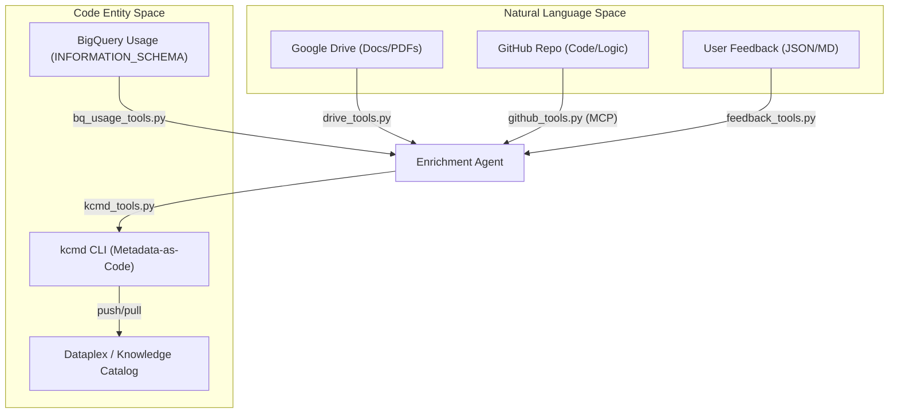
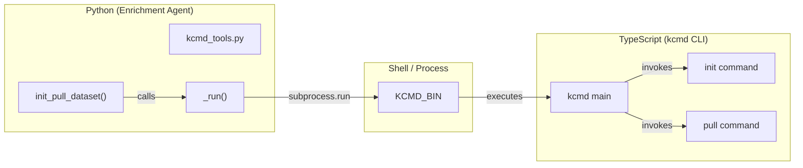

# Tools: Drive, BigQuery, GitHub, Feedback, and kcmd

Relevant source files

The following files were used as context for generating this wiki page:

- [samples/enrichment/README.md](samples/enrichment/README.md)

The Python enrichment agent utilizes a modular suite of tools to ingest context from diverse sources, interact with the Knowledge Catalog, and incorporate human feedback. These tools bridge the gap between "Natural Language Space" (documentation, code, user intent) and "Code Entity Space" (BigQuery schemas, Dataplex aspects, and catalog manifests).

## Tooling Architecture and Data Flow

The enrichment agent operates by gathering context from multiple sources, which are then processed by the LLM engine to generate metadata. The `kcmd` tool serves as the exclusive interface for catalog synchronization.

### Data Flow: Context to Catalog

Title: Enrichment Agent Tooling Data Flow

**Sources:** [agents/enrichment/src/tools/drive_tools.py:1-12](), [agents/enrichment/src/tools/bq_usage_tools.py:1-14](), [agents/enrichment/src/tools/github_tools.py:1-11](), [agents/enrichment/src/tools/kcmd_tools.py:1-17]()

---

## Google Drive and Local Markdown (`drive_tools.py`)

This module provides helpers for discovering and reading content from Google Drive (Docs, Sheets, Slides, PDFs) and local Markdown files.

### Key Functions
- **`get_service()`**: Returns a thread-local, authenticated Drive v3 service using Application Default Credentials (ADC) [agents/enrichment/src/tools/drive_tools.py:37-55](). It requires the `drive.readonly` scope [agents/enrichment/src/tools/drive_tools.py:27-27]().
- **`list_folder_files()`**: Recursively lists supported MIME types in a Drive folder, returning metadata like `id`, `name`, and `webViewLink` [agents/enrichment/src/tools/drive_tools.py:148-185]().
- **`fetch_doc_text()`**: Exports Google Docs to plain text or reads PDF content using the Drive API [agents/enrichment/src/tools/drive_tools.py:210-255]().
- **`is_local_path()`**: Determines if a provided string refers to a local file/directory or a Google Drive resource [agents/enrichment/src/tools/drive_tools.py:85-108]().

### Thread Safety
The module uses `threading.local()` to cache the Drive service per thread, as the underlying `httplib2` transport used by `googleapiclient` is not thread-safe [agents/enrichment/src/tools/drive_tools.py:29-34]().

**Sources:** [agents/enrichment/src/tools/drive_tools.py:20-55](), [agents/enrichment/src/tools/drive_tools.py:85-108](), [agents/enrichment/src/tools/drive_tools.py:148-185]()

---

## BigQuery Usage Signals (`bq_usage_tools.py`)

This module extracts query history from BigQuery's `INFORMATION_SCHEMA` to provide "usage signals" for table enrichment.

### Implementation Details
- **Batching**: To minimize costs, it performs one batched query per dataset rather than per table [agents/enrichment/src/tools/bq_usage_tools.py:11-14]().
- **Normalization**: The `normalize_query()` function strips literals (strings, numbers, dates) from SQL text to collapse similar queries into patterns and protect PII [agents/enrichment/src/tools/bq_usage_tools.py:144-161]().
- **Caching**: Aggregated usage data is cached locally at `~/.kc_enrich_cache/usage/` [agents/enrichment/src/tools/bq_usage_tools.py:37-38]().

### TableUsage Schema
The `TableUsage` dataclass captures the following signals [agents/enrichment/src/tools/bq_usage_tools.py:75-97]():
| Field | Description |
| :--- | :--- |
| `top_users` | Most active users (optionally hashed for anonymity) |
| `top_query_patterns` | Frequent SQL structures after literal stripping |
| `top_join_partners` | Tables frequently joined with the target table |
| `top_referenced_columns` | Columns most frequently appearing in queries |

**Sources:** [agents/enrichment/src/tools/bq_usage_tools.py:11-22](), [agents/enrichment/src/tools/bq_usage_tools.py:75-97](), [agents/enrichment/src/tools/bq_usage_tools.py:144-161]()

---

## GitHub Agentic Exploration (`github_tools.py`)

The GitHub tool uses the Model Context Protocol (MCP) to allow an LLM to explore source code repositories.

### Agentic Pipeline
Unlike other tools, `github_tools.py` initializes an `LlmAgent` (via the Google ADK) that uses the GitHub MCP server's tools (e.g., `search_code`, `get_file_contents`) to distill code into "component cards" [agents/enrichment/src/tools/github_tools.py:1-11]().

### Configuration
- **Transport**: Supports both `stdio` (local binary) and `http` (remote endpoint) transports [agents/enrichment/src/tools/github_tools.py:157-160]().
- **Precedence**: Configuration is resolved from the `--mcp-config` flag or the `KC_ENRICH_MCP_CONFIG` environment variable [agents/enrichment/src/tools/github_tools.py:161-165]().

**Sources:** [agents/enrichment/src/tools/github_tools.py:1-37](), [agents/enrichment/src/tools/github_tools.py:144-160]()

---

## User Feedback Integration (`feedback_tools.py`)

This module processes human-provided corrections, which are treated as higher priority than automated context sources.

### Routing Logic
Proposals are routed to specific tables based on the `target_asset.name` FQN.
- **TABLE**: `project.dataset.table` (3 segments) [agents/enrichment/src/tools/feedback_tools.py:148-149]().
- **COLUMN**: `project.dataset.table.column` (4 segments, last segment stripped) [agents/enrichment/src/tools/feedback_tools.py:150-151]().

### Golden SQL
If a feedback proposal contains an `eval_candidate` with `golden_sql`, it is converted into a entry for the `queries` aspect, cited as `[Source: User Feedback]` [agents/enrichment/src/tools/feedback_tools.py:24-29]().

**Sources:** [agents/enrichment/src/tools/feedback_tools.py:1-38](), [agents/enrichment/src/tools/feedback_tools.py:138-156](), [agents/enrichment/src/tools/feedback_tools.py:172-199]()

---

## Catalog Integration (`kcmd_tools.py`)

The enrichment agent interacts with Dataplex exclusively through the `kcmd` CLI to ensure a Metadata-as-Code workflow.

### Manifest Templates
The module manages several manifest templates used to initialize workspaces:
- **`_BQ_MANIFEST`**: Configures the `bq-dataset` scope and ensures the `overview` and `queries` aspects are tracked [agents/enrichment/src/tools/kcmd_tools.py:63-78]().
- **`_EG_MANIFEST`**: Used for `doc_mode`, configuring an entry group with the `generic` entry type [agents/enrichment/src/tools/kcmd_tools.py:136-150]().
- **`_OVERLAY_MANIFEST`**: Used for `context_overlay` mode, creating a reference to read-only BigQuery tables while allowing edits in a separate entry group [agents/enrichment/src/tools/kcmd_tools.py:157-181]().

### Code Entity Mapping
The following diagram illustrates how the Python `kcmd_tools` module invokes the `kcmd` TypeScript binary.

Title: kcmd Tool Execution Bridge

**Sources:** [agents/enrichment/src/tools/kcmd_tools.py:1-17](), [agents/enrichment/src/tools/kcmd_tools.py:27-45](), [agents/enrichment/src/tools/kcmd_tools.py:183-205]()

---

## Enrichment Workflow Integration

The tools described above are orchestrated by the enrichment agent's main entry points. For example, `enrichment.download` uses `kcmd_tools` to pull initial state, and `enrichment.publish` uses it to push updates.

| Step | Script | Tool Used | Purpose |
| :--- | :--- | :--- | :--- |
| **Download** | `enrichment.download` | `kcmd_tools.py` | Create local metadata snapshot from BigQuery [samples/enrichment/README.md:63-66]() |
| **Enrich** | `enrichment.enrich` | `drive_tools.py`, `bq_usage_tools.py` | Gather context and generate new metadata [samples/enrichment/README.md:71-75]() |
| **Publish** | `enrichment.publish` | `kcmd_tools.py` | Sync local changes back to Dataplex [samples/enrichment/README.md:87-89]() |

**Sources:** [samples/enrichment/README.md:60-90]()
