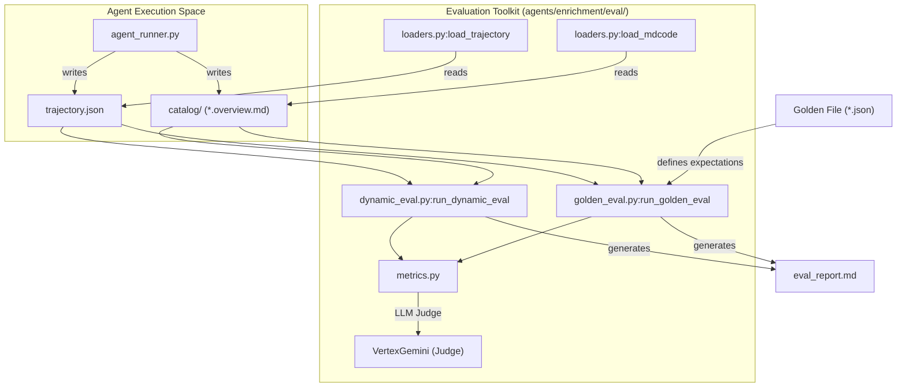
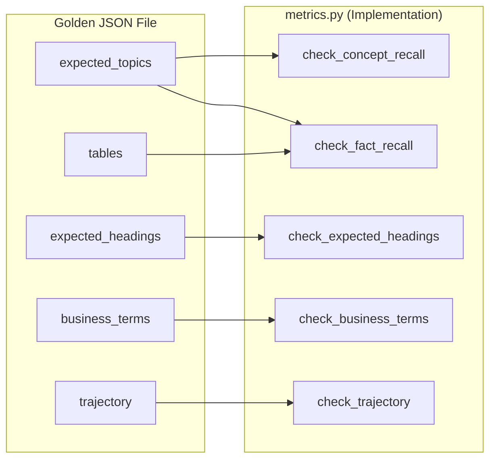

# Evaluation Framework

<details>
<summary>Relevant source files</summary>

The following files were used as context for generating this wiki page:

- [samples/enrichment/README.md](samples/enrichment/README.md)

</details>


The Knowledge Catalog evaluation framework provides a toolkit for assessing the quality, accuracy, and stability of the enrichment agents. It supports both **Dynamic (Golden-free)** evaluation, which grounds claims in the agent's own retrieved context, and **Golden-based** evaluation, which compares agent output against human-curated ground truth.

The framework is primarily located under `agents/enrichment/eval/` and is designed to run against the output of the Python enrichment agent.

## System Architecture and Data Flow

The evaluation framework operates by consuming the `trajectory.json` (execution logs and retrieved context) and the generated `catalog/` (Metadata-as-Code artifacts) produced by an agent run.

### Evaluation Pipeline Diagram

The following diagram illustrates the data flow from an agent run through the evaluation scoring process, bridging the conceptual "Natural Language Space" of documentation to the "Code Entity Space" of the evaluation modules.

**Enrichment Evaluation Data Flow**

**Sources:** `agents/enrichment/eval/dynamic_eval.py`, `agents/enrichment/eval/golden_eval.py`, `agents/enrichment/eval/loaders.py`

## Metric Categories

Metrics are categorized by how they are calculated: deterministic (code-based) or subjective (LLM-judge based).

### Core Metrics Table

| Metric | Category | Description |
| :--- | :--- | :--- |
| `structural_validity` | Deterministic | Checks if the generated MaC is well-formed and follows naming conventions. |
| `hallucination_free` | Judge-based | Verifies every factual claim in the overviews is supported by the agent's retrieved context. |
| `concept_recall` | Golden-based | Measures if expected concepts (from `expected_topics`) were captured as entries. |
| `fact_recall` | Golden-based | Checks if specific facts declared in the golden are present in the output. |
| `perf` | Deterministic | Evaluates token usage and latency against an optional budget. |
| `redundancy_index` | Judge-based | Assesses if the agent repeated information unnecessarily. |

**Sources:** `agents/enrichment/eval/dynamic_eval.py`, `agents/enrichment/eval/golden_eval.py`

## Multi-Run Aggregation and Stability

To account for LLM non-determinism, the framework supports running the same case multiple times using the `--runs` flag in `eval/__main__.py`. The `aggregate.py` module rolls these runs into a single report.

### Stability Metrics
When `runs >= 2`, the framework calculates two stability metrics:
1.  **`concept_consistency`**: Does the agent produce the same set of entries across runs?
2.  **`content_consistency`**: For recurring entries, are the stated facts consistent?

**Sources:** `agents/enrichment/eval/aggregate.py`, `agents/enrichment/eval/__main__.py`

## Running Evaluations

The evaluation suite is invoked via `python -m eval` from the `agents/enrichment/` directory.

### 1. Dynamic Evaluation (Golden-free)
Used to score an existing output directory without needing a reference file. It relies on the `trajectory.json` to ground claims.
```bash
python -m eval --output-dir /path/to/output
```
**Sources:** `agents/enrichment/eval/__main__.py`

### 2. Golden Evaluation (Score-only)
Scores an existing output against a specific golden JSON file.
```bash
python -m eval --output-dir /path/to/output --golden eval/goldens/supply_chain.json
```
**Sources:** `agents/enrichment/eval/__main__.py`

### 3. Case Execution (`--run`)
This mode executes the agent and then scores it. It uses the `run` block within a golden file to determine agent inputs.
```bash
python -m eval --run --goldens eval/goldens/thelook_ecommerce.json \
    --project my-gcp-project --runs 3 --concurrency 2
```
**Sources:** `agents/enrichment/eval/__main__.py`, `samples/enrichment/README.md:71-75`()

## Golden File Schema

Golden files define the "Ground Truth" for specific scenarios. They are stored in `agents/enrichment/eval/goldens/`.

### Golden Schema Association
The following diagram maps the JSON keys in a Golden file to the internal metric functions that process them.

**Golden Schema to Code Entity Mapping**

**Sources:** `agents/enrichment/eval/golden_eval.py`

## Corpora and Sample Goldens

The repository includes synthetic corpora for testing the evaluation framework without requiring external Google Drive access.

*   **Corpora (`eval/corpora/`)**: Contains Markdown documents for domains like `financial_services`, `phone_services`, and `supply_chain`.
*   **theLook eCommerce**: A ready-to-run table-mode golden (`thelook_ecommerce.json`) based on BigQuery public data. The evaluation runner handles copying the public dataset into the target project before execution.

**Sources:** `agents/enrichment/eval/runner.py`, `samples/enrichment/README.md:53-54`()
