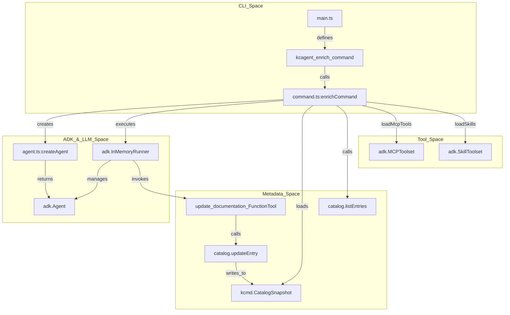
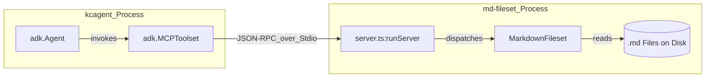

# toolbox/enrichment: TypeScript kcagent and md-fileset

Relevant source files

The following files were used as context for generating this wiki page:

- [toolbox/enrichment/README.md](toolbox/enrichment/README.md)
- [toolbox/enrichment/package-lock.json](toolbox/enrichment/package-lock.json)
- [toolbox/enrichment/package.json](toolbox/enrichment/package.json)
- [toolbox/enrichment/src/agent/enrich/agent.ts](toolbox/enrichment/src/agent/enrich/agent.ts)
- [toolbox/enrichment/src/agent/enrich/command.ts](toolbox/enrichment/src/agent/enrich/command.ts)
- [toolbox/enrichment/src/agent/tools.ts](toolbox/enrichment/src/agent/tools.ts)
- [toolbox/enrichment/src/tools/md/fileset.ts](toolbox/enrichment/src/tools/md/fileset.ts)
- [toolbox/enrichment/src/tools/md/main.ts](toolbox/enrichment/src/tools/md/main.ts)
- [toolbox/enrichment/src/tools/md/server.ts](toolbox/enrichment/src/tools/md/server.ts)
- [toolbox/enrichment/tsconfig.json](toolbox/enrichment/tsconfig.json)

The TypeScript enrichment agent provides an agentic workflow for extracting metadata from external sources and documenting data assets. It leverages the **Google ADK (Agent Development Kit)** and the **Model Context Protocol (MCP)** to interact with various tools, specifically focusing on documenting assets managed via the `kcmd` (Metadata as Code) library.

## Architecture and Orchestration

The system is built as a command-line interface (`kcagent`) that orchestrates an LLM-driven loop. It iterates through entries in a local `kcmd` catalog, invokes an agent to synthesize documentation for each entry, and uses tools to discover and read external information.

### Component Relationship Diagram
The following diagram illustrates how the CLI entrypoint connects to the ADK Agent and the underlying metadata storage.

**Figure 1: Orchestration Flow**

**Sources:** `[toolbox/enrichment/src/agent/enrich/command.ts:16-113]()`, `[toolbox/enrichment/src/agent/enrich/agent.ts:89-108]()`, `[toolbox/enrichment/package.json:12-13]()`

---

## The kcagent CLI

The `kcagent` CLI is the primary entry point for the enrichment workflow. It is distributed as a standalone binary compiled using `bun` `[toolbox/enrichment/package.json:12]()`.

### `enrich` Command Workflow
The `enrichCommand` function in `[toolbox/enrichment/src/agent/enrich/command.ts:16-113]()` performs the following steps:
1.  **Validation**: Verifies that the catalog path, tools path, and prompt file exist and are accessible `[toolbox/enrichment/src/agent/enrich/command.ts:19-33]()`.
2.  **Configuration Loading**: Loads MCP tools from `mcp.json` and ADK skills from the `skills/` directory using specialized loaders `[toolbox/enrichment/src/agent/enrich/command.ts:36-37]()`.
3.  **Catalog Initialization**: Loads the local `kcmd` catalog snapshot using `kcmd.CatalogSnapshot.fromPath` `[toolbox/enrichment/src/agent/enrich/command.ts:40]()`.
4.  **Entry Loop**: Iterates over every entry name retrieved via `catalog.listEntries()` `[toolbox/enrichment/src/agent/enrich/command.ts:42-43]()`.
5.  **Agent Execution**: For each entry, it creates a fresh `adk.Agent` instance. It injects a specific `update_documentation` tool into the agent's toolset `[toolbox/enrichment/src/agent/enrich/command.ts:51-77]()`.
6.  **Persistence**: When the agent calls `update_documentation`, it updates the `dataplex-types.global.overview` aspect of the entry and calls `catalog.updateEntry(entry, [...])` to persist the change to disk `[toolbox/enrichment/src/agent/enrich/command.ts:68-72]()`.

**Sources:** `[toolbox/enrichment/src/agent/enrich/command.ts:16-113]()`, `[toolbox/enrichment/README.md:16-27]()`

---

## Agent Implementation (ADK)

The agent is defined in `[toolbox/enrichment/src/agent/enrich/agent.ts]()` using the Google ADK. It utilizes the `gemini-2.5-flash` model by default `[toolbox/enrichment/src/agent/enrich/agent.ts:9]()`.

### Prompting and Behavior
The agent is initialized with a system instruction that defines its persona as an experienced data steward `[toolbox/enrichment/src/agent/enrich/agent.ts:12]()`. The prompt enforces a strict documentation template:
*   **Summary**: A few paragraphs of key information.
*   **Data Details**: Salient details about the data.
*   **Usage Details**: Business context and query advice.
*   **Citations**: A list of sources formatted as title and reference `[toolbox/enrichment/src/agent/enrich/agent.ts:46-61]()`.

### Thinking Configuration
The agent is configured to use Gemini's thinking capabilities, with `includeThoughts` set to true and a `thinkingBudget` of -1 (allowing the model to determine the necessary depth) `[toolbox/enrichment/src/agent/enrich/agent.ts:101-106]()`.

**Sources:** `[toolbox/enrichment/src/agent/enrich/agent.ts:8-108]()`, `[toolbox/enrichment/src/agent/enrich/command.ts:116-140]()`

---

## Tool and Skill Loading

The agent's capabilities are extended through two mechanisms managed in `[toolbox/enrichment/src/agent/tools.ts]()`.

### MCP Tool Loading
The `loadMcpTools` function reads a `tools/mcp.json` file `[toolbox/enrichment/src/agent/tools.ts:17]()`. It parses the `mcpServers` configuration and supports two connection types:
*   **StdioConnectionParams**: Spawns a local process using a `command` and `args`. It handles environment variable expansion for configuration values `[toolbox/enrichment/src/agent/tools.ts:30-46]()`.
*   **StreamableHTTPConnectionParams**: Connects to a remote MCP server via a `url` `[toolbox/enrichment/src/agent/tools.ts:48-59]()`.

### Skill Loading
Skills are high-level agent capabilities often defined in Markdown files. `loadSkills` looks for a `skills/` subdirectory and uses `adk.loadAllSkillsInDir` to ingest them `[toolbox/enrichment/src/agent/tools.ts:70-77]()`. These skills are executed using an `adk.UnsafeLocalCodeExecutor` `[toolbox/enrichment/src/agent/tools.ts:84]()`.

**Sources:** `[toolbox/enrichment/src/agent/tools.ts:9-92]()`

---

## md-fileset MCP Server

The `md-fileset` tool is a specialized MCP server that provides the agent with the ability to navigate and read a local directory of Markdown files.

### Implementation Details
The core logic resides in the `MarkdownFileset` class `[toolbox/enrichment/src/tools/md/fileset.ts:13]()`. It exposes three tools to the MCP framework:

| Tool Name | Implementation Function | Description |
| :--- | :--- | :--- |
| `list_fileset_contents` | `listContents()` | Lists files and sub-directories at a given relative path `[toolbox/enrichment/src/tools/md/server.ts:31-40]()`. |
| `read_fileset_file` | `readFile()` | Returns the full text content of a specified Markdown file `[toolbox/enrichment/src/tools/md/server.ts:54-62]()`. |
| `search_fileset_contents`| `searchContents()` | Performs a regex-based search across all `.md` files in the fileset `[toolbox/enrichment/src/tools/md/server.ts:42-52]()`. |

### Security and Path Handling
The `MarkdownFileset` includes a `safePath` utility that ensures all file operations are restricted to the designated root directory, preventing directory traversal `[toolbox/enrichment/src/tools/md/fileset.ts:23-31]()`.

**Figure 2: md-fileset Data Flow**

**Sources:** `[toolbox/enrichment/src/tools/md/fileset.ts:13-125]()`, `[toolbox/enrichment/src/tools/md/server.ts:25-66]()`, `[toolbox/enrichment/src/tools/md/main.ts:11-33]()`
