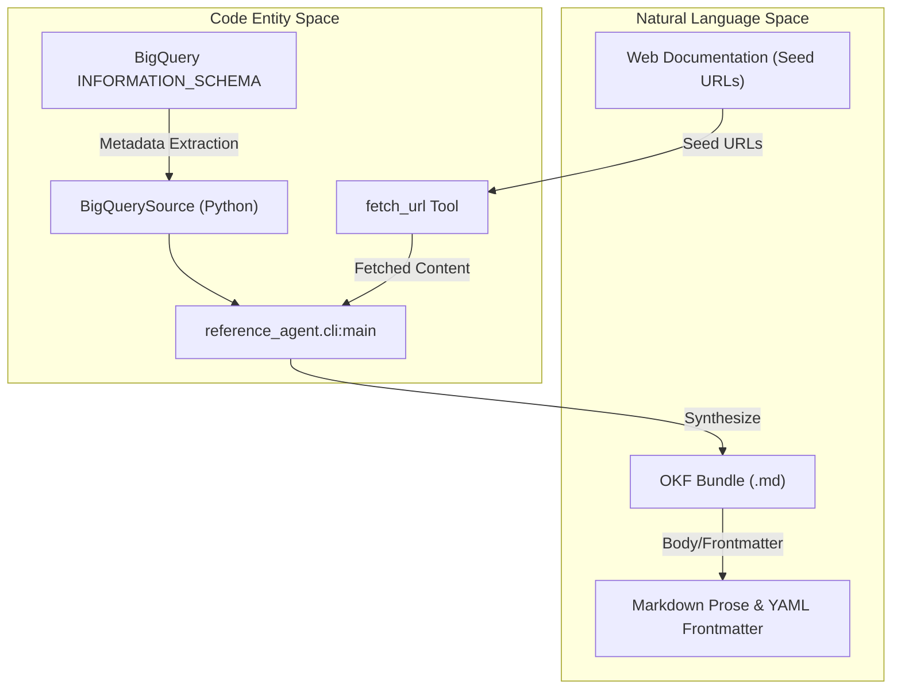
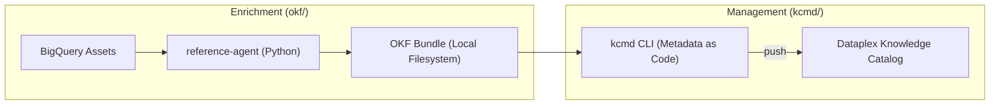

# Open Knowledge Format (OKF)

Relevant source files

The following files were used as context for generating this wiki page:

- [okf/README.md](okf/README.md)
- [okf/pyproject.toml](okf/pyproject.toml)

The **Open Knowledge Format (OKF)** is a universal, vendor-neutral specification for representing knowledge as plain Markdown files with YAML frontmatter [okf/README.md:8-11](). Within this repository, OKF serves as the standard exchange format between data sources, automated enrichment agents, and the Knowledge Catalog. It is designed to be "Metadata as Code," enabling version control, human readability, and seamless ingestion by LLMs [okf/README.md:37-52]().

## Overview of OKF Components

The OKF ecosystem consists of three primary pillars: a formal specification, a reference implementation for generating and processing these bundles, and a set of sample bundles that demonstrate real-world applications.

### OKF Specification (v0.1)
The specification defines a "Bundle" as a directory-based structure containing Markdown files with YAML frontmatter [okf/README.md:39-41](). This format ensures that knowledge is both human-readable and easily parsed by LLMs or traditional software. Key design properties include:
*   **Human and Agent Readable:** No proprietary SDK is required to access the content [okf/README.md:43-45]().
*   **Version Controllable:** Bundles live in git, allowing for standard PR and diff workflows [okf/README.md:46-48]().
*   **Graph-Shaped:** Concepts link to each other via standard Markdown links, expressing complex relationships [okf/README.md:68-70]().
*   **Progressive Disclosure:** `index.md` files allow consumers to navigate the hierarchy without loading the entire bundle into context [okf/README.md:65-67]().

For details, see [OKF Specification](#4.1).

### OKF Reference Enrichment Agent
The reference enrichment agent, located in `okf/src/enrichment_agent/`, is a Python-based tool (invoked via `reference-agent`) that demonstrates how to produce OKF bundles automatically [okf/README.md:22-25](), [okf/pyproject.toml:21-22](). It implements a multi-pass pipeline:
*   **BQ Pass:** Extracts technical metadata, schemas, and usage patterns directly from BigQuery [okf/README.md:94-95]().
*   **Web Pass:** Uses the LLM as a crawler to fetch documentation from seed URLs (via `fetch_url` tool) and enrich existing concept docs [okf/README.md:96-105]().
*   **Visualization:** Includes a `visualize` subcommand that renders bundles as self-contained interactive HTML files [okf/README.md:149-156]().

For details, see [OKF Reference Enrichment Agent](#4.2).

### Sample Bundles
The repository includes three ready-to-browse bundles produced by the reference agent, located in `okf/bundles/` [okf/README.md:27-35]():
*   **GA4 Google Merchandise Store:** Public e-commerce dataset seeded with canonical GA4 export documentation [okf/README.md:131-135]().
*   **Stack Overflow:** Mirror of the Stack Exchange Data Dump, exercising multi-concept enrichment [okf/README.md:136-141]().
*   **Bitcoin (Crypto):** Public blockchain dataset highlighting cross-table foreign-key relationships [okf/README.md:142-147]().

## System Architecture: From Data to Knowledge

The following diagram illustrates how the `reference-agent` bridges the "Natural Language Space" (web documentation and prose) and the "Code Entity Space" (BigQuery metadata and Python implementation).

### Knowledge Synthesis Pipeline

**Sources:** [okf/README.md:92-106](), [okf/pyproject.toml:21-22]()

## Integration with Knowledge Catalog

OKF acts as the intermediate representation before metadata is pushed to Dataplex (Knowledge Catalog). The workflow typically involves an agent generating an OKF bundle, which is then managed by `kcmd` for synchronization.

### Metadata Lifecycle

**Sources:** [okf/README.md:1-25](), [okf/README.md:108-119]()

## Related Child Pages
*   **[OKF Specification](#4.1):** Deep dive into the file formats, frontmatter schemas, and link semantics.
*   **[OKF Reference Enrichment Agent](#4.2):** Technical details on the Python implementation, BQ source integration, and visualization tools.

**Sources:**
*   [okf/README.md:1-156]()
*   [okf/pyproject.toml:1-33]()
